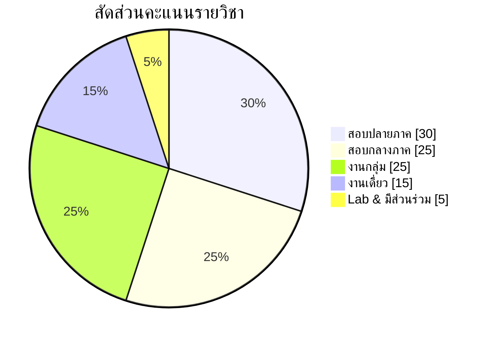

# 💯 การวัดผลและเกณฑ์การให้คะแนน

## 1. สัดส่วนคะแนนรวม 100%

| # | รายการประเมิน | สัดส่วน | สัปดาห์ | CLO ที่วัด | ลิงก์ |
|:--:|---|:--:|:--:|:--:|---|
| 1 | **สอบกลางภาค** (Midterm) | **25%** | W8 | 1, 2, 3 | [[Midterm-Exam-Blueprint]] |
| 2 | **สอบปลายภาค** (Final) | **30%** | ช่วงสอบ | 4, 5, 6 | [[Final-Exam-Blueprint]] |
| 3 | **งานเดี่ยว** — DSS Data Analysis & Dashboard | **15%** | W4→W7 | 2, 3 | [[Individual-Assignment]] |
| 4 | **งานกลุ่ม** — Mini-DSS Prototype | **25%** | W9→W16 | 4, 5, 6 | [[Group-Project]] |
| 5 | **การมีส่วนร่วมและ Lab** | **5%** | ทุกสัปดาห์ | ทุก CLO | [[Lab-Index]] |
| | **รวม** | **100%** | | | |

**สมดุลของการประเมิน:** สอบ 55% / ปฏิบัติ 45% — สอบวัดความเข้าใจเชิงทฤษฎีและการวิเคราะห์ ส่วนงานวัดความสามารถในการสร้างระบบจริง สัดส่วนนี้ทำให้ผู้เรียนที่เก่งทฤษฎีแต่ไม่ลงมือทำ และผู้เรียนที่ทำเป็นแต่อธิบายเหตุผลไม่ได้ ไม่สามารถผ่านด้วยคะแนนสูงได้ทั้งคู่

## 2. รายละเอียดการแบ่งคะแนนย่อย

### 2.1 สอบกลางภาค (25 คะแนน) — ครอบคลุม W1–W7
| ส่วน | รูปแบบ | ข้อ | คะแนน | เวลา |
|---|---|:--:|:--:|:--:|
| A | ปรนัย 4 ตัวเลือก (Concept check) | 20 | 5 | 20 นาที |
| B | อัตนัยสั้น / อธิบายเชิงเปรียบเทียบ | 4 | 8 | 40 นาที |
| C | โจทย์คำนวณและวิเคราะห์ (OLAP, Data Mining) | 2 | 6 | 40 นาที |
| D | กรณีศึกษาออกแบบระบบ (Design case) | 1 | 6 | 50 นาที |
| | **รวม** | | **25** | **150 นาที** |

### 2.2 สอบปลายภาค (30 คะแนน) — ครอบคลุม W9–W15 (+ แนวคิดแกน W1–W2 ประมาณ 15%)
| ส่วน | รูปแบบ | ข้อ | คะแนน | เวลา |
|---|---|:--:|:--:|:--:|
| A | ปรนัย 4 ตัวเลือก | 20 | 5 | 20 นาที |
| B | อัตนัยสั้น / เปรียบเทียบเทคนิค | 5 | 8 | 40 นาที |
| C | โจทย์คำนวณ (LP, Bayes, Fuzzy, Metrics) | 3 | 9 | 50 นาที |
| D | กรณีศึกษาบูรณาการ (เลือก 1 จาก 2) | 1 | 8 | 70 นาที |
| | **รวม** | | **30** | **180 นาที** |

> [!note] สัดส่วนสะสม (Cumulative)
> ข้อสอบปลายภาคไม่ใช่ข้อสอบสะสมเต็มรูปแบบ แต่ส่วน D บังคับให้ใช้แนวคิดจาก [[DSS-Architecture-Subsystems]] และ [[Simon-Decision-Phases]] ของครึ่งภาคแรกในการวางกรอบคำตอบเสมอ เพราะการออกแบบ DSS ที่ดีต้องอ้างอิงสถาปัตยกรรม

### 2.3 งานเดี่ยว (15 คะแนน)
| องค์ประกอบ | คะแนน |
|---|:--:|
| การเตรียมข้อมูลและ Star Schema | 3 |
| การวิเคราะห์ OLAP / Data Mining | 4 |
| คุณภาพ Dashboard (Visual Analytics + บริบทข้อมูล) | 4 |
| รายงานและข้อเสนอแนะเชิงการตัดสินใจ | 4 |

### 2.4 งานกลุ่ม (25 คะแนน)
| องค์ประกอบ | คะแนน | กำหนดส่ง |
|---|:--:|---|
| Proposal + Decision Framing | 3 | W10 |
| Checkpoint 1 (Data + Model layer) | 3 | W12 |
| Checkpoint 2 (Prototype ทำงานได้) | 3 | W14 |
| รายงานฉบับสมบูรณ์ + โค้ด | 8 | W15 |
| การนำเสนอและสาธิต | 5 | W16 |
| คะแนนรายบุคคล (Peer evaluation × contribution) | 3 | W16 |

> [!warning] คะแนนรายบุคคลในงานกลุ่ม
> คะแนน 22 จาก 25 เป็นคะแนนกลุ่ม (ทุกคนได้เท่ากัน) และ 3 คะแนนมาจาก peer evaluation แต่หากผลประเมินเพื่อนร่วมกลุ่มร่วมกับ commit history ชี้ชัดว่าสมาชิกคนใดมีส่วนร่วมต่ำกว่า 40% ของค่าเฉลี่ยกลุ่ม ผู้สอนสงวนสิทธิ์ปรับ **คะแนนกลุ่มของบุคคลนั้นลงตามสัดส่วนการมีส่วนร่วมจริง**

### 2.5 การมีส่วนร่วมและ Lab (5 คะแนน)
- ส่ง Lab notebook ครบ ≥ 10 จาก 13 แลบ: 3 คะแนน
- การอภิปรายกรณีศึกษาในชั้นเรียน: 2 คะแนน

## 3. เกณฑ์ระดับผลการเรียน

| ช่วงคะแนน | เกรด | ความหมายเชิงสมรรถนะ |
|---|:--:|---|
| 80–100 | A | ออกแบบและสร้าง DSS ครบทุกชั้นได้เอง พร้อมอธิบายเหตุผลเชิงสถาปัตยกรรมและข้อจำกัดของเทคนิคที่เลือก |
| 75–79 | B+ | สร้างได้ครบ อธิบายเหตุผลได้ดี มีจุดอ่อนเล็กน้อยด้านการประเมินผลหรือความลึกของการวิเคราะห์ |
| 70–74 | B | ประยุกต์เทคนิคหลักได้ถูกต้อง แต่การบูรณาการข้ามชั้นยังไม่สมบูรณ์ |
| 65–69 | C+ | ทำตามขั้นตอนที่กำหนดได้ แต่เลือกเทคนิคเองยังไม่แม่นยำ |
| 60–64 | C | เข้าใจแนวคิดหลัก ปฏิบัติได้ภายใต้การชี้แนะ |
| 55–59 | D+ | เข้าใจนิยามและสถาปัตยกรรมพื้นฐาน แต่ปฏิบัติได้จำกัด |
| 50–54 | D | ผ่านเกณฑ์ขั้นต่ำ |
| < 50 | F | ไม่ผ่าน |

## 4. Mapping — การประเมินครอบคลุม CLO ครบถ้วน

| | CLO1 | CLO2 | CLO3 | CLO4 | CLO5 | CLO6 |
|---|:--:|:--:|:--:|:--:|:--:|:--:|
| สอบกลางภาค | ● | ● | ○ | | | |
| สอบปลายภาค | ○ | | | ● | ● | ○ |
| งานเดี่ยว | | ● | ● | | | |
| งานกลุ่ม | | ○ | ○ | ● | ● | ● |
| Lab | ○ | ● | ● | ● | ● | |

● = ประเมินหลัก · ○ = ประเมินรอง

---
**ที่เกี่ยวข้อง:** [[Home]] · [[Rubrics]] · [[Midterm-Exam-Blueprint]] · [[Final-Exam-Blueprint]]
