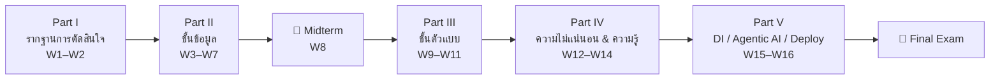

# 📄 ประมวลรายวิชา — ระบบสนับสนุนการตัดสินใจ (Decision Support Systems)

## 1. ข้อมูลรายวิชา

| หัวข้อ | รายละเอียด |
|---|---|
| ชื่อวิชา | ระบบสนับสนุนการตัดสินใจ / Decision Support Systems |
| หน่วยกิต | 3 (2-2-5) |
| เวลาเรียน | บรรยาย 2 ชม. + ปฏิบัติ 2 ชม. ต่อสัปดาห์ รวม 16 สัปดาห์ |
| วิชาบังคับก่อน | ระบบฐานข้อมูล (Database Systems) — แนะนำให้ผ่านสถิติเบื้องต้นและการเขียนโปรแกรม |
| ภาษาที่ใช้ | ไทย (ศัพท์เทคนิคภาษาอังกฤษ) |

## 2. คำอธิบายรายวิชา

แนวคิดและกระบวนการตัดสินใจในองค์กร ปัญหาแบบมีโครงสร้าง กึ่งโครงสร้าง และไม่มีโครงสร้าง วิวัฒนาการจาก TPS/MIS สู่ DSS, BI และ Decision Intelligence สถาปัตยกรรมและระบบย่อยของ DSS (การจัดการข้อมูล การจัดการตัวแบบ ส่วนต่อประสานผู้ใช้ และฐานความรู้) คลังข้อมูลและการประมวลผลเชิงวิเคราะห์ออนไลน์ (OLAP) การทำเหมืองข้อมูล การออกแบบแผงควบคุมสำหรับผู้บริหาร การสร้างตัวแบบเชิงพยากรณ์ด้วยการเรียนรู้ของเครื่องและตัวแบบเชิงให้คำแนะนำด้วยการหาค่าเหมาะที่สุด การตัดสินใจภายใต้ความไม่แน่นอนด้วยตรรกศาสตร์คลุมเครือและเครือข่ายแบบเบย์ ระบบผู้เชี่ยวชาญและการจัดการกฎทางธุรกิจตามมาตรฐาน DMN ตลอดจนการนำระบบขึ้นใช้งานจริงและประเด็นด้านจริยธรรมและการกำกับดูแล AI

## 3. ผลลัพธ์การเรียนรู้ของรายวิชา (Course Learning Outcomes — CLO)

| รหัส | ผลลัพธ์การเรียนรู้ | ระดับ Bloom | วัดผลด้วย |
|---|---|---|---|
| **CLO1** | อธิบายนิยาม วิวัฒนาการ และสถาปัตยกรรมของ DSS รวมถึงจำแนกประเภทปัญหาการตัดสินใจตามกรอบของ Simon ได้ | Understand | สอบกลางภาค |
| **CLO2** | ออกแบบโครงสร้างคลังข้อมูลและใช้ OLAP/Data Mining เพื่อสกัดสารสนเทศเชิงลึกจากข้อมูลจริงได้ | Apply | สอบกลางภาค, งานเดี่ยว |
| **CLO3** | ออกแบบและสร้างแผงควบคุม (Dashboard) ที่สื่อสารบริบทข้อมูลอย่างถูกต้อง ตรวจสอบย้อนกลับได้ | Create | งานเดี่ยว |
| **CLO4** | สร้างตัวแบบเชิงพยากรณ์และเชิงให้คำแนะนำ พร้อมประเมินประสิทธิภาพด้วยเมตริกที่เหมาะสม | Apply / Analyze | สอบปลายภาค, งานกลุ่ม |
| **CLO5** | ประยุกต์เทคนิคจัดการความไม่แน่นอน (Fuzzy Logic, Bayesian Networks) และการให้เหตุผลด้วยกฎ (Expert System / DMN) กับปัญหาโดเมนจริง | Apply | สอบปลายภาค, งานกลุ่ม |
| **CLO6** | บูรณาการองค์ประกอบทั้งหมดเป็นต้นแบบ DSS ที่ใช้งานได้ พร้อมอธิบายเหตุผลเชิงสถาปัตยกรรมและประเด็นจริยธรรม | Create / Evaluate | งานกลุ่ม, การนำเสนอ |

## 4. โครงสร้างเนื้อหา 5 ส่วน

## 5. วิธีการจัดการเรียนการสอน
- **บรรยาย (2 ชม.)** — ทฤษฎี กรณีศึกษาอุตสาหกรรม และการอภิปรายเชิงวิพากษ์
- **ปฏิบัติการ (2 ชม.)** — [[Lab-Index|Lab]] ด้วย Python / Power BI / DMN Engine (ดู [[Tools-and-Software-Setup]])
- **Case discussion** — ทุกสัปดาห์มีกรณีศึกษาจากอุตสาหกรรมจริง (การแพทย์ การเงิน โลจิสติกส์ เมืองอัจฉริยะ)
- **Project-based learning** — [[Group-Project]] ดำเนินคู่ขนานตั้งแต่ W9

## 6. การวัดและประเมินผล
สรุปย่อ — รายละเอียดเต็มที่ [[Assessment-and-Grading]]

| รายการ | สัดส่วน |
|---|---|
| สอบกลางภาค ([[Midterm-Exam-Blueprint]]) | 25% |
| สอบปลายภาค ([[Final-Exam-Blueprint]]) | 30% |
| งานเดี่ยว ([[Individual-Assignment]]) | 15% |
| งานกลุ่ม ([[Group-Project]]) | 25% |
| การมีส่วนร่วมและ Lab | 5% |

## 7. นโยบายรายวิชา
- **การเข้าเรียน** — ต้องมีเวลาเรียนไม่น้อยกว่า 80% จึงมีสิทธิ์สอบปลายภาค
- **การส่งงานล่าช้า** — หัก 10% ของคะแนนเต็มต่อวัน สูงสุด 3 วัน หลังจากนั้นไม่รับ
- **ความซื่อสัตย์ทางวิชาการ** — การคัดลอกงาน (Plagiarism) ได้ 0 ในชิ้นนั้นทันที
- **การใช้ AI (Generative AI Policy)** — อนุญาตให้ใช้ช่วยเขียนโค้ดและตรวจภาษา **แต่ต้องระบุไว้ในภาคผนวกว่าใช้เครื่องมือใด ในขั้นตอนใด และตรวจสอบผลอย่างไร** งานที่ให้ AI ตัดสินใจเชิงออกแบบแทนทั้งหมดโดยไม่มีการวิเคราะห์ของผู้เรียน จะถูกหักคะแนนในหมวดเหตุผลเชิงออกแบบ

## 8. เอกสารประกอบ
ดู [[Reading-List]]

---
**ที่เกี่ยวข้อง:** [[Home]] · [[Course-Outline-16-Weeks]] · [[Assessment-and-Grading]]
