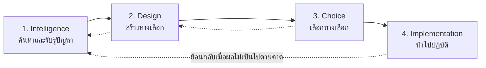

# 📘 สัปดาห์ที่ 1 — การตัดสินใจและบทบาทของระบบสนับสนุนการตัดสินใจ

⬅️ — | ➡️ [[Week-02-DSS-Architecture]]

## 🎯 จุดประสงค์การเรียนรู้
เมื่อจบสัปดาห์นี้ ผู้เรียนสามารถ
1. อธิบายว่าเหตุใดการตัดสินใจของมนุษย์จึงมีข้อจำกัด และ DSS เข้ามาอุดช่องว่างใดได้
2. จำแนกปัญหาออกเป็นแบบมีโครงสร้าง กึ่งโครงสร้าง และไม่มีโครงสร้าง พร้อมยกตัวอย่างในโดเมนจริง
3. ระบุระยะของกระบวนการตัดสินใจตามกรอบของ Simon และบอกได้ว่า DSS สนับสนุนระยะใดอย่างไร
4. ลำดับวิวัฒนาการจาก TPS → MIS → DSS → BI → Decision Intelligence ได้

## 📖 เนื้อหาบรรยาย (2 ชม.)

### ช่วงที่ 1 (50 นาที) — ทำไมต้องมี DSS
- การตัดสินใจในฐานะกิจกรรมใจกลางของการบริหารจัดการ ทั้งภาครัฐ เอกชน และอุตสาหกรรม
- ข้อจำกัดของมนุษย์: ข้อจำกัดทางสติปัญญา (Cognitive limitations), ความลำเอียง (Biases), ขีดความสามารถในการประมวลผลข้อมูลจำกัด → [[Bounded-Rationality]]
- ผลลัพธ์เมื่อเผชิญปัญหาซับซ้อนและข้อมูลมหาศาล: ตัดสินใจผิดพลาดหรือล่าช้า
- นิยาม DSS: เครื่องมือเชิงบูรณาการที่ผสาน **เทคโนโลยีสารสนเทศ + ฐานข้อมูล + แบบจำลองทางคณิตศาสตร์** เข้ากับ **วิจารณญาณของผู้เชี่ยวชาญ** → [[DSS-Definition-and-Evolution]]
- 🔑 ประเด็นสำคัญ: DSS ไม่ได้ "ตัดสินใจแทน" แต่ "สนับสนุนการตัดสินใจ" ของมนุษย์

### ช่วงที่ 2 (35 นาที) — ทฤษฎีการตัดสินใจ
- [[Problem-Structuredness|โครงสร้างของปัญหา]]: Structured / Semi-structured / Unstructured — DSS มีคุณค่าสูงสุดในสองประเภทหลัง
- ทฤษฎีอรรถประโยชน์ (Utility / Pragmatic Theory) — การเลือกทางเลือกที่ให้อรรถประโยชน์คาดหวังสูงสุด
- ทฤษฎีเกม (Game Theory) — เมื่อผลลัพธ์ขึ้นกับการตัดสินใจของผู้เล่นอื่น
- ความสมเหตุสมผลแบบจำกัด (Bounded Rationality) และแนวคิด *satisficing* ของ Herbert Simon

### ช่วงที่ 3 (35 นาที) — กรอบกระบวนการตัดสินใจของ Simon
→ [[Simon-Decision-Phases]]

| ระยะ | คำถามหลัก | เทคโนโลยี DSS ที่สนับสนุน |
|---|---|---|
| Intelligence | ปัญหาคืออะไร? เกิดที่ไหน? | Data Warehouse, [[OLAP]], การตรวจจับสัญญาณ |
| Design | มีทางเลือกอะไรบ้าง? | [[Machine-Learning-for-DSS]], [[Monte-Carlo-Simulation]], What-if analysis |
| Choice | ทางเลือกใดดีที่สุด? | [[Optimization-and-Operations-Research]], [[Sensitivity-Analysis]] |
| Implementation | ทำได้จริงหรือไม่? ผลเป็นอย่างไร? | [[Dashboard-Design]], ระบบติดตามผลป้อนกลับ |

### ช่วงที่ 4 (20 นาที) — เส้นทางวิวัฒนาการและภาพรวมรายวิชา
- ทศวรรษ 1970: MIS ออกรายงานตามรอบเวลา → 1980s–90s: DSS + Expert Systems → 2000s: [[Business-Intelligence]] → 2010s: AI/ML → ปัจจุบัน: [[Decision-Intelligence]]
- แนะนำโครงสร้าง 5 ส่วนของรายวิชา ([[Course-Outline-16-Weeks]]) และการประเมินผล ([[Assessment-and-Grading]])

## 🔬 ปฏิบัติการ (2 ชม.)
**Lab 0 — ปฐมนิเทศเครื่องมือ**
- ติดตั้งสภาพแวดล้อมตาม [[Tools-and-Software-Setup]]
- สร้าง repo ส่วนตัวและทดสอบ Jupyter + pandas ด้วยชุดข้อมูล Retail Sales
- แบบฝึกอุ่นเครื่อง: หา 5 ข้อมูลเชิงลึกจากข้อมูลยอดขายด้วย pandas เพียงอย่างเดียว → เพื่อให้เห็นความเจ็บปวดของการวิเคราะห์แบบ ad-hoc ก่อนเรียน OLAP ใน W4

## 🏭 กรณีศึกษาอภิปรายในชั้นเรียน
**องค์กรโทรคมนาคม — การกำหนดอัตราค่าบริการ (Tariff Plan)**
บริษัทพัฒนา DSS แบบกำหนดเอง (custom-made) ที่รวบรวมพฤติกรรมการใช้งานของลูกค้า และใช้ฐานตัวแบบคณิตศาสตร์คำนวณอัตราค่าบริการที่ทำกำไรสูงสุดโดยยังรักษาฐานลูกค้าไว้ได้ ผู้บริหารปรับตัวแปรผ่านส่วนต่อประสานและเห็นผลจำลองทันที

**คำถามอภิปราย**
1. ปัญหาการตั้งราคานี้จัดเป็นปัญหาแบบใด (structured / semi / unstructured)? เพราะเหตุใด
2. ในระยะใดของ Simon ที่ระบบนี้ให้คุณค่ามากที่สุด?
3. ถ้าระบบเปลี่ยนราคาให้อัตโนมัติโดยไม่ผ่านผู้บริหาร ยังเรียกว่า DSS อยู่หรือไม่?

## 📝 การบ้าน / เตรียมสัปดาห์หน้า
- อ่าน Sharda et al. บทที่ 1–2
- เขียนบันทึกสั้น 1 หน้า: ยกตัวอย่างการตัดสินใจในองค์กรที่ตนรู้จัก 1 กรณี แล้วจำแนกตามโครงสร้างปัญหาและระบุว่าอยู่ในระยะใดของ Simon

## ✅ ตรวจสอบความเข้าใจตนเอง
- [ ] อธิบายความต่างระหว่าง "ระบบที่ตัดสินใจแทน" กับ "ระบบที่สนับสนุนการตัดสินใจ" ได้ในหนึ่งย่อหน้า
- [ ] ยกตัวอย่างปัญหากึ่งโครงสร้างในสาขาของตนได้ 3 ตัวอย่าง
- [ ] จับคู่ระยะของ Simon กับเทคโนโลยีที่รองรับได้ครบ 4 ระยะ

> [!exam] ความสำคัญต่อการสอบ
> เนื้อหาสัปดาห์นี้เป็น **กรอบอ้างอิงของทั้งรายวิชา** — ปรากฏในส่วน A และ D ของ [[Midterm-Exam-Blueprint|สอบกลางภาค]] และยังถูกใช้เป็นกรอบตอบกรณีศึกษาใน [[Final-Exam-Blueprint|สอบปลายภาค]] ส่วน D

---
**แนวคิดหลัก:** [[DSS-Definition-and-Evolution]] · [[Simon-Decision-Phases]] · [[Bounded-Rationality]] · [[Problem-Structuredness]]

## 📦 ชุดสอนฉบับขยาย

- [[week01/README|ดัชนีชุดสอน Week 01]]
- [[week01/Week-01-Expanded-Content|ประวัติ DSS, 20 Applications และ Future DSS]]
- [[week01/Week-01-Questions|คำถามทบทวน 10 ข้อพร้อมแนวคำตอบ]]
- [[week01/Lab-01-DSS-History-and-Decision-Case|Lab 01 — DSS History and Decision Case]]
- [[week01/Lab-02-Design-a-Future-DSS|Lab 02 — Design a Future DSS]]
- ไฟล์สไลด์: `week01/Week-01-DSS-History-Applications-Future.pptx`

## 🎮 สื่อจำลองประกอบการเรียน

- [[Sim-01-Decision-Cockpit|🎛️ Sim 01 — Decision Cockpit]] — จำลองการตัดสินใจตามกรอบ Simon 4 ระยะ เทียบผลระหว่างไม่มีระบบ / มี BI / มี DSS พร้อมใบงานและเฉลย
- เปิดใช้: `npm --prefix web run dev` → `http://localhost:3000/sims/decision-cockpit` หรือดับเบิลคลิก `06-Simulations/sim-01-decision-cockpit.html`
- ดัชนีสื่อจำลองทั้งหมด: [[Simulation-Index]]
