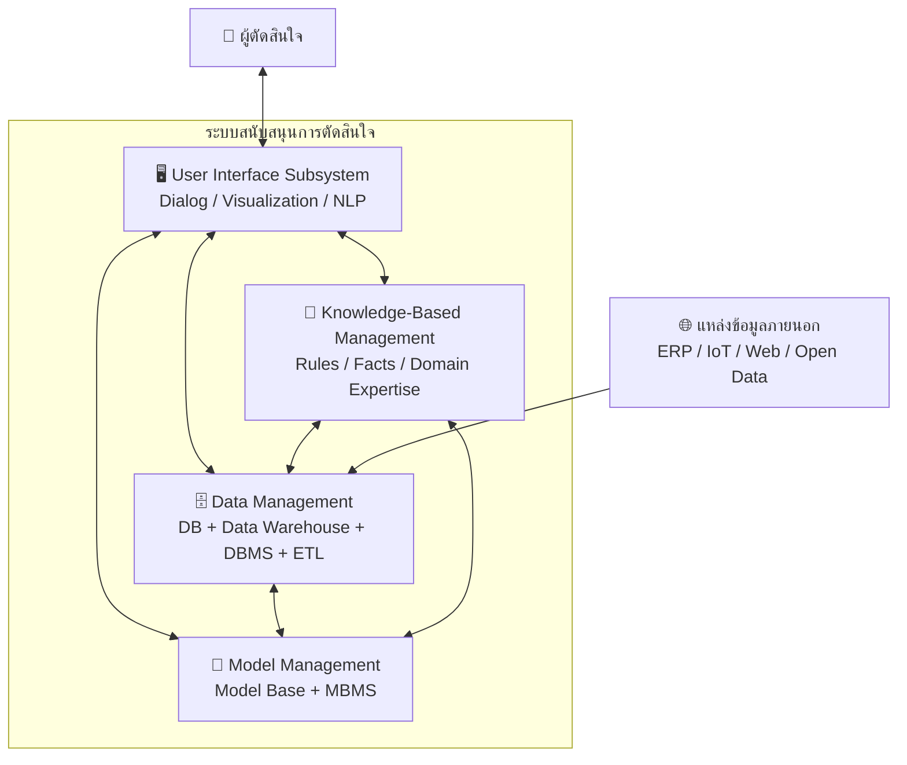

# 📘 สัปดาห์ที่ 2 — สถาปัตยกรรมและระบบย่อยของ DSS

⬅️ [[Week-01-Introduction-to-Decision-Making]] | ➡️ [[Week-03-Data-Management-and-Data-Warehouse]]

## 🎯 จุดประสงค์การเรียนรู้
1. ระบุระบบย่อยทั้ง 4 ของ DSS พร้อมหน้าที่และเป้าหมายเชิงกลยุทธ์ของแต่ละส่วน
2. เชื่อมโยงระบบย่อยแต่ละส่วนเข้ากับระยะการตัดสินใจของ Simon
3. จำแนกประเภทของ DSS (Data-driven, Model-driven, Knowledge-driven, Communication-driven, Document-driven)
4. วิเคราะห์ระบบจริงแล้วถอดออกมาเป็นแผนภาพสถาปัตยกรรมได้

## 📖 เนื้อหาบรรยาย (2 ชม.)

### ช่วงที่ 1 (45 นาที) — ระบบย่อยทั้ง 4
→ [[DSS-Architecture-Subsystems]]

| ระบบย่อย | องค์ประกอบทางเทคนิค | เป้าหมายเชิงกลยุทธ์ |
|---|---|---|
| **Data Management** | ฐานข้อมูล, [[Data-Warehouse]], DBMS, กระบวนการ [[ETL-Process\|ETL]] จากแหล่งภายในและภายนอก | สร้างความน่าเชื่อถือและความพร้อมใช้ของข้อมูลเพื่อเป็นรากฐานการวิเคราะห์ |
| **Model Management** | แบบจำลองคณิตศาสตร์ สถิติ การเงิน วิทยาการจัดการ + MBMS | อำนวยความสะดวกในการจำลองสถานการณ์ [[Sensitivity-Analysis\|วิเคราะห์ความอ่อนไหว]] และหาค่าเหมาะที่สุด |
| **User Interface** | สภาพแวดล้อมโต้ตอบมนุษย์–คอมพิวเตอร์, [[Visual-Analytics\|Data Visualization]], NLP | ลดภาระการรับรู้ของผู้ใช้ ให้ผู้บริหารเข้าถึงข้อมูลเชิงลึกได้โดยไม่ต้องมีทักษะเทคนิคขั้นสูง |
| **Knowledge-Based Management** | กฎเกณฑ์ (Rules) ข้อเท็จจริง ความเชี่ยวชาญจาก Domain Experts | เสริมความสามารถในการให้เหตุผล อธิบายข้อเสนอแนะ และสนับสนุนการตัดสินใจเชิงวิเคราะห์ที่ซับซ้อน |

> [!important] ข้อสังเกตเชิงสถาปัตยกรรม
> ระบบย่อย Knowledge-Based เป็นสิ่งที่แยก DSS ออกจาก "แอปวิเคราะห์ข้อมูลธรรมดา" — เพราะมันคือที่มาของความสามารถ **อธิบายเหตุผล** ซึ่งเชื่อมกับ [[Expert-Systems]] (W14) และ [[Explainable-AI-and-Governance]] (W15)

### ช่วงที่ 2 (35 นาที) — ประเภทของ DSS
→ [[Types-of-DSS]] — กรอบของ Power (2002)
- **Data-driven** — เน้นการเข้าถึงและวิเคราะห์ข้อมูลอนุกรมเวลาขนาดใหญ่ (เช่นระบบ OLAP ขององค์กรค้าปลีก)
- **Model-driven** — เน้นตัวแบบคณิตศาสตร์ (เช่นระบบวางแผนการผลิต)
- **Knowledge-driven** — เน้นกฎและความเชี่ยวชาญ (เช่นระบบวินิจฉัยโรค)
- **Communication-driven** — สนับสนุนการตัดสินใจแบบกลุ่ม (GDSS)
- **Document-driven** — สืบค้นและวิเคราะห์เอกสารไม่มีโครงสร้าง
- ระบบจริงมักเป็นแบบผสม — ฝึกระบุ "แกนหลัก" ของระบบ

### ช่วงที่ 3 (25 นาที) — วิวัฒนาการทางสถาปัตยกรรม
- TPS (ประมวลผลรายการประจำวัน) → MIS (รายงานตามรอบ) → DSS แบบ standalone → Client-server → Web-based → **Cloud + Distributed Systems**
- ผลกระทบของสถาปัตยกรรมกระจายศูนย์: การขยายขนาดตามความต้องการ ความพร้อมใช้ และการแยกชั้นข้อมูลออกจากชั้นตัวแบบ
- เกริ่นสู่ยุคไมโครเซอร์วิสซึ่งจะลงลึกใน [[Week-15-Decision-Intelligence-and-Agentic-AI]]

### ช่วงที่ 4 (15 นาที) — การเลือกฮาร์ดแวร์/ซอฟต์แวร์ให้เหมาะกับบริบทธุรกิจ
- ตัวขับเคลื่อนการเลือก: ปริมาณข้อมูล ความถี่ในการตัดสินใจ ข้อกำหนดด้าน latency งบประมาณ และข้อบังคับด้านกำกับดูแล
- Build vs. Buy: DSS แบบสำเร็จรูป (Power BI, Tableau) เทียบกับ custom-made

## 🔬 ปฏิบัติการ (2 ชม.)
[[Lab-01-DSS-Architecture-Teardown]] — เลือกระบบจริง 1 ระบบ (เช่น ระบบแนะนำสินค้าของอีคอมเมิร์ซ, ระบบอนุมัติสินเชื่อ, Google Maps) แล้วถอดออกเป็นแผนภาพระบบย่อย 4 ส่วน ระบุว่าอะไรอยู่ในแต่ละกล่อง และอะไรที่ระบบนั้น **ไม่มี**

## 🏭 กรณีศึกษา
ต่อยอดกรณีโทรคมนาคมจาก W1 — คราวนี้วาดสถาปัตยกรรมเต็มรูปแบบ: ฐานข้อมูลพฤติกรรมลูกค้า (Data Management) → ตัวแบบคำนวณกำไรและอัตราการเลิกใช้บริการ (Model Management) → หน้าจอปรับตัวแปรและดูผลจำลอง (UI) → กฎเกณฑ์ข้อบังคับ กสทช. (Knowledge Base)

## 📝 กิจกรรมสำคัญประจำสัปดาห์
- **จัดกลุ่มโครงงาน** (กลุ่มละ 4–5 คน) ดู [[Group-Project]]
- แต่ละกลุ่มเสนอโดเมนที่สนใจอย่างน้อย 2 โดเมน (ยังไม่ต้องสรุป)

## ✅ ตรวจสอบความเข้าใจตนเอง
- [ ] วาดแผนภาพระบบย่อย 4 ส่วนจากความจำได้
- [ ] อธิบายได้ว่าถ้าตัดระบบย่อยใดออก ระบบจะสูญเสียความสามารถอะไร
- [ ] จำแนกประเภทของ DSS ได้จากคำอธิบายระบบสั้นๆ

> [!exam] ความสำคัญต่อการสอบ
> ตารางระบบย่อย 4 ส่วนคือ **ข้อสอบที่ออกแน่นอน** ทั้งในรูปปรนัยและเป็นโครงของคำตอบข้อกรณีศึกษาใน [[Midterm-Exam-Blueprint|กลางภาค]] ส่วน D

---
**แนวคิดหลัก:** [[DSS-Architecture-Subsystems]] · [[Types-of-DSS]] · [[DSS-Definition-and-Evolution]]

## 📦 ชุดสอนฉบับขยาย

- [[week02/README|หน้าหลักชุด Week 02]]
- [[week02/Week-02-Expanded-Content|เนื้อหาขยาย: สถาปัตยกรรม ตัวอย่าง 20 applications และ Future DSS]]
- [[week02/Week-02-Questions|คำถาม 10 ข้อพร้อมแนวคำตอบ]]
- [[week02/Lab-01-DSS-Architecture-Teardown|Lab 1: DSS Architecture Teardown]]
- [[week02/Lab-02-Design-a-Future-DSS-Architecture|Lab 2: Design a Future DSS Architecture]]
- [[week02/References|เอกสารอ้างอิง]]
- `week02/Week-02-DSS-Architecture-and-Future.pptx` — สไลด์ 20 หน้า

## 🎮 สื่อจำลองประกอบการเรียน

- [[Sim-01-Decision-Cockpit|🎛️ Sim 01 — Decision Cockpit]] — จำลองการตัดสินใจตามกรอบ Simon 4 ระยะ เทียบผลระหว่างไม่มีระบบ / มี BI / มี DSS พร้อมใบงานและเฉลย
- เปิดใช้: `npm --prefix web run dev` → `http://localhost:3000/sims/decision-cockpit` หรือดับเบิลคลิก `06-Simulations/sim-01-decision-cockpit.html`
- ดัชนีสื่อจำลองทั้งหมด: [[Simulation-Index]]
