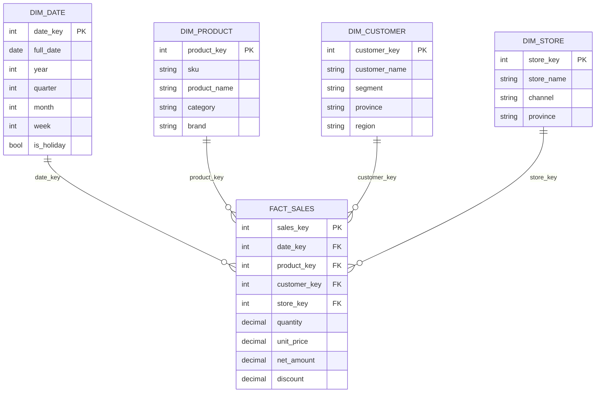

# 📘 สัปดาห์ที่ 3 — การจัดการข้อมูลและคลังข้อมูล

⬅️ [[Week-02-DSS-Architecture]] | ➡️ [[Week-04-OLAP-and-Multidimensional-Analysis]]

## 🎯 จุดประสงค์การเรียนรู้
1. อธิบายความแตกต่างระหว่างระบบ OLTP กับคลังข้อมูลเชิงวิเคราะห์ และเหตุผลที่ต้องแยกกัน
2. ออกแบบ [[Star-and-Snowflake-Schema|Star Schema]] จากความต้องการทางธุรกิจได้
3. อธิบายและลงมือทำกระบวนการ [[ETL-Process|ETL]] พร้อมจัดการปัญหาคุณภาพข้อมูล
4. อธิบายบทบาทของ Data Warehouse / Data Mart / Data Lake ในสถาปัตยกรรม DSS

## 📖 เนื้อหาบรรยาย (2 ชม.)

### ช่วงที่ 1 (30 นาที) — ทำไม DSS ต้องมีคลังข้อมูลแยกต่างหาก
- ระบบ OLTP ออกแบบมาเพื่อ "เขียนเร็ว ถูกต้อง ไม่ซ้ำซ้อน" (Normalization) — แต่การวิเคราะห์ต้อง "อ่านมาก รวมยอดข้ามตาราง ย้อนหลังหลายปี"
- ถ้ารันรายงานหนักบน OLTP โดยตรง → กระทบระบบปฏิบัติการจริง
- ลักษณะ 4 ประการของคลังข้อมูล (Inmon): **Subject-oriented, Integrated, Time-variant, Non-volatile** → [[Data-Warehouse]]

| มิติ | OLTP | Data Warehouse |
|---|---|---|
| จุดประสงค์ | ดำเนินธุรกรรมประจำวัน | สนับสนุนการวิเคราะห์และตัดสินใจ |
| การออกแบบ | Normalized (3NF) | Denormalized ([[Star-and-Snowflake-Schema\|Star/Snowflake]]) |
| ลักษณะคิวรี | อ่าน/เขียนแถวเดียว จำนวนมาก | สแกนและรวมยอดข้อมูลมหาศาล |
| ข้อมูลย้อนหลัง | ปัจจุบัน | หลายปี (Time-variant) |
| ผู้ใช้ | พนักงานปฏิบัติการ | นักวิเคราะห์ ผู้บริหาร |

### ช่วงที่ 2 (40 นาที) — การสร้างแบบจำลองมิติ (Dimensional Modeling)
→ [[Star-and-Snowflake-Schema]]
- **Fact table** — ข้อมูลเชิงปริมาณที่วัดได้ (measures) + foreign keys, granularity ("หนึ่งแถวคืออะไร?") เป็นการตัดสินใจที่สำคัญที่สุด
- **Dimension table** — บริบทเชิงพรรณนา (ใคร อะไร ที่ไหน เมื่อไร)
- Star vs. Snowflake: การทำ normalization ของมิติแลกมาด้วยจำนวน join ที่มากขึ้น
- Slowly Changing Dimensions (SCD Type 1/2) — เมื่อที่อยู่ลูกค้าเปลี่ยน จะเก็บประวัติหรือทับ?

### ช่วงที่ 3 (35 นาที) — กระบวนการ ETL/ELT
→ [[ETL-Process]]
- **Extract** — ดึงจากแหล่งภายใน (ERP, CRM, POS) และภายนอก (open data, API, IoT)
- **Transform** — ทำความสะอาด แปลงหน่วย จับคู่รหัส แก้ค่าซ้ำ จัดการค่าสูญหาย
- **Load** — full load vs. incremental load
- ELT ในยุคคลาวด์: โหลดดิบเข้า warehouse ก่อนแล้วแปลงด้วย SQL (dbt pattern)
- ปัญหาคุณภาพข้อมูลที่พบบ่อย: ค่าซ้ำ ค่าว่าง ค่าผิดรูปแบบ ความไม่สอดคล้องของรหัสระหว่างระบบ

### ช่วงที่ 4 (15 นาที) — Data Warehouse / Data Mart / Data Lake / Lakehouse
- Data Mart = คลังข้อมูลย่อยเฉพาะแผนก
- Data Lake = เก็บข้อมูลดิบทุกรูปแบบ (รวมข้อมูลไร้โครงสร้าง) — เสี่ยงกลายเป็น "data swamp" หากไม่มี [[Metadata-Lineage-Semantic-Layer|metadata governance]]
- Lakehouse = ความพยายามรวมข้อดีทั้งสอง

## 🔬 ปฏิบัติการ (2 ชม.)
[[Lab-02-Build-a-Star-Schema]] — ออกแบบและสร้าง Star Schema จากชุดข้อมูล Retail Sales ดิบ เขียนสคริปต์ ETL ด้วย pandas + DuckDB โหลดเข้า fact/dimension แล้วตรวจสอบความถูกต้องด้วยการเทียบยอดรวม

## 🏭 กรณีศึกษา
ธนาคารต้องการรายงานยอดใช้จ่ายบัตรเครดิตแยกตามหมวดหมู่ ภูมิภาค และช่วงเวลา แต่ข้อมูลกระจายอยู่ใน 3 ระบบที่ใช้รหัสหมวดหมู่ไม่ตรงกัน — อภิปรายว่าจะออกแบบชั้น Transform อย่างไร และใครควรเป็นเจ้าของนิยาม "หมวดหมู่มาตรฐาน"

## ✅ ตรวจสอบความเข้าใจตนเอง
- [ ] ระบุ granularity ของ fact table ที่ออกแบบเองได้ในหนึ่งประโยค
- [ ] อธิบายได้ว่าเมื่อใดควรเลือก Snowflake แทน Star
- [ ] แก้ปัญหาข้อมูลไม่สอดคล้องระหว่าง 2 ระบบต้นทางได้อย่างเป็นระบบ

> [!exam] ความสำคัญต่อการสอบ
> **ออกสอบกลางภาคส่วน C แน่นอน** — จะให้ความต้องการทางธุรกิจแล้วให้ออกแบบ Star Schema พร้อมระบุ fact/dimension/granularity

---
**แนวคิดหลัก:** [[Data-Warehouse]] · [[Star-and-Snowflake-Schema]] · [[ETL-Process]] · [[Data-Preprocessing]]

## 📦 ชุดสอนฉบับขยาย

- [[week03/README|หน้าหลักชุด Week 03]]
- [[week03/Week-03-Expanded-Content|เนื้อหาขยาย: Data Warehouse, 20 applications และ Future Data Architecture]]
- [[week03/Week-03-Questions|คำถาม 10 ข้อพร้อมแนวคำตอบ]]
- [[week03/Lab-01-Data-Quality-and-Grain-Contract|Lab 1: Data Quality and Grain Contract]]
- [[week03/Lab-02-Build-a-Retail-Star-Schema|Lab 2: Build a Retail Star Schema]]
- [[week03/References|เอกสารอ้างอิง]]
- `week03/Week-03-Data-Management-and-Warehouse.pptx` — สไลด์ 20 หน้า

## 🎮 สื่อจำลองประกอบการเรียน

- [[Sim-02-OLAP-Cube-Explorer|🧊 Sim 02 — OLAP Cube Explorer]] — ลูกบาศก์ข้อมูลที่หมุนได้ กด Roll-up / Drill-down / Slice / Dice / Pivot แล้วเห็น SQL ที่เทียบเท่า พร้อมโหมดท้าทาย 6 คำถามและเฉลย
- เปิดใช้: `npm --prefix web run dev` → `http://localhost:3000/sims/olap-cube` หรือดับเบิลคลิก `06-Simulations/sim-02-olap-cube-explorer.html`
- ดัชนีสื่อจำลองทั้งหมด: [[Simulation-Index]]

## 🎮 สื่อจำลองและ Lab บน Colab

สื่อจำลอง 3 ตัว + Lab Python 3 ชุด ที่ใช้ไฟล์ CSV เดียวกัน ตัวเลขบนหน้าจอกับที่ได้จาก pandas ตรงกันทุกหลัก

| สื่อจำลอง | Lab | เฉลยหลัก |
|---|---|---|
| 🔎 Grain Detective | `labs/week03/Lab-W3-1-Grain-Detective.ipynb` | เลือก grain ผิด ยอดขายพอง **+12.96
## 🎮 สื่อจำลองและ Lab บน Colab

สื่อจำลอง 3 ตัว + Lab Python 3 ชุด ใช้ไฟล์ CSV เดียวกัน ตัวเลขบนหน้าจอกับที่ได้จาก pandas ตรงกันทุกหลัก

| สื่อจำลอง | Lab | เฉลยหลัก |
|---|---|---|
| 🔎 Grain Detective | `labs/week03/Lab-W3-1-Grain-Detective.ipynb` | เลือก grain ผิด ยอดขายพอง **+12.96%** |
| 🧼 Dirty Data Gauntlet | `labs/week03/Lab-W3-2-Dirty-Data-Gauntlet.ipynb` | ยอดที่ถูกต้อง **3,814,298.55 บาท** |
| 🔁 ETL Pipeline Sim | `labs/week03/Lab-W3-3-ETL-Pipeline.ipynb` | **1,549 แถว · 1,822,503.00 บาท** |

รายละเอียดและเฉลยเต็ม: [[Sim-W3-Data-Management]] · ชุดข้อมูล: `datasets/week03/`
