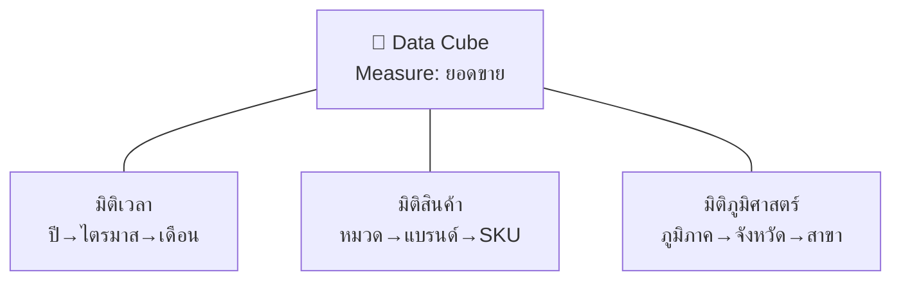

# 📘 สัปดาห์ที่ 4 — OLAP และการวิเคราะห์หลายมิติ

⬅️ [[Week-03-Data-Management-and-Data-Warehouse]] | ➡️ [[Week-05-Data-Mining-I]]

## 🎯 จุดประสงค์การเรียนรู้
1. อธิบายแบบจำลองข้อมูลหลายมิติและแนวคิดลูกบาศก์ข้อมูล (Data Cube)
2. ดำเนินการ OLAP ทั้ง 5 แบบ: Roll-up, Drill-down, Slice, Dice, Pivot ได้อย่างถูกต้อง
3. เปรียบเทียบ MOLAP / ROLAP / HOLAP และเลือกใช้ให้เหมาะกับบริบท
4. แปลงคำถามทางธุรกิจเป็นการดำเนินการ OLAP และเขียนคิวรีที่ให้คำตอบได้

## 📖 เนื้อหาบรรยาย (2 ชม.)

### ช่วงที่ 1 (35 นาที) — แบบจำลองหลายมิติและ Data Cube
→ [[OLAP]]
- OLAP ถูกออกแบบมาเพื่อรองรับการเรียกดูข้อมูลอย่างรวดเร็วจากโครงสร้างหลายมิติ (Multidimensional Data Model)
- ลูกบาศก์ข้อมูล = measures (เช่น ยอดขาย) ตัดกับหลายมิติ (เวลา × สินค้า × ภูมิภาค)
- ลำดับชั้นของมิติ (Hierarchy): ปี → ไตรมาส → เดือน → วัน / ประเทศ → ภูมิภาค → จังหวัด → สาขา
- Sparsity ของลูกบาศก์และการ pre-aggregate

### ช่วงที่ 2 (45 นาที) — การดำเนินการ OLAP
| การดำเนินการ | ความหมาย | ตัวอย่างคำถามธุรกิจ |
|---|---|---|
| **Roll-up** | รวมยอดขึ้นไปตามลำดับชั้น | "ยอดขายรายเดือน → รายไตรมาส" |
| **Drill-down** | เจาะลึกลงรายละเอียด | "ไตรมาส 3 ตกเพราะเดือนใด? สาขาใด?" |
| **Slice** | ตัดลูกบาศก์ด้วยค่าคงที่ 1 มิติ | "ดูเฉพาะปี 2025" |
| **Dice** | ตัดย่อยด้วยเงื่อนไขหลายมิติ | "ปี 2025 + ภาคอีสาน + หมวดเครื่องดื่ม" |
| **Pivot (Rotate)** | หมุนแกนการแสดงผล | "สลับให้ภูมิภาคเป็นแถว เดือนเป็นคอลัมน์" |
| **Drill-across** | ข้าม fact table | "เทียบยอดขายกับยอดคืนสินค้า" |
| **Drill-through** | ทะลุลงถึงข้อมูลธุรกรรมดิบ | "ดูใบเสร็จจริงที่ประกอบเป็นตัวเลขนี้" |

- ฝึกแปลงคำถามธุรกิจ → ลำดับการดำเนินการ OLAP → SQL (`GROUP BY`, `ROLLUP`, `CUBE`, `GROUPING SETS`, window functions)

### ช่วงที่ 3 (25 นาที) — สถาปัตยกรรม OLAP
| แบบ | จัดเก็บอย่างไร | ข้อดี | ข้อจำกัด |
|---|---|---|---|
| **MOLAP** | ลูกบาศก์ที่คำนวณล่วงหน้า | คิวรีเร็วมาก | ใช้พื้นที่มาก, รีเฟรชช้า, ขนาดข้อมูลจำกัด |
| **ROLAP** | ตารางเชิงสัมพันธ์ + SQL | รองรับข้อมูลขนาดใหญ่มาก, สดใหม่ | คิวรีช้ากว่า ต้องปรับแต่ง index/materialized view |
| **HOLAP** | ผสม — สรุปเก็บเป็นลูกบาศก์ รายละเอียดอยู่ในตาราง | สมดุล | ซับซ้อนในการดูแล |

- แนวโน้มปัจจุบัน: columnar engines (DuckDB, ClickHouse) และ semantic layer ทำให้เส้นแบ่งนี้เบลอลง → [[Metadata-Lineage-Semantic-Layer]]

### ช่วงที่ 4 (15 นาที) — OLAP เทียบกับ Data Mining
- OLAP = **ผู้ใช้ตั้งสมมติฐาน แล้วให้ระบบยืนยัน** (hypothesis-driven, descriptive)
- Data Mining = **ระบบค้นหารูปแบบที่มนุษย์ไม่ได้ตั้งสมมติฐานไว้** (discovery-driven)
- ทั้งสองเกื้อหนุนกัน ไม่ใช่ทดแทนกัน — เกริ่นสู่ [[Week-05-Data-Mining-I]]

## 🔬 ปฏิบัติการ (2 ชม.)
[[Lab-03-OLAP-Cube-Operations]] — สร้างลูกบาศก์จาก Star Schema ของ W3 แล้วตอบคำถามธุรกิจ 8 ข้อด้วยการดำเนินการ OLAP บันทึกว่าแต่ละคำตอบใช้การดำเนินการใดบ้าง

## 🏭 กรณีศึกษา
ทีมการตลาดของธนาคารใช้ OLAP วิเคราะห์กลุ่มประชากรผู้ถือบัตรเครดิตแยกตามหมวดหมู่การใช้จ่าย เพื่อออกแบบแคมเปญที่ตรงกลุ่มเป้าหมายที่สุด — อภิปราย: ลำดับ drill-down ใดที่จะพาไปสู่ข้อค้นพบเชิงปฏิบัติได้เร็วที่สุด และกับดักการตีความอะไรที่ต้องระวัง (เช่น Simpson's paradox)

## 📌 กิจกรรมสำคัญ
> [!todo] ปล่อยงานเดี่ยว
> [[Individual-Assignment]] — DSS Data Analysis & Dashboard (15%) กำหนดส่งสิ้นสัปดาห์ที่ 7

## ✅ ตรวจสอบความเข้าใจตนเอง
- [ ] แปลงคำถามธุรกิจเป็นลำดับการดำเนินการ OLAP ได้ทันที
- [ ] อธิบายได้ว่าเมื่อใดควรเลือก ROLAP แทน MOLAP
- [ ] บอกความต่างของ OLAP กับ Data Mining ได้ในหนึ่งประโยค

> [!exam] ความสำคัญต่อการสอบ
> **ออกสอบกลางภาคส่วน C** — โจทย์ให้ตารางลูกบาศก์แล้วถามผลลัพธ์ของการ roll-up/dice และให้ระบุการดำเนินการจากคำถามธุรกิจ

---
**แนวคิดหลัก:** [[OLAP]] · [[Data-Warehouse]] · [[Star-and-Snowflake-Schema]]

## 📦 ชุดสอนฉบับขยาย

- [[week04/README|หน้าหลักชุด Week 04]]
- [[week04/Week-04-Expanded-Content|เนื้อหาขยาย: OLAP, 20 applications และ Future OLAP]]
- [[week04/Week-04-Questions|คำถาม 10 ข้อพร้อมแนวคำตอบ]]
- [[week04/Lab-01-OLAP-Operations-and-SQL|Lab 1: OLAP Operations and SQL]]
- [[week04/Lab-02-Root-Cause-and-Aggregation-Traps|Lab 2: Root Cause and Aggregation Traps]]
- [[week04/References|เอกสารอ้างอิง]]
- `week04/Week-04-OLAP-and-Multidimensional-Analysis.pptx` — สไลด์ 20 หน้า

## 🎮 สื่อจำลองประกอบการเรียน

- [[Sim-02-OLAP-Cube-Explorer|🧊 Sim 02 — OLAP Cube Explorer]] — ลูกบาศก์ข้อมูลที่หมุนได้ กด Roll-up / Drill-down / Slice / Dice / Pivot แล้วเห็น SQL ที่เทียบเท่า พร้อมโหมดท้าทาย 6 คำถามและเฉลย
- เปิดใช้: `npm --prefix web run dev` → `http://localhost:3000/sims/olap-cube` หรือดับเบิลคลิก `06-Simulations/sim-02-olap-cube-explorer.html`
- ดัชนีสื่อจำลองทั้งหมด: [[Simulation-Index]]
