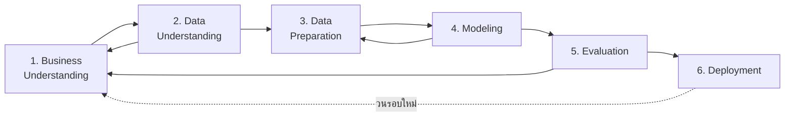

# 📘 สัปดาห์ที่ 5 — การทำเหมืองข้อมูล I: CRISP-DM และการจำแนกประเภท

⬅️ [[Week-04-OLAP-and-Multidimensional-Analysis]] | ➡️ [[Week-06-Data-Mining-II]]

> [!info] ชุดสอนฉบับขยาย
> - [[week05/README|ภาพรวม Week 05]]
> - [[week05/Week-05-Expanded-Content|เนื้อหาขยาย]]
> - [[week05/Week-05-Questions|คำถาม 10 ข้อพร้อมแนวคำตอบ]]
> - [[week05/Lab-01-Classification-Pipeline|Lab 1: Classification Pipeline]]
> - [[week05/Lab-02-Cost-Sensitive-Threshold-and-Monitoring|Lab 2: Threshold และ Monitoring]]
> - [[week05/References|เอกสารอ้างอิง]]
> - `week05/Week-05-Data-Mining-I.pptx` — สไลด์ 20 หน้า

## 🎯 จุดประสงค์การเรียนรู้
1. อธิบายและใช้กระบวนการมาตรฐานอุตสาหกรรม [[CRISP-DM]] ครบ 6 ระยะ
2. ดำเนินการเตรียมข้อมูล (Data Preprocessing) ได้อย่างเป็นระบบและอธิบายเหตุผลของแต่ละขั้น
3. สร้างและตีความโมเดล Decision Tree และ Naive Bayes ได้
4. ประเมินโมเดลจำแนกประเภทด้วย Confusion Matrix และเมตริกที่เหมาะกับบริบทของปัญหา

## 📖 เนื้อหาบรรยาย (2 ชม.)

### ช่วงที่ 1 (25 นาที) — Data Mining คืออะไรและอยู่ตรงไหนใน DSS
→ [[Data-Mining-Overview]]
- นิยาม: การประยุกต์อัลกอริทึมการเรียนรู้ของเครื่องเพื่อค้นหารูปแบบ ความสัมพันธ์ หรือกฎเกณฑ์ที่ซ่อนอยู่ในชุดข้อมูลขนาดใหญ่โดยอัตโนมัติ ซึ่งมนุษย์มองไม่เห็นด้วยตาเปล่า
- ตำแหน่งใน [[DSS-Architecture-Subsystems]]: อยู่ในชั้น Model Management โดยดึงข้อมูลจากชั้น Data Management
- งานหลัก 4 ประเภท: [[Classification]], [[Clustering]], [[Association-Rules]], Regression/Forecasting

### ช่วงที่ 2 (30 นาที) — กระบวนการ CRISP-DM
→ [[CRISP-DM]]

> [!warning] ความจริงที่ต้องเน้นย้ำ
> ระยะที่ 3 (Data Preparation) กินเวลามากที่สุด ราว **60–80%** ของโครงการจริง แต่มักถูกสอนน้อยที่สุด — สัปดาห์นี้จึงให้เวลากับมันมากกว่าตัวอัลกอริทึม

### ช่วงที่ 3 (30 นาที) — การเตรียมข้อมูล
→ [[Data-Preprocessing]]
- **Data cleaning** — ค่าสูญหาย (ลบ / เติมด้วยค่ากลาง / เติมด้วยโมเดล), ค่าผิดปกติ (outliers), ค่าซ้ำ
- **Data transformation** — normalization/standardization, log transform, binning
- **Encoding** — one-hot, ordinal, target encoding และกับดัก data leakage
- **Feature engineering** — สร้างตัวแปรจากความรู้โดเมน (เช่น recency, frequency, monetary)
- **การแบ่งข้อมูล** — train/validation/test และเหตุผลที่ต้องแบ่ง **ก่อน** ทำ preprocessing บางอย่าง
- การจัดการข้อมูลไม่สมดุล (imbalanced classes) — resampling, class weights

### ช่วงที่ 4 (35 นาที) — อัลกอริทึมการจำแนกประเภท
→ [[Classification]]
- **Decision Tree** — เกณฑ์การแตกกิ่ง (Entropy/Information Gain, Gini), การตัดกิ่ง (pruning), จุดแข็งคือ **อธิบายได้** จึงเหมาะกับ DSS ที่ต้องชี้แจงเหตุผล
- **Naive Bayes** — ทฤษฎีบทเบย์ + สมมติฐานความเป็นอิสระตามเงื่อนไข, เร็ว ทนต่อข้อมูลมิติสูง เหมาะกับข้อความ
- การเชื่อมโยงล่วงหน้า: สมมติฐานของ Naive Bayes จะถูกผ่อนคลายด้วย [[Bayesian-Networks]] ใน W13
- [[Model-Evaluation-Metrics|การประเมินผล]]: Confusion Matrix, Accuracy, Precision, Recall, F1, ROC-AUC
- 🔑 **การเลือกเมตริกคือการตัดสินใจเชิงธุรกิจ** — ในการตรวจจับทุจริต Recall สำคัญกว่า Accuracy อย่างมาก

## 🔬 ปฏิบัติการ (2 ชม.)
[[Lab-04-Classification-Pipeline]] — สร้าง pipeline จำแนกลูกค้าผิดนัดชำระหนี้: preprocessing → Decision Tree → Naive Bayes → เปรียบเทียบด้วย confusion matrix พร้อมอธิบายว่าเมตริกใดควรใช้ตัดสินและเพราะเหตุใด

## 🏭 กรณีศึกษา
**การตรวจจับทุจริตบัตรเครดิต** — ระบบเรียนรู้รูปแบบธุรกรรมผิดปกติ เช่น การรูดบัตรในต่างประเทศในเวลาใกล้เคียงกับการใช้ในประเทศ แล้วระงับการอนุมัติแบบเรียลไทม์
**คำถามอภิปราย:** ต้นทุนของ False Positive (บล็อกลูกค้าจริง) เทียบกับ False Negative (ปล่อยทุจริตผ่าน) ต่างกันอย่างไร แล้วควรตั้ง threshold อย่างไร?

## ✅ ตรวจสอบความเข้าใจตนเอง
- [ ] เรียงลำดับ 6 ระยะของ CRISP-DM และบอกได้ว่าระยะใดวนกลับไประยะใดได้
- [ ] คำนวณ Precision/Recall/F1 จาก confusion matrix ด้วยมือได้
- [ ] อธิบายได้ว่าเหตุใด Accuracy จึงหลอกลวงในข้อมูลไม่สมดุล

> [!exam] ความสำคัญต่อการสอบ
> **กลางภาคส่วน B และ C** — คำนวณเมตริกจาก confusion matrix, คำนวณ Information Gain, และอธิบายเหตุผลการเลือกเมตริกตามบริบท

---
**แนวคิดหลัก:** [[Data-Mining-Overview]] · [[CRISP-DM]] · [[Data-Preprocessing]] · [[Classification]] · [[Model-Evaluation-Metrics]]
