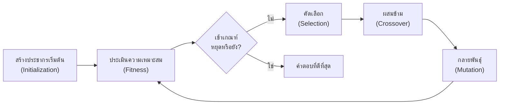

# 📘 สัปดาห์ที่ 11 — วิธีวิทยาการสำรวจและการจำลองสถานการณ์

⬅️ [[Week-10-Optimization-and-Prescriptive]] | ➡️ [[Week-12-Fuzzy-Logic]]

## 🎯 จุดประสงค์การเรียนรู้
1. อธิบายว่าเหตุใดปัญหา NP-hard จึงต้องใช้ heuristic และยอมรับคำตอบที่ "ดีพอ"
2. ออกแบบและใช้อัลกอริทึมเชิงพันธุกรรม (Genetic Algorithm) กับปัญหาการจัดเส้นทาง
3. สร้างแบบจำลอง Monte Carlo เพื่อประเมินความเสี่ยงของการตัดสินใจภายใต้ความไม่แน่นอน
4. เลือกได้ว่าปัญหาใดควรใช้ exact optimization, heuristic หรือ simulation

## 📖 เนื้อหาบรรยาย (2 ชม.)

### ช่วงที่ 1 (25 นาที) — เหตุใดต้องมี Heuristics
→ [[Heuristic-Search]]
- ทบทวนความซับซ้อนเชิงคำนวณ: TSP ที่มี 20 เมืองมีเส้นทางที่เป็นไปได้มากกว่า 10¹⁷ เส้นทาง
- **"ดีพอในเวลาที่ทันใช้" มีค่ามากกว่า "ดีที่สุดแต่สายเกินไป"** — เชื่อมกับแนวคิด satisficing ของ [[Bounded-Rationality]] อย่างตรงไปตรงมา
- ตระกูลของวิธีการ: Greedy, Local search, Simulated Annealing, Tabu Search, Genetic Algorithms, Ant Colony, Particle Swarm
- การแลกเปลี่ยนระหว่าง Exploration กับ Exploitation

### ช่วงที่ 2 (40 นาที) — อัลกอริทึมเชิงพันธุกรรม
→ [[Genetic-Algorithms]]

- การเข้ารหัสคำตอบ (chromosome encoding) — การตัดสินใจที่สำคัญที่สุดของ GA
- ฟังก์ชันความเหมาะสม (Fitness function) และการจัดการข้อจำกัดด้วย penalty
- พารามิเตอร์: ขนาดประชากร อัตราการผสมข้าม อัตราการกลายพันธุ์ elitism
- ⚠️ GA **ไม่รับประกันคำตอบที่ดีที่สุด** และผลลัพธ์ต่างกันทุกครั้งที่รัน → ต้องรายงานสถิติจากการรันหลายรอบ ไม่ใช่ผลรอบเดียว

### ช่วงที่ 3 (40 นาที) — Monte Carlo Simulation
→ [[Monte-Carlo-Simulation]]
- แนวคิด: แทนที่จะใช้ค่าเดียว (point estimate) ให้สุ่มค่าจากการแจกแจงความน่าจะเป็นนับพันครั้ง แล้วดูการแจกแจงของผลลัพธ์
- ขั้นตอน: กำหนดตัวแปรไม่แน่นอน → เลือกการแจกแจง → สุ่มและคำนวณ n รอบ → วิเคราะห์การแจกแจงผลลัพธ์
- ผลผลิตที่มีค่าต่อการตัดสินใจ: ความน่าจะเป็นที่โครงการจะขาดทุน, ช่วงความเชื่อมั่น, Value at Risk (VaR)
- 🔑 **การเปลี่ยนคำถามจาก "กำไรจะเท่าไร" เป็น "โอกาสขาดทุนมีเท่าไร"** คือการยกระดับคุณภาพการตัดสินใจ
- Discrete-event simulation (SimPy) สำหรับระบบคิวและกระบวนการ

### ช่วงที่ 4 (15 นาที) — จะเลือกใช้อะไรเมื่อไร

| สถานการณ์ | เครื่องมือที่เหมาะ |
|---|---|
| ปัญหาเชิงเส้น ขนาดจัดการได้ ต้องการคำตอบที่พิสูจน์ได้ว่าดีที่สุด | [[Linear-Programming]] |
| พื้นที่คำตอบมหาศาล ไม่เชิงเส้น มีเวลาจำกัด | [[Genetic-Algorithms]] / Heuristics |
| มีความไม่แน่นอนสูง ต้องประเมินความเสี่ยง | [[Monte-Carlo-Simulation]] |
| ระบบมีคิว ทรัพยากรจำกัด และเวลามีผล | Discrete-event simulation |
| ต้องพยากรณ์ค่าในอนาคตก่อนตัดสินใจ | [[Machine-Learning-for-DSS]] (W9) |

- รูปแบบที่พบบ่อยในระบบจริง: **ML พยากรณ์อุปสงค์ → Optimization/GA จัดสรรทรัพยากร → Monte Carlo ทดสอบความทนทานของแผน**

## 🔬 ปฏิบัติการ (2 ชม.)
[[Lab-09-GA-and-Monte-Carlo]] — ส่วนที่ 1: ใช้ DEAP แก้ปัญหาจัดเส้นทางยานพาหนะ (VRP) ขนาดเล็ก เปรียบเทียบกับคำตอบ exact · ส่วนที่ 2: จำลอง Monte Carlo ประเมินความเสี่ยงของแผนเส้นทางเมื่อเวลาเดินทางไม่แน่นอน

## 🏭 กรณีศึกษา
บริษัทโลจิสติกส์ใช้ ML พยากรณ์ปริมาณพัสดุรายวัน จากนั้นใช้อัลกอริทึม optimization คำนวณเส้นทางรถบรรทุกที่ใช้เชื้อเพลิงน้อยที่สุด ภายใต้ข้อจำกัดเรื่องเวลาส่งของและความจุน้ำหนักของรถแต่ละคัน
**คำถามอภิปราย:** ถ้าการพยากรณ์คลาดเคลื่อน 15% แผนเส้นทางจะพังหรือไม่? จะออกแบบระบบให้ทนทานต่อความคลาดเคลื่อนได้อย่างไร?

## ✅ ตรวจสอบความเข้าใจตนเอง
- [ ] อธิบายวงรอบของ GA ครบทุกขั้นตอนโดยไม่ดูสไลด์
- [ ] ออกแบบการเข้ารหัส chromosome สำหรับปัญหาใหม่ได้
- [ ] ตีความ histogram ผลลัพธ์ Monte Carlo เป็นข้อเสนอเชิงการตัดสินใจได้

> [!exam] ความสำคัญต่อการสอบ
> **ปลายภาคส่วน B** — เปรียบเทียบว่าเมื่อใดควรใช้ exact vs. heuristic vs. simulation พร้อมเหตุผล และอธิบายขั้นตอนของ GA

---
**แนวคิดหลัก:** [[Heuristic-Search]] · [[Genetic-Algorithms]] · [[Monte-Carlo-Simulation]] · [[Optimization-and-Operations-Research]]
