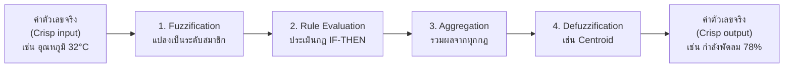

# 📘 สัปดาห์ที่ 12 — ตรรกศาสตร์คลุมเครือและระบบอนุมานแบบฟัซซี

⬅️ [[Week-11-Heuristics-and-Simulation]] | ➡️ [[Week-13-Bayesian-Networks-and-ANFIS]]

## 🎯 จุดประสงค์การเรียนรู้
1. แยกแยะ **ความคลุมเครือ (Vagueness)** ออกจาก **ความน่าจะเป็น (Probability)** ได้อย่างชัดเจน
2. ออกแบบฟังก์ชันความเป็นสมาชิก (Membership Function) และตัวแปรเชิงภาษา (Linguistic Variables)
3. สร้างระบบอนุมานแบบฟัซซีตามแบบ Mamdani ครบทั้ง 4 ขั้นตอน
4. อธิบายว่าเหตุใด Fuzzy Logic จึงแก้ปัญหา "ความแข็งกระด้างของเงื่อนไขตายตัว" ในระบบกฎ

## 📖 เนื้อหาบรรยาย (2 ชม.)

### ช่วงที่ 1 (30 นาที) — ธรรมชาติของความไม่แน่นอน
- สภาพแวดล้อมจริงเต็มไปด้วยข้อมูลที่ไม่สมบูรณ์ คลุมเครือ หรือมีสัญญาณรบกวน
- **ความแตกต่างเชิงปรัชญาที่สำคัญที่สุดของสัปดาห์นี้:**

| | Fuzzy Logic | Probability |
|---|---|---|
| จัดการกับ | **ความคลุมเครือ (Vagueness)** — ขอบเขตของแนวคิดไม่ชัด | **ความไม่แน่นอนเชิงสุ่ม (Randomness)** — ไม่รู้ว่าเหตุการณ์จะเกิดหรือไม่ |
| ตัวอย่าง | "อากาศร้อน" — ร้อนแค่ไหนถึงเรียกว่าร้อน? | "พรุ่งนี้ฝนตก 70%" — ตกหรือไม่ตกชัดเจน แต่ยังไม่รู้ |
| ค่าที่ใช้ | ระดับความเป็นสมาชิก μ ∈ [0,1] | ความน่าจะเป็น P ∈ [0,1] |
| เมื่อรู้ผลแล้ว | ค่ายังคงอยู่ (คนสูง 175 ซม. ยังเป็นสมาชิก "สูง" ระดับ 0.6 เสมอ) | ค่ายุบเป็น 0 หรือ 1 |

- ตรรกศาสตร์แบบบูลีนมีค่าความจริงเพียง 0 หรือ 1 — Fuzzy Logic อนุญาตให้มี **ระดับความจริง (Degree of Truth)** ระหว่าง 0 ถึง 1

### ช่วงที่ 2 (35 นาที) — เซตฟัซซีและฟังก์ชันความเป็นสมาชิก
→ [[Fuzzy-Logic]]
- **Membership Function** ทำหน้าที่แปลงค่าข้อมูลเชิงปริมาณเป็น **ตัวแปรเชิงภาษา (Linguistic Variables)** ที่สอดคล้องกับสามัญสำนึกของมนุษย์ เช่น "ความดันโลหิตสูงเล็กน้อย" หรือ "ความเสี่ยงทางการเงินปานกลาง"
- รูปทรงที่ใช้บ่อย: สามเหลี่ยม (triangular), สี่เหลี่ยมคางหมู (trapezoidal), เกาส์เซียน (Gaussian), sigmoid
- การดำเนินการกับเซตฟัซซี: AND = min, OR = max, NOT = 1 − μ
- 🔑 การออกแบบ MF มาจาก **ความรู้ของผู้เชี่ยวชาญโดเมน** ไม่ใช่จากข้อมูลเพียงอย่างเดียว — นี่คือจุดที่เชื่อมกับ Knowledge-Based Subsystem ใน [[DSS-Architecture-Subsystems]]

### ช่วงที่ 3 (40 นาที) — Fuzzy Inference System
→ [[Fuzzy-Inference-System]]

- **Mamdani** — ผลลัพธ์ของกฎเป็นเซตฟัซซี ตีความง่าย เหมาะกับการรับความรู้จากผู้เชี่ยวชาญ
- **Sugeno (TSK)** — ผลลัพธ์เป็นฟังก์ชันเชิงเส้นของอินพุต คำนวณเร็ว เหมาะกับระบบควบคุมและการปรับค่าอัตโนมัติ (และเป็นพื้นฐานของ [[ANFIS]] ใน W13)
- วิธี Defuzzification: Centroid (Center of Gravity), Bisector, Mean of Maximum
- ตัวอย่างเดินสดในชั้นเรียน: ระบบประเมินความเสี่ยงสินเชื่อจากรายได้และประวัติการชำระ

### ช่วงที่ 4 (15 นาที) — Fuzzy Logic ใน DSS
- แก้ปัญหา **ความแข็งกระด้างของการตั้งเงื่อนไขแบบตายตัว** — เช่น กฎ "อนุมัติถ้ารายได้ ≥ 30,000" จะปฏิเสธคนที่มีรายได้ 29,999 อย่างไร้เหตุผล
- จุดแข็งสำหรับ DSS: **อธิบายได้ด้วยภาษามนุษย์** ต่างจากโครงข่ายประสาทเทียมที่เป็นกล่องดำ
- การประยุกต์: ระบบควบคุมการเคลื่อนไหวของหุ่นยนต์ให้นุ่มนวลและปลอดภัยเมื่อทำงานร่วมกับมนุษย์ → [[Industry-Applications]]

## 🔬 ปฏิบัติการ (2 ชม.)
[[Lab-10-Fuzzy-Inference-System]] — สร้าง FIS แบบ Mamdani ด้วย scikit-fuzzy สำหรับประเมินความเสี่ยงผู้ป่วย (อินพุต: ความดันโลหิต, อายุ, ค่า BMI) เปรียบเทียบผลกับระบบกฎแบบ if-else ตายตัว แล้ววิเคราะห์ว่าเคสใดที่ผลต่างกันอย่างมีนัยสำคัญและเพราะเหตุใด

## 🏭 กรณีศึกษา
ระบบควบคุมหุ่นยนต์ร่วมปฏิบัติงาน (Cobot) ในโรงงาน — ใช้กฎแบบคลุมเครือกำหนดความเร็วการเคลื่อนไหวตามระยะห่างจากมนุษย์ ("ใกล้มาก → ช้าลงมาก") ทำให้การเคลื่อนไหวนุ่มนวลกว่าการตัดสินแบบขั้นบันได
**คำถามอภิปราย:** ถ้าใช้กฎแบบบูลีนแทน จะเกิดพฤติกรรมอะไรที่เป็นอันตราย?

## 📌 Checkpoint
> [!danger] Checkpoint 1 โครงงานกลุ่ม (3 คะแนน)
> ต้องแสดง Data layer ที่ทำงานได้ + ตัวแบบเบื้องต้นที่ให้ผลลัพธ์ได้แล้ว → [[Group-Project]]

## ✅ ตรวจสอบความเข้าใจตนเอง
- [ ] อธิบายความต่างระหว่าง vagueness กับ probability ให้คนทั่วไปเข้าใจได้
- [ ] คำนวณค่า μ จากฟังก์ชันสามเหลี่ยมที่กำหนดให้ได้
- [ ] เดินขั้นตอน Mamdani ครบ 4 ขั้นด้วยมือจากกฎ 2–3 ข้อได้

> [!exam] ความสำคัญต่อการสอบ
> **ปลายภาคส่วน C แน่นอน** — คำนวณ fuzzification, ประเมินกฎ และหา centroid ด้วยมือ · **ส่วน B** — เปรียบเทียบ Fuzzy กับ Bayesian

---
**แนวคิดหลัก:** [[Fuzzy-Logic]] · [[Fuzzy-Inference-System]] · [[ANFIS]] · [[Expert-Systems]]
