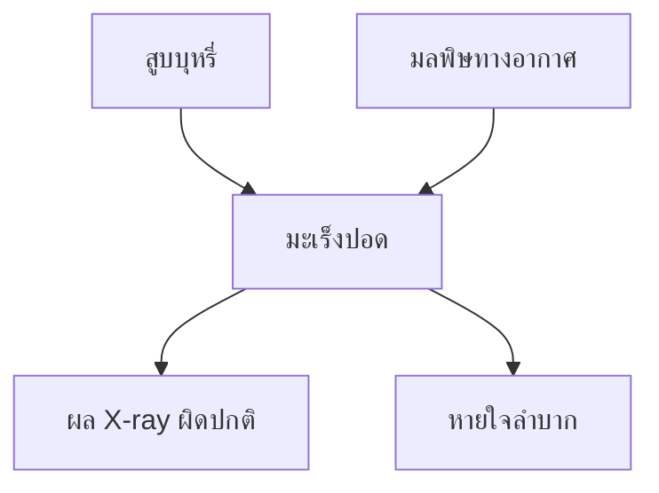

# 📘 สัปดาห์ที่ 13 — เครือข่ายแบบเบย์และ ANFIS

⬅️ [[Week-12-Fuzzy-Logic]] | ➡️ [[Week-14-Expert-Systems-and-DMN]]

## 🎯 จุดประสงค์การเรียนรู้
1. สร้างและอ่านโครงสร้าง Bayesian Network ในรูป DAG พร้อมตาราง CPT
2. ประยุกต์ทฤษฎีบทของเบย์เพื่อปรับปรุงความน่าจะเป็นเมื่อมีหลักฐานใหม่
3. อธิบายว่าเหตุใด Bayesian Network จึงรับมือกับข้อมูลสูญหายและอนุมานสถานะที่สังเกตไม่ได้
4. อธิบายสถาปัตยกรรม 5 ชั้นของ ANFIS และเหตุผลที่การผสาน Fuzzy กับ Neural Network มีคุณค่าต่อ DSS

## 📖 เนื้อหาบรรยาย (2 ชม.)

### ช่วงที่ 1 (40 นาที) — Bayesian Networks
→ [[Bayesian-Networks]]
- โครงสร้าง: กราฟระบุทิศทางแบบไม่มีวงจร (**Directed Acyclic Graph — DAG**)
  - **โหนด (Nodes)** = ตัวแปรสุ่ม
  - **เส้นเชื่อม (Edges)** = ความสัมพันธ์เชิงสาเหตุ (Causal relationships)
  - **CPT** = ตารางความน่าจะเป็นเชิงเงื่อนไขประจำแต่ละโหนด
- ทฤษฎีบทของเบย์: `P(H|E) = P(E|H)·P(H) / P(E)` — ปรับปรุงความเชื่อเมื่อมีหลักฐานใหม่

- คุณสมบัติเด่นสำหรับ DSS:
  1. **อนุมานสถานะที่สังเกตไม่ได้ (Unobservable states)** จากหลักฐานที่มี — เช่นอนุมานโรคจากอาการ
  2. **รับมือกับข้อมูลสูญหายบางส่วน (Missing data)** ได้อย่างทรงประสิทธิภาพ
  3. **อธิบายเส้นทางเหตุผลได้** — ชี้ได้ว่าหลักฐานใดผลักความน่าจะเป็นไปทางใด
  4. รวม **ความรู้ผู้เชี่ยวชาญ** (โครงสร้างกราฟ) เข้ากับ **ข้อมูล** (การเรียนรู้ CPT) ได้ในโมเดลเดียว
- การอนุมาน: exact (variable elimination) vs. approximate (sampling)
- ⚠️ **ความสัมพันธ์ในข้อมูล ≠ สาเหตุ** — ทิศทางของลูกศรมาจากความรู้โดเมน ไม่ใช่จากข้อมูลเพียงอย่างเดียว (ปิดประเด็นที่ค้างจาก [[Association-Rules]] ใน W6)

### ช่วงที่ 2 (20 นาที) — เปรียบเทียบ 3 วิธีจัดการความไม่แน่นอน

| | [[Fuzzy-Logic]] | [[Bayesian-Networks]] | [[Machine-Learning-for-DSS\|ML แบบทั่วไป]] |
|---|---|---|---|
| จัดการ | ความคลุมเครือของนิยาม | ความไม่แน่นอนเชิงความน่าจะเป็น | รูปแบบทางสถิติ |
| ต้องการความรู้ผู้เชี่ยวชาญ | สูง (ออกแบบ MF และกฎ) | ปานกลาง (โครงสร้างกราฟ) | ต่ำ |
| ต้องการข้อมูล | น้อย | ปานกลาง | มาก |
| อธิบายได้ | สูงมาก | สูง | ต่ำถึงปานกลาง |
| รับมือข้อมูลสูญหาย | ปานกลาง | ดีเยี่ยม | ต้องเติมค่าก่อน |

### ช่วงที่ 3 (40 นาที) — ANFIS
→ [[ANFIS]]
- แนวคิด: ผสาน **ความสามารถในการอธิบายตนเองของ Fuzzy Logic** เข้ากับ **ความสามารถในการเรียนรู้รูปแบบจากข้อมูลของโครงข่ายประสาทเทียม**
- แก้ปัญหาที่ Fuzzy บริสุทธิ์มี: การออกแบบ MF และกฎด้วยมือใช้เวลามากและอาจไม่เหมาะที่สุด → ANFIS **ปรับ MF และกฎโดยอัตโนมัติจากข้อมูล**

**สถาปัตยกรรม 5 ชั้น (แบบ Sugeno):**

| ชั้น | ชื่อ | หน้าที่ | ปรับค่าได้? |
|:--:|---|---|:--:|
| 1 | Fuzzification | คำนวณระดับความเป็นสมาชิกของอินพุต | ✅ (พารามิเตอร์ MF) |
| 2 | Rule / Product | คูณระดับสมาชิกเพื่อหาความแรงของกฎ (firing strength) | ❌ |
| 3 | Normalization | ทำให้ความแรงของกฎเป็นสัดส่วน | ❌ |
| 4 | Defuzzification | คำนวณผลลัพธ์ของแต่ละกฎ (ฟังก์ชันเชิงเส้น) | ✅ (พารามิเตอร์ผลลัพธ์) |
| 5 | Output | รวมผลทั้งหมดเป็นค่าเดียว | ❌ |

- การเรียนรู้แบบผสม (Hybrid learning): least squares สำหรับพารามิเตอร์ชั้น 4 + gradient descent สำหรับชั้น 1
- จุดแข็ง: **ทนทานต่อสัญญาณรบกวน (Noise tolerance)** และแม่นยำสูงในงานพยากรณ์และการควบคุม โดยยังคงความสามารถในการอธิบาย

### ช่วงที่ 4 (20 นาที) — การประยุกต์ในโดเมนวิกฤต
- **การวินิจฉัยทางการแพทย์** — Bayesian Network รับอาการเป็นหลักฐานแล้วคำนวณความน่าจะเป็นของโรคแต่ละชนิด
- **การจำแนกภาพถ่ายทางการแพทย์** — ANFIS ใช้ตรวจหาเซลล์มะเร็ง เพราะเรียนรู้รูปแบบซับซ้อนได้ **และยังอธิบายให้แพทย์ทราบได้ว่าเหตุใดจึงตัดสินเช่นนั้น** ซึ่งเป็นปัจจัยวิกฤตของระบบ CDSS
- **การพยากรณ์ภาวะโรคไตเรื้อรัง** — ANFIS ผสาน PSO บูรณาการข้อมูลพันธุกรรม ประวัติผู้ป่วย และสัญญาณชีพ
- 🔑 ประเด็นร่วม: **ในโดเมนที่ความผิดพลาดมีต้นทุนสูง ความอธิบายได้ไม่ใช่ของแถม แต่เป็นข้อกำหนดขั้นต่ำ**

## 🔬 ปฏิบัติการ (2 ชม.)
[[Lab-11-Bayesian-Network]] — สร้าง Bayesian Network ด้วย pgmpy จากชุดข้อมูลการกลับเข้ารักษาซ้ำในโรงพยาบาล: กำหนดโครงสร้างจากความรู้โดเมน → เรียนรู้ CPT จากข้อมูล → ทำ inference เมื่อมีข้อมูลสูญหาย → เปรียบเทียบกับ Naive Bayes จาก W5 ว่าสมมติฐานความเป็นอิสระถูกผ่อนคลายอย่างไร

## ✅ ตรวจสอบความเข้าใจตนเอง
- [ ] คำนวณ posterior จากทฤษฎีบทเบย์ด้วยมือได้
- [ ] อ่าน DAG แล้วบอกได้ว่าตัวแปรใดเป็นอิสระต่อกันตามเงื่อนไข
- [ ] ระบุชั้นทั้ง 5 ของ ANFIS และบอกได้ว่าชั้นใดปรับค่าได้
- [ ] เลือกได้ว่าโจทย์ที่ให้มาควรใช้ Fuzzy, Bayesian หรือ ANFIS

> [!exam] ความสำคัญต่อการสอบ
> **ปลายภาคส่วน C** — คำนวณ Bayes จาก CPT ที่กำหนดให้ · **ส่วน B** — ตารางเปรียบเทียบ Fuzzy/Bayesian/ML และอธิบายสถาปัตยกรรม ANFIS

---
**แนวคิดหลัก:** [[Bayesian-Networks]] · [[ANFIS]] · [[Fuzzy-Logic]] · [[Explainable-AI-and-Governance]]
