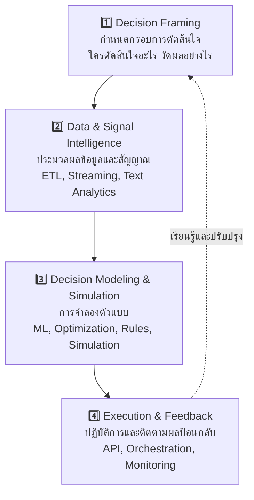

# 📘 สัปดาห์ที่ 15 — จาก BI สู่ Decision Intelligence, Agentic AI และการนำระบบขึ้นใช้งาน

⬅️ [[Week-14-Expert-Systems-and-DMN]] | ➡️ [[Week-16-Project-Presentation]]

## 🎯 จุดประสงค์การเรียนรู้
1. เปรียบเทียบ BI, AI/ML และ Decision Intelligence ได้ครบทุกมิติ
2. อธิบายสถาปัตยกรรม 4 ชั้นของ Decision Intelligence และนำมาใช้วางกรอบระบบของตนเอง
3. อธิบายแนวคิด Agentic AI, Multi-Agent Systems และ DecisionOps
4. นำ DSS ขึ้นใช้งานจริงในรูปแบบ API พร้อมพิจารณาประเด็นจริยธรรมและการกำกับดูแล

## 📖 เนื้อหาบรรยาย (2 ชม.)

### ช่วงที่ 1 (35 นาที) — จาก BI สู่ Decision Intelligence
→ [[Decision-Intelligence]] · [[Business-Intelligence]]

การเติบโตของข้อมูลระดับ Big Data ทำให้ BI แบบดั้งเดิมไม่เพียงพอต่อการแข่งขัน การหลอมรวม BI กับ AI นำไปสู่กระบวนทัศน์ที่ Gartner เรียกว่า **Decision Intelligence (DI)**

| มิติการวิเคราะห์ | **Business Intelligence** | **AI / ML** | **Decision Intelligence** |
|---|---|---|---|
| คำถามหลัก | เกิดอะไรขึ้นในอดีต? | จะเกิดอะไรขึ้นในอนาคต? | **เราควรทำอย่างไร?** |
| ผลผลิตของระบบ | รายงานเชิงพรรณนาและแผงควบคุมแสดงสถานะ | การพยากรณ์ การจำแนกประเภท คะแนนความน่าจะเป็น | **ข้อเสนอแนะการกระทำและการดำเนินการตามการตัดสินใจ** |
| บทบาทของมนุษย์ | ตีความผลลัพธ์จากรายงานเพื่อกำหนดกลยุทธ์ | ตรวจสอบความถูกต้องของโมเดลและปรับพารามิเตอร์ | **ออกแบบสถาปัตยกรรมการตัดสินใจและตรวจสอบความสอดคล้อง** |
| ลักษณะการทำงาน | ระบบหยุดแค่การรายงาน มนุษย์ต้องดำเนินการต่อเอง | ระบบหยุดที่การทำนาย มนุษย์นำผลไปพิจารณา | **ระบบทำงานเชิงรุก ตรวจพบเงื่อนไขและกระตุ้นการตอบสนองข้ามสายงาน** |

- DI ทำหน้าที่เป็นสถาปัตยกรรมที่ **ลดช่องว่างระหว่างการพบสัญญาณ (Signal) ไปสู่การประสานการดำเนินงานจริง (Action coordination)** โดยอัตโนมัติ

### ช่วงที่ 2 (25 นาที) — สถาปัตยกรรม 4 ชั้นของ DI

- 🔑 **ชั้นที่ 1 คือชั้นที่ถูกข้ามบ่อยที่สุดและเป็นสาเหตุหลักที่โครงการวิเคราะห์ข้อมูลล้มเหลว** — สร้างโมเดลแม่นยำเพื่อการตัดสินใจที่ไม่มีใครต้องตัดสินใจ
- แมปกลับไปยัง [[DSS-Architecture-Subsystems]]: DI ไม่ได้ทิ้งสถาปัตยกรรมคลาสสิก แต่เพิ่ม **ชั้นกรอบการตัดสินใจ** ไว้ด้านหน้าและ **ชั้นวงจรป้อนกลับ** ไว้ด้านหลัง

### ช่วงที่ 3 (30 นาที) — Agentic AI และ DecisionOps
→ [[Agentic-AI]] · [[DecisionOps-and-MLOps]]
- **Agentic AI** = ระบบตัวแทนปัญญาประดิษฐ์แบบอิสระที่สามารถ **วางแผน ดำเนินการ และใช้เครื่องมือต่างๆ ข้ามแพลตฟอร์มได้เอง**
- **Multi-Agent Systems** — ตัวแทนหลายตัวสื่อสารกันเพื่อแก้ปัญหาระดับระบบ เช่น การจัดสรรหน่วยกู้ภัยในกรณีฉุกเฉินระดับเมือง
- **DecisionOps** — วิวัฒนาการที่เหนือกว่า MLOps:

| | **MLOps** | **DecisionOps** |
|---|---|---|
| เน้นที่ | การคงความแม่นยำของโมเดล | การประสานงานการตอบสนอง (Operational response) |
| ตัวชี้วัด | Model accuracy, drift | **ความหน่วงระหว่างคำแนะนำกับการกระทำจริง** |
| ขอบเขต | วงจรชีวิตของโมเดล | เครือข่ายการตัดสินใจข้ามสายงาน |

- ⚠️ ต้องระวัง buzzword — ให้นักศึกษาถามเสมอว่า "ระบบนี้ทำอะไรได้ที่ pipeline ธรรมดาทำไม่ได้จริงๆ?"

### ช่วงที่ 4 (30 นาที) — การนำระบบขึ้นใช้งานและการกำกับดูแล
- **สถาปัตยกรรมสมัยใหม่**: DSS ก้าวข้ามข้อจำกัดของแอปแบบ standalone ไปสู่ **ไมโครเซอร์วิส** ที่ตอบสนองเรียลไทม์
  - บรรจุโมเดลและเครื่องยนต์อนุมานลง **Docker Container**
  - เปิดให้บริการเป็น **API ผ่าน FastAPI**
  - เชื่อมกับฐานข้อมูลองค์กร (PostgreSQL) และ Frontend สมัยใหม่
- **Python ในฐานะภาษามาตรฐานอุตสาหกรรมของ DSS**: Pandas/NumPy (ข้อมูล) → Scikit-learn (ML) → scikit-fuzzy (ฟัซซี) → pgmpy (เบย์) → PuLP/OR-Tools (optimization)
- **จริยธรรมและการกำกับดูแล** → [[Explainable-AI-and-Governance]]
  - Explainable AI เป็นข้อกำหนดขั้นต่ำในโดเมนที่มีข้อบังคับ
  - ความลำเอียงของอัลกอริทึม (Algorithmic bias) และความเป็นธรรม
  - Human-in-the-loop / Human-on-the-loop / Human-out-of-the-loop — ควรเลือกระดับใดกับการตัดสินใจแบบใด
  - Auditability: DMN + Rule Engines ทำให้สถาบันการเงินบันทึกและตรวจสอบย้อนหลังกระบวนการตัดสินใจได้สมบูรณ์ ตอบสนองข้อบังคับภาครัฐได้ทันท่วงที
  - ความรับผิดชอบเมื่อระบบอัตโนมัติตัดสินใจผิด

## 🔬 ปฏิบัติการ (2 ชม.)
[[Lab-13-Deploy-DSS-as-API]] — บรรจุโมเดลจาก Lab ก่อนหน้าเป็น FastAPI service + Dockerfile ทดสอบด้วย HTTP request แล้วต่อกับหน้า Streamlit เพื่อให้ได้ DSS ที่ครบทุกชั้นตั้งแต่ข้อมูลถึง UI

## 🏭 กรณีศึกษา
**การจัดการห่วงโซ่อุปทานด้วย DI** — เมื่อระบบตรวจพบสัญญาณความเสี่ยงจากซัพพลายเออร์ผ่าน Text Analytics ระบบจะไม่เพียงส่งรายงานแจ้งเตือน (แบบ BI) แต่โมเดล DI จะรันแบบจำลองเส้นทางการผลิตทางเลือก ประเมินต้นทุนค่าเสียโอกาส และออกคำสั่งไปยังระบบโลจิสติกส์เพื่อเปลี่ยนเส้นทางขนส่งวัตถุดิบโดยอัตโนมัติ **ก่อน** ที่ความเสี่ยงจะกระทบสายการผลิตจริง
**คำถามอภิปราย:** ควรตั้งเงื่อนไขใดที่ระบบ **ต้อง** หยุดถามมนุษย์ก่อนดำเนินการ? ให้ออกแบบเกณฑ์จริง (มูลค่า, ความไม่แน่นอน, ความสามารถในการย้อนกลับของการกระทำ)

## 📌 กำหนดส่ง
> [!danger] ส่งรายงานโครงงานฉบับสมบูรณ์ + โค้ด (8 คะแนน)
> ภายในเที่ยงคืนวันอาทิตย์ท้ายสัปดาห์ที่ 15 → [[Group-Project]]

## ✅ ตรวจสอบความเข้าใจตนเอง
- [ ] เติมตารางเปรียบเทียบ BI / AI-ML / DI ได้ครบทั้ง 4 มิติจากความจำ
- [ ] ระบุชั้นทั้ง 4 ของ DI และแมปโครงงานตนเองเข้ากับแต่ละชั้นได้
- [ ] อธิบายความต่างระหว่าง MLOps กับ DecisionOps ได้
- [ ] กำหนดระดับ human-in-the-loop ที่เหมาะสมให้กับการตัดสินใจที่กำหนดให้

> [!exam] ความสำคัญต่อการสอบ
> **ปลายภาคส่วน A, B และ D** — ตารางเปรียบเทียบ BI/AI/DI เป็นข้อสอบที่ออกแน่นอน และส่วน D จะให้ออกแบบระบบตามสถาปัตยกรรม 4 ชั้นของ DI พร้อมวิเคราะห์ประเด็นจริยธรรม

---
**แนวคิดหลัก:** [[Decision-Intelligence]] · [[Business-Intelligence]] · [[Agentic-AI]] · [[DecisionOps-and-MLOps]] · [[Explainable-AI-and-Governance]] · [[Industry-Applications]]
