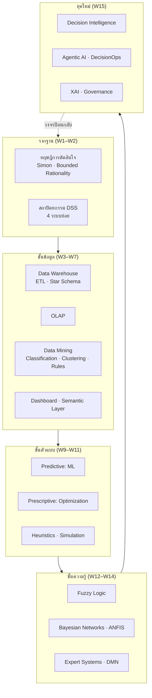

# 📘 สัปดาห์ที่ 16 — นำเสนอโครงงานกลุ่มและทบทวนรวบยอด

⬅️ [[Week-15-Decision-Intelligence-and-Agentic-AI]] | ➡️ [[Final-Exam-Blueprint|🧪 สอบปลายภาค]]

## 🎯 จุดประสงค์ของสัปดาห์
1. นำเสนอและสาธิตต้นแบบ DSS ที่พัฒนาขึ้น พร้อมปกป้องการตัดสินใจเชิงออกแบบ
2. ประเมินงานของกลุ่มอื่นอย่างมีวิจารณญาณด้วยเกณฑ์เดียวกัน
3. เชื่อมโยงเนื้อหาทั้ง 15 สัปดาห์เข้าเป็นภาพเดียว
4. เตรียมความพร้อมสำหรับการสอบปลายภาค

## 📋 ช่วงที่ 1 — การนำเสนอโครงงาน (2.5 ชม.)

### รูปแบบการนำเสนอ (กลุ่มละ 15 นาที + ถาม-ตอบ 5 นาที)

| ช่วง | เวลา | เนื้อหาที่ต้องมี |
|---|:--:|---|
| 1. Decision Framing | 3 นาที | ใครคือผู้ตัดสินใจ? ตัดสินใจอะไร? ปัจจุบันตัดสินใจอย่างไรและมีปัญหาอะไร? วัดความสำเร็จอย่างไร? |
| 2. สถาปัตยกรรมระบบ | 3 นาที | แผนภาพระบบย่อย 4 ส่วน + เหตุผลการเลือกเทคโนโลยีแต่ละชั้น |
| 3. สาธิตระบบสด | 5 นาที | **ต้องสาธิตสด ไม่ใช่วิดีโอ** — เดินผ่านสถานการณ์การใช้งานจริง 1 สถานการณ์ |
| 4. ผลการประเมิน | 2 นาที | เมตริกของโมเดล + การตรวจสอบความถูกต้อง |
| 5. ข้อจำกัดและก้าวต่อไป | 2 นาที | **สิ่งที่ระบบทำไม่ได้** ความเสี่ยง และประเด็นจริยธรรม |

> [!tip] ส่วนที่ 5 คือส่วนที่ทำคะแนนได้มากที่สุด
> กลุ่มที่ระบุข้อจำกัดของตนเองได้อย่างตรงไปตรงมาและลึกซึ้ง ได้คะแนนสูงกว่ากลุ่มที่อ้างว่าระบบสมบูรณ์แบบเสมอ เพราะนี่คือทักษะของวิศวกรที่แท้จริง

### คำถามที่ผู้สอนจะถามทุกกลุ่ม
1. ถ้าข้อมูลนำเข้าหายไป 30% ระบบจะทำอย่างไร?
2. ผู้ใช้จะรู้ได้อย่างไรว่าทำไมระบบจึงเสนอทางเลือกนี้?
3. ถ้าโลกเปลี่ยนไปในอีก 6 เดือน ระบบจะรู้ตัวได้อย่างไรว่าตนเองเริ่มผิด?
4. ทำไมจึงเลือกเทคนิคนี้แทนเทคนิคที่ง่ายกว่า?

### Peer Review
ทุกกลุ่มประเมินกลุ่มอื่นด้วยแบบฟอร์มตาม [[Rubrics]] — คะแนน peer review มีน้ำหนัก 20% ของคะแนนการนำเสนอ (ผู้สอน 80%)

## 📋 ช่วงที่ 2 — ทบทวนรวบยอด (1.5 ชม.)

### แผนที่ความรู้ทั้งรายวิชา

### เส้นเรื่องหลัก 5 เส้นที่ร้อยทั้งรายวิชา
1. **มนุษย์เป็นศูนย์กลาง** — DSS สนับสนุน ไม่ใช่แทนที่ ([[Bounded-Rationality]] → [[Explainable-AI-and-Governance]])
2. **ความอธิบายได้เป็นข้อกำหนด ไม่ใช่ของแถม** ([[Expert-Systems]] → [[Fuzzy-Logic]] → [[ANFIS]] → XAI)
3. **ข้อมูลคือรากฐาน** — ไม่มีชั้นข้อมูลที่ดี ชั้นตัวแบบไร้ความหมาย ([[ETL-Process]] → [[Metadata-Lineage-Semantic-Layer]])
4. **การเลือกเทคนิคคือการตัดสินใจเชิงบริบท** — ไม่มีเทคนิคใดดีที่สุดเสมอ
5. **จากรายงาน → พยากรณ์ → ให้คำแนะนำ → ลงมือ** ([[Business-Intelligence]] → [[Decision-Intelligence]])

### ทบทวนเตรียมสอบปลายภาค
- เดินผ่านโครงสร้างข้อสอบตาม [[Final-Exam-Blueprint]]
- ทำโจทย์ตัวอย่างจาก [[Question-Bank]] ร่วมกัน 3 ข้อ (LP, Bayes, Fuzzy)
- เปิดถาม-ตอบอิสระ

## ✅ สิ่งที่ต้องส่งในสัปดาห์นี้
- [ ] สไลด์นำเสนอ (PDF) ก่อนเริ่มคาบ
- [ ] แบบประเมินเพื่อนร่วมกลุ่ม (Peer evaluation) — รายบุคคล ส่งแยก เป็นความลับ
- [ ] แบบประเมินกลุ่มอื่น (Peer review) — ระหว่างคาบ

---
**ที่เกี่ยวข้อง:** [[Group-Project]] · [[Rubrics]] · [[Final-Exam-Blueprint]] · [[Home]]
