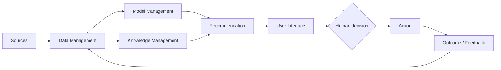
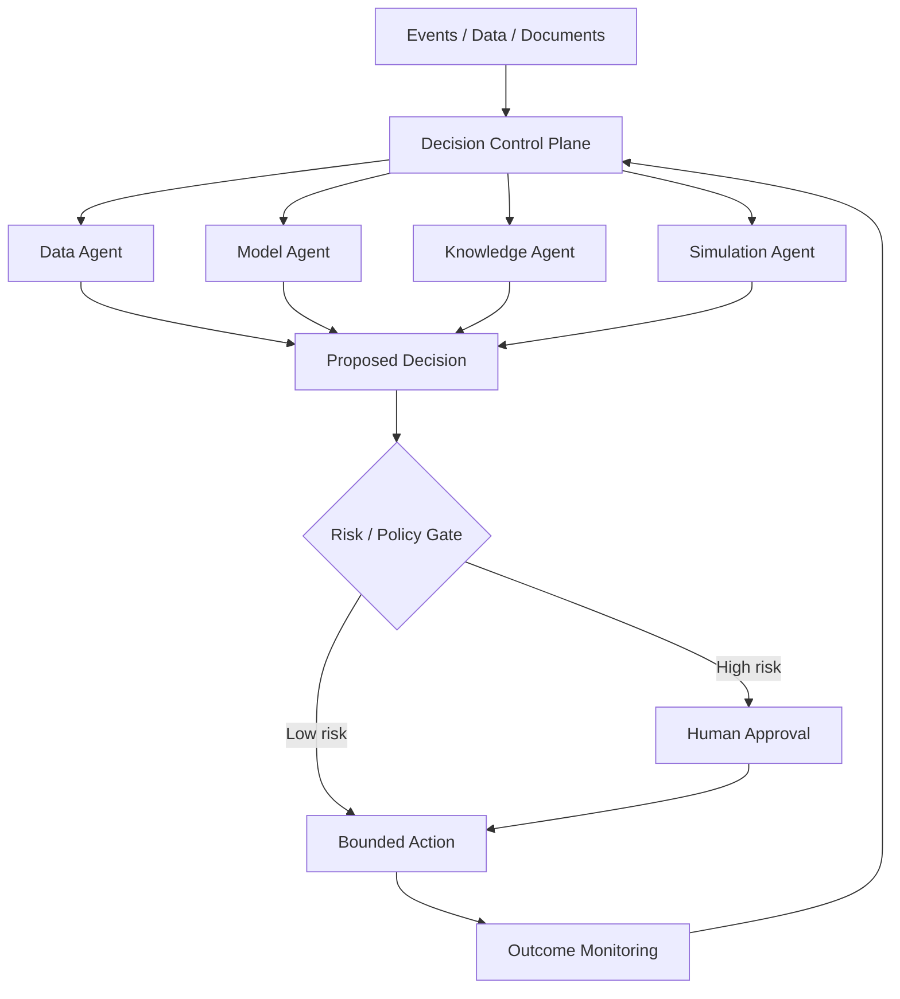

# สถาปัตยกรรม DSS: จากข้อมูลสู่การตัดสินใจ

## 1. Architecture คือการจัดสรรความรับผิดชอบ

สถาปัตยกรรมบอกว่าองค์ประกอบใดรับข้อมูล องค์ประกอบใดคำนวณหรือให้เหตุผล ใครเห็นคำอธิบาย ใครมีอำนาจอนุมัติ และระบบจะเรียนรู้จากผลลัพธ์อย่างไร ภาพที่มีเพียงกล่องและลูกศรจึงยังไม่พอ ต้องระบุ **contract** ระหว่างส่วนต่าง ๆ ได้แก่ input, output, latency, owner, failure handling และ audit evidence

คำถามหลักของสถาปนิก DSS คือ “ถ้าส่วนนี้ช้า ผิด หรือหยุดทำงาน ผู้ตัดสินใจจะเห็นอะไรและทำอะไรต่อ?”

## 2. ระบบย่อย 4 ส่วน

### 2.1 Data Management Subsystem

รับผิดชอบการนำเข้า จัดเก็บ รวม ตรวจคุณภาพ ควบคุมสิทธิ์ และให้บริการข้อมูล ประกอบด้วย operational databases, data warehouse/lakehouse, ETL/ELT, metadata, lineage และ data-quality rules

- คุณภาพ: accuracy, completeness, timeliness, consistency
- ความเสี่ยง: schema drift, stale data, leakage, missing values, unauthorized access
- หลักฐานที่ควรมี: เวลาอัปเดต แหล่งที่มา เวอร์ชัน และเจ้าของข้อมูล

### 2.2 Model Management Subsystem

จัดเก็บ เรียกใช้ เปรียบเทียบ และควบคุมวงจรชีวิตของแบบจำลอง ตั้งแต่สูตรการเงิน optimization, simulation, forecasting จนถึง machine learning

- Model base: แบบจำลองและพารามิเตอร์
- Model execution: solver, inference service, simulation engine
- Model governance: version, validation, approval, monitoring และ rollback
- คำถามสำคัญ: โมเดลเหมาะกับประชากรและช่วงเวลานี้หรือไม่?

### 2.3 Knowledge-Based Management Subsystem

เก็บกฎ นโยบาย ข้อจำกัด และความรู้โดเมน ใช้ตรวจความสมเหตุสมผล อธิบาย และจำกัดขอบเขตคำแนะนำ เช่น “ห้ามอนุมัติถ้าเอกสารไม่ครบ” หรือ “ต้องส่งแพทย์ทบทวนเมื่อความมั่นใจต่ำ”

Knowledge ต่างจาก Model ตรงที่กฎมักสะท้อน **สิ่งที่องค์กรอนุญาตหรือกำหนด** ส่วนโมเดลประมาณ **สิ่งที่น่าจะเกิดขึ้นหรือทางเลือกที่เหมาะสม**

### 2.4 User Interface / Dialog Subsystem

เป็นพื้นที่ที่ผู้ใช้ตั้งคำถาม ปรับสมมติฐาน เปรียบเทียบทางเลือก เห็นความไม่แน่นอน และบันทึกเหตุผลของการตัดสินใจ UI ที่ดีไม่ใช่เพียง dashboard สวย แต่ต้องสนับสนุน cognition:

- แสดง recommendation พร้อมเหตุผลและข้อจำกัด
- แยก “ข้อมูลจริง” “ค่าคาดการณ์” และ “สมมติฐาน”
- เปิดให้ drill-down และ what-if
- เตือนเมื่อข้อมูลล้าสมัยหรืออยู่นอกขอบเขตโมเดล
- มี approve, override, defer และ escalate

## 3. การทำงานร่วมกันแบบ End-to-End

ตัวอย่างระบบอนุมัติสินเชื่อ:

1. Data layer รวมคำขอ ประวัติชำระ รายได้ และข้อมูลเครดิต
2. Model layer ประเมิน probability of default และ expected loss
3. Knowledge layer ใช้นโยบายสินเชื่อ กฎหมาย และข้อจำกัดผลิตภัณฑ์
4. UI แสดงคะแนน ปัจจัยสำคัญ ความไม่แน่นอน และทางเลือก
5. เจ้าหน้าที่อนุมัติ ปฏิเสธ หรือส่งตรวจเพิ่ม
6. ผลการชำระจริงย้อนกลับเพื่อวัด drift และปรับปรุงระบบ

จุดตรวจที่ขาดไม่ได้: data freshness, model version, rule version, user identity, timestamp, rationale และ final outcome

## 4. DSS 5 ประเภทตามแกนขับเคลื่อน

| ประเภท | ทรัพยากรหลัก | ตัวอย่าง |
|---|---|---|
| Data-driven | ข้อมูลจำนวนมากและ query/OLAP | วิเคราะห์ยอดขาย |
| Model-driven | แบบจำลองและ solver | วางแผนการผลิต |
| Knowledge-driven | กฎหรือความเชี่ยวชาญ | คัดกรองอาการ |
| Communication-driven | การทำงานและตัดสินใจร่วมกัน | ห้องบัญชาการภัยพิบัติ |
| Document-driven | เอกสารไม่มีโครงสร้าง | วิเคราะห์สัญญา |

ระบบจริงมักเป็น hybrid เช่น clinical DSS อาจใช้เวชระเบียน (data), risk model (model), clinical guideline (knowledge), multidisciplinary review (communication) และบทความวิจัย (document)

## 5. ทางเลือกเชิงสถาปัตยกรรม

### Batch กับ Real-time

- Batch เหมาะกับการตัดสินใจเป็นรอบ เช่น forecast รายสัปดาห์ ต้นทุนต่ำและตรวจสอบง่าย
- Real-time เหมาะเมื่อ value of information ลดลงรวดเร็ว เช่น fraud หรือ traffic control แต่ต้องลงทุนเรื่อง streaming, availability และ graceful degradation

### Cloud กับ Edge

- Cloud เหมาะกับการรวมข้อมูล ปรับขนาด และใช้บริการร่วมกัน
- Edge เหมาะกับ latency ต่ำ ความต่อเนื่องเมื่อเครือข่ายขาด และข้อมูลอ่อนไหว
- Hybrid ใช้ edge ตัดสินใจเบื้องต้นและ cloud ฝึกโมเดล/กำกับดูแล

### Centralized กับ Distributed

Centralized ให้มาตรฐานและ governance ง่าย ส่วน distributed เพิ่ม autonomy และ resilience แต่เสี่ยงต่อเวอร์ชันไม่ตรงกัน การตัดสินใจขัดแย้ง และ observability ที่ซับซ้อน

## 6. คุณลักษณะคุณภาพของ DSS

| คุณลักษณะ | คำถามตรวจสอบ |
|---|---|
| Correctness | ข้อมูล กฎ และโมเดลถูกต้องสำหรับบริบทหรือไม่ |
| Timeliness | คำแนะนำมาถึงก่อนหมดโอกาสตัดสินใจหรือไม่ |
| Availability | เมื่อ component ล้ม ระบบยังทำงานระดับใด |
| Explainability | ผู้ใช้เข้าใจเหตุผล ข้อจำกัด และความไม่แน่นอนหรือไม่ |
| Security & Privacy | ใครเห็นข้อมูลหรือสั่ง action ได้ |
| Auditability | ย้อนสร้างเหตุการณ์และเวอร์ชันที่ใช้ได้หรือไม่ |
| Adaptability | ปรับกฎ โมเดล และ workflow ได้เร็วเพียงใด |

## 7. ตัวอย่าง DSS 20 Applications ในมุมสถาปัตยกรรม

| # | Application | ระบบย่อยเด่น | เส้นทางตัดสินใจ | ประเด็นสถาปัตยกรรม |
|---:|---|---|---|---|
| 1 | Clinical decision support | Knowledge + Model | EHR → risk/guideline → clinician | safety, explanation |
| 2 | Hospital capacity | Model | census → simulation → bed plan | real-time demand |
| 3 | Credit approval | Model + Knowledge | application → risk/policy → officer | fairness, audit |
| 4 | Fraud detection | Data + Model | stream → score → block/review | millisecond latency |
| 5 | Portfolio allocation | Model | market → optimize → rebalance | scenario risk |
| 6 | Demand forecasting | Data + Model | sales → forecast → order | seasonality, drift |
| 7 | Dynamic pricing | Model + Knowledge | demand → price → publish | guardrails |
| 8 | Product assortment | Data | basket → insight → shelf plan | data granularity |
| 9 | Production scheduling | Model | orders/capacity → solver → schedule | constraint changes |
| 10 | Predictive maintenance | Data + Model | sensor → failure risk → work order | edge inference |
| 11 | Route optimization | Model | traffic/orders → route → driver | continuous replanning |
| 12 | Supply-chain risk | Data + Document | events/docs → risk → mitigation | source reliability |
| 13 | Precision agriculture | Data + Model | sensor/weather → recommendation → field | offline/edge |
| 14 | Disaster response | Communication | multi-source → common picture → command | resilience |
| 15 | Energy dispatch | Model | demand/grid → optimize → dispatch | safety, real-time |
| 16 | Traffic control | Model | sensors → predict → signal plan | low latency |
| 17 | Student early warning | Data + Knowledge | LMS → risk/rules → advisor | privacy, bias |
| 18 | Workforce scheduling | Model | demand/skills → roster → manager | human constraints |
| 19 | Cybersecurity response | Knowledge + Model | telemetry → detect → contain | approval gates |
| 20 | Policy simulation | Model + Communication | assumptions → scenarios → deliberation | uncertainty |

## 8. Failure Modes และ Anti-patterns

1. **Dashboard-only DSS** — แสดงข้อมูลแต่ไม่มีทางเลือกหรือ action loop
2. **Model as oracle** — ซ่อนสมมติฐานและ uncertainty
3. **Stale-data certainty** — ไม่แสดงเวลาอัปเดต
4. **Rule spaghetti** — กฎซ้ำ ขัดกัน และไม่มี owner
5. **Untraceable decision** — ไม่เก็บเวอร์ชันหรือเหตุผล override
6. **Automation without exit** — ไม่มี escalation, rollback หรือ manual fallback
7. **One metric dominance** — optimize KPI เดียวจนเกิดผลข้างเคียง
8. **Feedback blindness** — ไม่ติดตามว่าคำแนะนำสร้างผลจริงอย่างไร

## 9. Future DSS Architecture

Future DSS มีแนวโน้มเปลี่ยนจากโมเดลเดี่ยวสู่ระบบที่มีหลาย agent รับบทค้นข้อมูล วิเคราะห์ จำลอง ตรวจนโยบาย และสื่อสาร แต่ความสามารถที่เพิ่มขึ้นต้องมาคู่กับ control plane:

- agent registry และขอบเขตสิทธิ์
- orchestration และ conflict resolution
- policy-as-code และ approval gates
- telemetry, trace และ evaluation
- memory/data provenance
- sandbox, rate limit และ rollback
- human oversight ตามระดับความเสี่ยง

หลักสำคัญคือ **autonomy ต้องเป็นตัวแปรที่ออกแบบ** ไม่ใช่ผลพลอยได้ ระบบควรระบุว่า AI แนะนำ ดำเนินการภายในขอบเขต หรือจำเป็นต้องรอมนุษย์ในสถานการณ์ใด

## 10. Checklist ก่อนนำ DSS ไปใช้

1. Decision owner และผู้ได้รับผลกระทบคือใคร?
2. ข้อมูลมาจากไหน สดและเชื่อถือได้เพียงใด?
3. Model และ rule ใดให้คำแนะนำนี้?
4. ความไม่แน่นอนและข้อจำกัดแสดงอย่างไร?
5. Latency budget และ fallback คืออะไร?
6. ใครอนุมัติ override หรือ rollback?
7. บันทึกหลักฐานเพียงพอสำหรับ audit หรือไม่?
8. เฝ้าระวัง drift, bias และผลกระทบอย่างไร?
9. เมื่อ component หนึ่งล้ม ระบบ degrade อย่างปลอดภัยหรือไม่?
10. Feedback จากผลลัพธ์กลับสู่การปรับปรุงอย่างไร?

