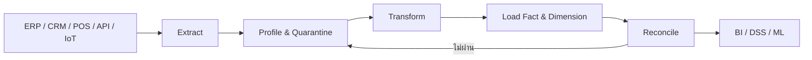
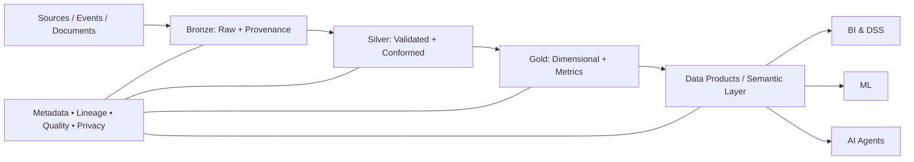

# การจัดการข้อมูลและคลังข้อมูลสำหรับ DSS

## 1. ปัญหาเริ่มต้น: ทำไมตัวเลขเดียวกันจึงมีหลายคำตอบ

ฝ่ายขายรายงานยอดขาย 9.8 ล้านบาท ฝ่ายบัญชีรายงาน 9.2 ล้านบาท และ dashboard แสดง 10.1 ล้านบาท ทั้งสามตัวเลขอาจ “ถูก” ภายใต้นิยามต่างกัน:

- วันที่สั่งซื้อหรือวันที่รับรู้รายได้
- ยอดก่อนหรือหลังคืนสินค้า
- รวม VAT หรือไม่
- ใช้อัตราแลกเปลี่ยนวันใด
- รวมคำสั่งซื้อที่ยังไม่ชำระหรือไม่

Data Warehouse จึงไม่ได้แก้ปัญหาเพียงการเก็บข้อมูล แต่สร้าง **นิยามร่วม ประวัติ และหลักฐานการคำนวณ** เพื่อให้ DSS ใช้ข้อมูลเดียวกันอย่างตรวจสอบได้

## 2. OLTP กับ Analytical Data Warehouse

| มิติ | OLTP | Data Warehouse |
|---|---|---|
| เป้าหมาย | ทำธุรกรรมให้ถูกต้องและรวดเร็ว | วิเคราะห์แนวโน้มและสนับสนุนการตัดสินใจ |
| รูปแบบงาน | insert/update แถวขนาดเล็กจำนวนมาก | scan, join, aggregate ข้อมูลจำนวนมาก |
| แบบจำลอง | normalized ลดความซ้ำซ้อน | dimensional ลดความซับซ้อนในการวิเคราะห์ |
| เวลา | สถานะปัจจุบัน | ประวัติหลายช่วงเวลา |
| ผู้ใช้ | ระบบปฏิบัติการและพนักงาน | นักวิเคราะห์ ผู้บริหาร โมเดล และ DSS |
| ความเสี่ยง | transaction conflict / downtime | นิยามไม่ตรง ข้อมูลช้า และยอดไม่ reconcile |

การแยก workload ป้องกัน query วิเคราะห์ขนาดใหญ่กระทบระบบขายจริง และเปิดให้คลังข้อมูลรวมข้อมูลจากหลายระบบภายใต้นิยามเดียว

## 3. คุณลักษณะของ Data Warehouse

กรอบคลาสสิกประกอบด้วย:

1. **Subject-oriented** — จัดรอบเรื่องธุรกิจ เช่น ลูกค้า ยอดขาย สินค้า
2. **Integrated** — แปลงรหัส หน่วย รูปแบบ และนิยามให้สอดคล้อง
3. **Time-variant** — เก็บเวลาและประวัติเพื่อเปรียบเทียบ
4. **Non-volatile** — ข้อมูลวิเคราะห์ถูกโหลดและรักษาประวัติ ไม่แก้ตามธุรกรรมรายวันโดยไม่มีหลักฐาน

คำว่า non-volatile ไม่ได้หมายถึง “ห้ามแก้ข้อมูลผิด” แต่หมายถึงการเปลี่ยนแปลงต้องควบคุม มีเวอร์ชัน และสามารถอธิบายได้

## 4. ETL และ ELT



### Extract

- full extraction เหมาะกับข้อมูลขนาดเล็กหรือ initial load
- incremental extraction ใช้ timestamp, sequence หรือ Change Data Capture
- ทุก batch ควรมี batch_id, source, extraction time และ row count

### Transform

- standardize วันที่ หน่วย เงินตรา และตัวพิมพ์
- map รหัสจากหลายระบบเข้าสู่รหัสมาตรฐาน
- deduplicate ด้วย business key และกฎเลือก record
- จัดการ missing values โดยไม่ซ่อนความไม่แน่นอน
- lookup surrogate keys และจัดการ unknown member

### Load

- โหลด dimension ก่อน fact เพื่อให้ foreign keys พร้อม
- ใช้ idempotent pipeline: รันซ้ำแล้วไม่สร้างข้อมูลซ้ำ
- แยก rejected records พร้อมเหตุผล
- reconcile จำนวนแถว จำนวนธุรกรรม และยอดเงิน

### ELT

ELT โหลดข้อมูลดิบลงแพลตฟอร์มก่อน แล้วแปลงภายใน warehouse/lakehouse เหมาะเมื่อ compute และ storage แยกจากกัน ต้องการเก็บ raw history และใช้ SQL ทำ transformation แต่ยังต้องมี validation, access control และ lineage

## 5. Data Quality เป็นกติกาที่ทดสอบได้

| มิติ | ตัวอย่างกฎ |
|---|---|
| Completeness | `order_id` และ `order_date` ห้ามว่าง |
| Uniqueness | `(source_system, order_line_id)` ต้องไม่ซ้ำ |
| Validity | `quantity > 0`; `discount` อยู่ระหว่าง 0–1 |
| Consistency | `net_amount = quantity × unit_price − discount_amount` |
| Timeliness | ข้อมูล POS ต้องถึง Silver ภายใน 30 นาที |
| Referential integrity | ทุก `product_key` ใน fact ต้องพบใน dimension |

คุณภาพข้อมูลต้องมี owner, threshold และ action เมื่อไม่ผ่าน เช่น reject, quarantine, warn หรือ stop pipeline

## 6. Reconciliation: หลักฐานว่าข้อมูลไม่สูญหาย

อย่างน้อยควรเทียบ:

1. source row count กับ accepted + rejected
2. distinct transaction count
3. sum ของ monetary measures
4. min/max business date
5. จำนวน unknown dimension keys

ตัวอย่าง control equation:

```text
source_rows = loaded_rows + quarantined_rows
source_net_amount = warehouse_net_amount + rejected_net_amount
```

## 7. Dimensional Modeling เริ่มจาก Business Process

ขั้นตอน 4 ข้อ:

1. เลือก business process เช่น retail sales
2. ประกาศ grain
3. ระบุ dimensions
4. ระบุ facts/measures

### Grain

ตัวอย่างที่ชัด:

> หนึ่งแถวใน `fact_sales` แทนสินค้าหนึ่งรายการในหนึ่งใบเสร็จ ณ เวลาที่ชำระเงิน

ตัวอย่างที่ไม่ชัด: “หนึ่งแถวแทนยอดขาย” เพราะไม่ระบุระดับสินค้า ใบเสร็จ ร้าน และเวลา

ห้ามผสม grain เช่น บางแถวเป็นรายการสินค้า แต่บางแถวเป็นยอดรวมรายวัน

## 8. Fact Table

Fact table เก็บเหตุการณ์ การอ้างอิง dimension และ measures:

- foreign keys: date, product, customer, store, promotion
- degenerate dimension: receipt number
- additive measure: quantity, net amount
- semi-additive measure: account balance รวมข้ามลูกค้าได้ แต่ไม่ควรรวมข้ามเวลา
- non-additive measure: ratio หรือ percentage ควรคำนวณจาก numerator/denominator

ประเภท fact ที่ควรรู้:

- Transaction fact — หนึ่งเหตุการณ์
- Periodic snapshot — สถานะตามรอบ เช่น inventory รายวัน
- Accumulating snapshot — กระบวนการที่มี milestone เช่น order-to-delivery

## 9. Dimension Table

Dimension ให้บริบทสำหรับ filter, group และ label:

- surrogate key แยกจาก natural/business key
- descriptive attributes เช่น category, province, segment
- hierarchy เช่น product → subcategory → category
- date dimension รองรับ fiscal period, holiday และ week
- conformed dimension ใช้ร่วมหลาย fact เพื่อให้รายงานเทียบกันได้

## 10. Star กับ Snowflake

- **Star**: มิติ denormalized, query ง่าย, join น้อย เหมาะกับ BI และ semantic model
- **Snowflake**: แยกลำดับชั้นเป็นหลายตาราง ลดความซ้ำบางส่วน แต่ query และ governance ซับซ้อนขึ้น

เลือก Snowflake เมื่อ hierarchy ใหญ่ ใช้ร่วมหลายส่วน มีทีมดูแลชัด และเครื่องมือรองรับ มิฉะนั้น Star มักสื่อสารกับผู้ใช้ได้ง่ายกว่า

## 11. Slowly Changing Dimensions

### Type 1 — Overwrite

ทับค่าเดิม เหมาะกับการแก้คำสะกดหรือข้อมูลที่ไม่ต้องวิเคราะห์ย้อนหลัง

### Type 2 — New Row

เพิ่มแถวใหม่พร้อม surrogate key, effective_from, effective_to และ is_current ทำให้ fact เดิมยังชี้ไปยังสถานะในอดีต

ตัวอย่าง: ลูกค้าย้ายจากภาคเหนือไปภาคกลาง หากต้องการรายงานยอดขายตามภูมิภาค ณ วันที่ซื้อ ต้องใช้ Type 2

## 12. Data Warehouse, Mart, Lake และ Lakehouse

| รูปแบบ | จุดเด่น | ความเสี่ยง |
|---|---|---|
| Data Warehouse | โครงสร้างและนิยามชัด เหมาะ BI | เปลี่ยนช้าเมื่อข้อมูลใหม่หลากหลาย |
| Data Mart | เร็วและโฟกัสแผนก | เกิด silo และนิยามซ้ำ |
| Data Lake | เก็บข้อมูลดิบหลากหลาย ราคายืดหยุ่น | กลายเป็น data swamp หากขาด metadata |
| Lakehouse | รวม open storage กับ table reliability | governance และ operational complexity |

## 13. ตัวอย่าง 20 Applications

| # | Application | Grain ตัวอย่าง | Dimensions หลัก | Measures / ประเด็นคุณภาพ |
|---:|---|---|---|---|
| 1 | Retail sales | 1 receipt line | date, product, customer, store | quantity, net sales; returns |
| 2 | Credit-card spend | 1 posted transaction | date, merchant, card, location | amount; currency mapping |
| 3 | Bank deposits | 1 account-day snapshot | date, account, branch | balance; semi-additive |
| 4 | Insurance claims | 1 claim event | date, policy, provider, diagnosis | paid amount; late updates |
| 5 | Hospital encounters | 1 patient encounter | date, patient, clinic, diagnosis | cost, length of stay; privacy |
| 6 | Pharmacy dispensing | 1 dispensed item | date, drug, patient, pharmacy | quantity; code standards |
| 7 | Telecom usage | 1 call/data session | time, subscriber, cell, plan | duration, bytes; volume |
| 8 | Churn analytics | 1 customer-month | month, customer, plan | churn flag, revenue; labels |
| 9 | E-commerce funnel | 1 user-session event | time, user, channel, page | conversion; identity stitching |
| 10 | Marketing attribution | 1 conversion-touch pair | date, campaign, channel, customer | attributed value; model definition |
| 11 | Inventory | 1 product-location-day | date, product, warehouse | on-hand qty; snapshot timing |
| 12 | Supply-chain delivery | 1 shipment milestone | date, supplier, route, product | lead time; missing events |
| 13 | Production output | 1 production batch | date, machine, product, shift | good/scrap qty; unit consistency |
| 14 | Equipment telemetry | 1 sensor-time interval | time, asset, sensor, site | reading; late/out-of-order data |
| 15 | Fleet operations | 1 vehicle trip | date, vehicle, driver, route | distance, fuel; GPS quality |
| 16 | Smart energy | 1 meter-interval | time, meter, tariff, location | kWh; time zone |
| 17 | Traffic analytics | 1 road-segment interval | time, segment, weather | speed, volume; missing sensors |
| 18 | Student analytics | 1 student-course-term | term, student, course, program | grade, attendance; privacy |
| 19 | Agriculture | 1 field-day | date, field, crop, weather | yield, water; sensor calibration |
| 20 | ESG reporting | 1 facility-period-source | period, facility, emission type | emissions; provenance/audit |

## 14. Failure Modes

1. ไม่ประกาศ grain ก่อนสร้างตาราง
2. ผสม transaction กับ snapshot ใน fact เดียว
3. ใช้ natural key เป็น dimension key โดยตรง
4. ทับประวัติที่ธุรกิจต้องใช้ย้อนหลัง
5. pipeline รันซ้ำแล้วเกิดข้อมูลซ้ำ
6. ทิ้ง rejected records โดยไม่เก็บเหตุผล
7. รายงานยอดแต่ไม่มี reconciliation
8. semantic definition ต่างกันระหว่างทีม
9. data lake ไม่มี catalog, lineage หรือ owner
10. ให้ AI ใช้ข้อมูลโดยไม่ระบุ freshness และ provenance

## 15. Future Data Architecture

สถาปัตยกรรมอนาคตมีแนวโน้มเชื่อมหลายรูปแบบ:

- batch และ streaming/CDC
- warehouse และ lakehouse
- Bronze (raw), Silver (validated), Gold (business-ready)
- reusable data products พร้อม owner และ service-level expectation
- semantic layer สำหรับ metric definition
- active metadata, lineage และ automated quality
- privacy-by-design และ policy enforcement
- structured, unstructured และ vector/embedding data สำหรับ AI



Future architecture ที่ดีไม่ใช่ระบบที่เก็บข้อมูลได้มากที่สุด แต่เป็นระบบที่ตอบได้ว่า **ข้อมูลนี้มาจากไหน หมายความว่าอะไร สดเพียงใด และเหมาะให้ใครใช้ตัดสินใจ**

## 16. Checklist ก่อนเผยแพร่ Data Product

1. Business process และ grain ชัดหรือไม่?
2. มี owner ของ dataset และ metric หรือไม่?
3. source-to-target mapping ตรวจสอบได้หรือไม่?
4. key uniqueness และ referential integrity ผ่านหรือไม่?
5. Type 1/2 สอดคล้องกับความต้องการประวัติหรือไม่?
6. pipeline idempotent และ recoverable หรือไม่?
7. source กับ target reconcile กันหรือไม่?
8. freshness และ latency ตรงกับการตัดสินใจหรือไม่?
9. lineage, privacy และ access policy ครบหรือไม่?
10. ผู้ใช้และ AI เห็น semantic definition เดียวกันหรือไม่?

