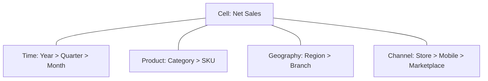

# OLAP และการวิเคราะห์หลายมิติ

## 1. OLAP คือการสำรวจคำถามต่อเนื่อง

เมื่อผู้บริหารถาม “ทำไมยอดขายไตรมาสนี้ลดลง?” คำตอบมักไม่จบใน query เดียว นักวิเคราะห์ต้อง:

1. Roll-up เพื่อเห็นภาพรวมและช่วงที่ผิดปกติ
2. Drill-down จากไตรมาสไปเดือน
3. Slice เฉพาะปีหรือช่องทาง
4. Dice เฉพาะภูมิภาคและหมวดสินค้าที่สนใจ
5. Pivot เพื่อเปลี่ยนแกนเปรียบเทียบ
6. Drill-through ไปดูธุรกรรมที่ประกอบเป็นยอด

OLAP จึงเป็นทั้งแบบจำลองข้อมูล ชุดการดำเนินการ และเส้นทางการให้เหตุผล

## 2. องค์ประกอบของ Multidimensional Model

### Measure

ค่าที่ต้องวิเคราะห์ เช่น revenue, quantity, cost, margin หรือ count ต้องระบุ aggregation behavior:

- additive: บวกได้ทุกมิติ
- semi-additive: บวกได้บางมิติ เช่น balance ไม่ควรรวมข้ามเวลา
- non-additive: ratio/percentage ต้องคำนวณจากฐาน

### Dimension

บริบทที่ใช้แบ่ง measure เช่น Time, Product, Geography, Customer และ Channel

### Hierarchy และ Level

ลำดับที่มีความหมาย:

- Year → Quarter → Month → Day
- Country → Region → Province → Branch
- Category → Subcategory → Product → SKU

Hierarchy ที่ดีต้องไม่มีการข้ามระดับที่ทำให้สมาชิกหนึ่งรายการมี parent หลายแบบโดยไม่กำหนดกติกา

### Member และ Cell

Member คือค่าหนึ่งใน dimension เช่น “Q1”, “ภาคอีสาน” หรือ “เครื่องดื่ม” ส่วน cell คือ measure ณ จุดตัดของสมาชิกแต่ละมิติ

## 3. Data Cube เป็นแนวคิด ไม่จำเป็นต้องมีเพียงสามมิติ

คำว่า cube ใช้อธิบายข้อมูลหลายมิติ แม้ระบบจริงมี 5–20 dimensions ผู้ใช้เห็นเพียงชุดมิติที่เกี่ยวกับคำถามขณะนั้น



## 4. Sparsity และ Pre-aggregation

ทุก combination อาจไม่มีข้อมูล เช่น สินค้าบางชนิดไม่ขายในบางจังหวัด Cube จึง sparse การ materialize ทุก cell อาจสิ้นเปลืองมาก

Pre-aggregation ช่วยให้ query เร็ว แต่แลกกับ:

- storage
- cube processing time
- freshness
- complexity เมื่อ dimension เปลี่ยน

ระบบ columnar สมัยใหม่คำนวณหลาย aggregation on demand ได้เร็วขึ้น ทำให้การเลือก materialization เป็นเรื่อง workload-specific

## 5. OLAP Operations

| Operation | เปลี่ยนอะไร | ตัวอย่าง |
|---|---|---|
| Roll-up | ลดรายละเอียด/รวมขึ้น hierarchy | Month → Quarter |
| Drill-down | เพิ่มรายละเอียดลง hierarchy | Region → Province |
| Slice | fix สมาชิกหนึ่งมิติ | Year = 2026 |
| Dice | จำกัดหลายมิติหรือหลายสมาชิก | 2026 + Northeast + Beverage |
| Pivot | สลับแกนการนำเสนอ | Month จาก row เป็น column |
| Drill-across | เปรียบเทียบ measure จากหลาย fact ที่มี conformed dimensions | Sales เทียบ Returns |
| Drill-through | ไปยังแถวรายละเอียดที่ประกอบเป็น cell | เปิด receipt lines |

### Drill-down ไม่เท่ากับ Filter

Drill-down เปลี่ยน level ภายใน hierarchy ส่วน filter จำกัด members แต่ไม่จำเป็นต้องเปลี่ยนระดับ

### Drill-through ไม่เท่ากับ Drill-down

Drill-down ยังอยู่ใน aggregated hierarchy แต่ drill-through ไปยังข้อมูลรายละเอียดหรือ report page ที่ผูก context ไว้

## 6. Decision Trail

การสำรวจที่ตรวจสอบได้ควรบันทึก:

- starting question
- filters และ members
- hierarchy path
- operation sequence
- metric definition
- comparison baseline
- final evidence หรือ transaction set

ตัวอย่าง:

```text
Net Sales ↓ 8%
→ Drill-down Time: Quarter > Month
→ Slice Month = July
→ Dice Region ∈ {NE, Central}, Category = Beverage
→ Pivot Branch × Channel
→ Drill-through 42 returned receipt lines
```

## 7. SQL สำหรับ OLAP

### GROUP BY

```sql
SELECT year, region, SUM(net_sales) AS sales
FROM sales
GROUP BY year, region;
```

### ROLLUP

```sql
SELECT year, quarter, month, SUM(net_sales) AS sales
FROM sales
GROUP BY ROLLUP (year, quarter, month);
```

สร้าง grouping sets ตามลำดับ hierarchy: `(year, quarter, month)`, `(year, quarter)`, `(year)`, `()`

### CUBE

```sql
SELECT region, category, channel, SUM(net_sales) AS sales
FROM sales
GROUP BY CUBE (region, category, channel);
```

สร้างทุก combination ของ dimensions จำนวน grouping sets เท่ากับ `2^n`

### GROUPING SETS

```sql
SELECT region, category, channel, SUM(net_sales) AS sales
FROM sales
GROUP BY GROUPING SETS (
  (region, category),
  (region, channel),
  (category),
  ()
);
```

เหมาะเมื่อรู้ชุดคำถามที่ต้องการและไม่ต้องการทุก combination

### GROUPING_ID

ใช้แยก NULL จากข้อมูลจริงกับ NULL ที่เกิดจาก subtotal/grand total

```sql
SELECT
  region, category,
  GROUPING_ID(region, category) AS level_id,
  SUM(net_sales) AS sales
FROM sales
GROUP BY CUBE(region, category);
```

## 8. Pivot และ Window Functions

Pivot เปลี่ยนรูปแบบการนำเสนอ ไม่ได้เปลี่ยนความจริงของ measure ควรระวัง column explosion เมื่อ member เยอะ

Window functions ช่วยตอบคำถามต่อเนื่อง เช่น:

- share of total
- rank ภายในภูมิภาค
- year-over-year growth
- moving average

```sql
SELECT
  month,
  SUM(net_sales) AS sales,
  LAG(SUM(net_sales)) OVER (ORDER BY month) AS prev_month
FROM sales
GROUP BY month;
```

## 9. MOLAP, ROLAP และ HOLAP

| แบบ | วิธีจัดเก็บ | จุดเด่น | ข้อจำกัด |
|---|---|---|---|
| MOLAP | cube และ aggregation ที่ประมวลผลล่วงหน้า | response เร็ว | refresh/storage สูง |
| ROLAP | relational/columnar tables + SQL | scale และ freshness | ต้อง optimize query/model |
| HOLAP | summary ใน cube; detail ใน relational store | สมดุล | deployment ซับซ้อน |

เลือกจาก workload:

- latency ที่ยอมรับได้
- cardinality และ sparsity
- refresh frequency
- concurrent users
- need for transaction-level drill-through
- operational skills ของทีม

## 10. Modern OLAP

Columnar storage อ่านเฉพาะคอลัมน์ที่ query ใช้และบีบอัดข้อมูลชนิดเดียวกันได้ดี Vectorized execution ประมวลผลเป็น batch และ data skipping ตัด block ที่ไม่เกี่ยวข้อง

แนวโน้มสำคัญ:

- embedded OLAP เช่น DuckDB
- distributed real-time OLAP
- lakehouse query engines
- semantic models บน warehouse/lake
- materialized views และ result caching

เส้นแบ่ง MOLAP/ROLAP จึงเบลอลง แต่หลักเรื่อง dimensions, hierarchies, aggregation และ metric semantics ยังเหมือนเดิม

## 11. OLAP เทียบกับ Data Mining

| OLAP | Data Mining |
|---|---|
| ผู้ใช้กำหนดมิติและเส้นทางสำรวจ | algorithm ค้นหารูปแบบ |
| descriptive / diagnostic | predictive / discovery |
| “ยอดลดที่ไหนและเมื่อไร?” | “ปัจจัยใดทำนายการลด?” |
| ผลลัพธ์ตรวจย้อนตาม aggregation | ต้องประเมิน model และ generalization |

ทั้งสองทำงานร่วมกัน: OLAP พบ segment ผิดปกติ → Data Mining สร้างโมเดล → OLAP ติดตามผล

## 12. Interpretation Traps

1. บวก non-additive measure
2. ค่าเฉลี่ยของค่าเฉลี่ยโดยไม่ถ่วงน้ำหนัก
3. subtotal NULL ปะปนกับ NULL จริง
4. เปลี่ยน filter context ระหว่าง comparison
5. hierarchy ไม่สมบูรณ์หรือ parent เปลี่ยน
6. double counting จาก many-to-many
7. เลือก drill path หลังเห็นผลจนเกิด cherry-picking
8. Simpson’s paradox: แนวโน้มรวมกลับทิศจากแนวโน้มในแต่ละกลุ่ม
9. ความสัมพันธ์เชิงเวลาไม่ใช่เหตุและผล
10. drill-through เปิดเผยข้อมูลละเอียดเกินสิทธิ์

## 13. ตัวอย่าง 20 Applications

| # | Application | Measure | Dimensions/Hierarchy | ตัวอย่างเส้นทาง OLAP |
|---:|---|---|---|---|
| 1 | Retail sales | net sales | year>month; category>SKU; region>store | drill เดือน → dice store/category |
| 2 | Banking spend | amount | month; merchant category; province | slice segment → pivot province |
| 3 | Insurance claims | paid amount | year; claim type; provider | roll-up month → quarter |
| 4 | Hospital operations | encounter count | day; clinic; diagnosis | drill hospital → clinic |
| 5 | Pharmacy | dispensed quantity | month; drug hierarchy; branch | dice drug class + region |
| 6 | Telecom usage | bytes/minutes | hour; plan; cell tower | drill day → hour |
| 7 | E-commerce funnel | conversions | session stage; channel; device | slice channel → pivot device |
| 8 | Marketing campaign | attributed revenue | campaign; channel; customer segment | drill-across cost vs revenue |
| 9 | Customer support | resolution time | week; issue; team | dice issue/team |
| 10 | Inventory | on-hand balance | date; SKU; warehouse | snapshot + drill warehouse |
| 11 | Supply chain | lead time | supplier; route; product | pivot supplier × route |
| 12 | Production | good units | shift; machine; product | drill plant → machine |
| 13 | Maintenance | downtime | month; asset; failure type | dice failure class |
| 14 | Fleet | fuel/distance | trip; vehicle; route | drill route → trip |
| 15 | Energy | kWh | hour; tariff; location | slice peak period |
| 16 | Traffic | vehicle count | interval; road; weather | drill city → segment |
| 17 | Education | pass rate | term; program; course | avoid average-of-averages |
| 18 | Agriculture | yield | season; crop; field | dice crop + soil zone |
| 19 | Public budget | spending | fiscal year; agency; program | drill ministry → project |
| 20 | ESG | emissions | period; facility; scope | roll-up facility → enterprise |

## 14. Future OLAP

Future OLAP เชื่อมสามชั้น:

1. **Fast analytical engine** — columnar, vectorized, streaming และ lakehouse
2. **Governed semantic layer** — metrics, hierarchies, relationships, access และ lineage
3. **AI-assisted exploration** — แปลภาษาธรรมชาติเป็น query, แนะนำ drill path และสรุปข้อค้นพบ

AI ไม่ควรข้าม semantic layer หรือสร้าง metric ใหม่โดยไม่บอก ผู้ใช้ต้องเห็น:

- metric definition
- filter context
- comparison baseline
- generated SQL/query
- lineage
- evidence rows

## 15. Checklist ก่อนยอมรับข้อค้นพบจาก OLAP

1. Measure และ aggregation behavior ถูกต้องหรือไม่?
2. Grain ของ fact ตรงกับคำถามหรือไม่?
3. Hierarchy มีความหมายและครบถ้วนหรือไม่?
4. Filter context เหมือนกันระหว่าง comparison หรือไม่?
5. Operation sequence บันทึกไว้หรือไม่?
6. NULL เป็นข้อมูลจริงหรือ subtotal?
7. มี double counting หรือ many-to-many หรือไม่?
8. ผลรวมซ่อนแนวโน้มย่อยหรือ Simpson’s paradox หรือไม่?
9. Drill-through มีหลักฐานและสิทธิ์เหมาะสมหรือไม่?
10. ข้อสรุปบอกเพียงความสัมพันธ์หรืออ้างเหตุและผลเกินข้อมูล?

