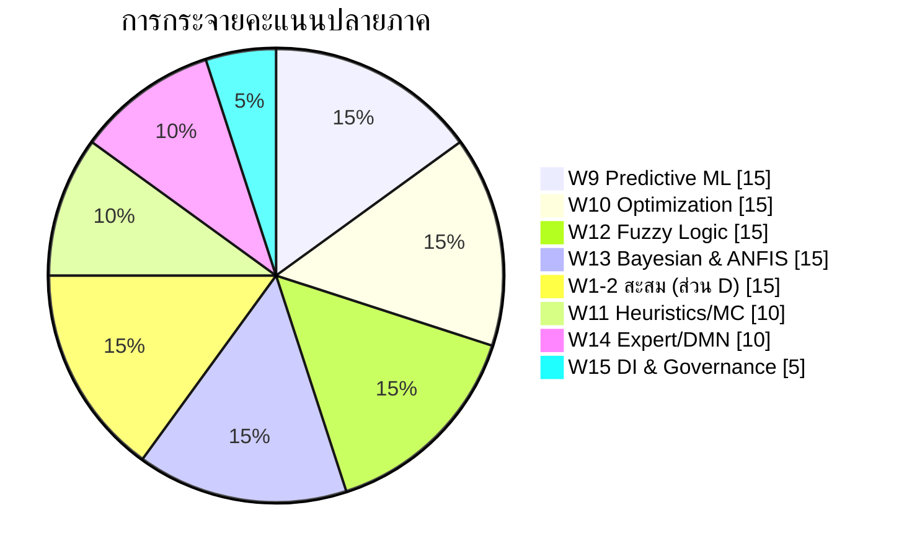

# 🧪 Blueprint สอบปลายภาค (30 คะแนน)

| รายการ | รายละเอียด |
|---|---|
| ขอบเขต | สัปดาห์ที่ 9–15 เป็นหลัก + แนวคิดแกนจาก W1–W2 ประมาณ 15% |
| น้ำหนัก | 30% ของคะแนนรวม |
| เวลา | 180 นาที |
| CLO | CLO4, CLO5, CLO6 (และ CLO1 บางส่วน) |
| อุปกรณ์ | เครื่องคิดเลข + กระดาษสรุป A4 **สองหน้า** เขียนด้วยลายมือ |

## 1. โครงสร้างข้อสอบ

| ส่วน | รูปแบบ | จำนวนข้อ | คะแนน | เวลาแนะนำ | ระดับ Bloom |
|:--:|---|:--:|:--:|:--:|---|
| **A** | ปรนัย 4 ตัวเลือก | 20 | 5 | 20 นาที | Remember / Understand |
| **B** | อัตนัยสั้น / เปรียบเทียบเทคนิค | 5 | 8 | 40 นาที | Understand / Analyze |
| **C** | โจทย์คำนวณ | 3 | 9 | 50 นาที | Apply |
| **D** | กรณีศึกษาบูรณาการ (เลือก 1 จาก 2) | 1 | 8 | 70 นาที | Analyze / Create / Evaluate |
| | **รวม** | **29** | **30** | **180 นาที** | |

## 2. การกระจายน้ำหนักตามสัปดาห์

| สัปดาห์ | หัวข้อ | คะแนน | สัดส่วน |
|:--:|---|:--:|:--:|
| W1–W2 (สะสม) | สถาปัตยกรรมและกรอบการตัดสินใจ (ใช้เป็นโครงของส่วน D) | 4.5 | 15% |
| W9 | Predictive Modeling ด้วย ML | 4.5 | 15% |
| W10 | Optimization / LP / Sensitivity | 4.5 | 15% |
| W11 | Heuristics, GA, Monte Carlo | 3.0 | 10% |
| W12 | Fuzzy Logic & FIS | 4.5 | 15% |
| W13 | Bayesian Networks & ANFIS | 4.5 | 15% |
| W14 | Expert Systems, BRMS, DMN | 3.0 | 10% |
| W15 | Decision Intelligence, Agentic AI, Governance | 1.5 | 5% |
| | **รวม** | **30** | **100%** |

> [!note] เหตุใดจึงมีเนื้อหาสะสม 15%
> ส่วน D บังคับให้ใช้ [[DSS-Architecture-Subsystems]] และ [[Simon-Decision-Phases]] เป็นโครงของคำตอบ เพราะการออกแบบ DSS ที่ดีต้องอ้างอิงสถาปัตยกรรม ไม่ใช่แค่เรียงเทคนิคต่อกัน

## 3. รายละเอียดรายส่วน

### ส่วน A — ปรนัย (20 ข้อ × 0.25 = 5 คะแนน)
กระจาย: W9×4, W10×3, W11×2, W12×3, W13×3, W14×3, W15×2

### ส่วน B — อัตนัยสั้น (5 ข้อ × 1.6 = 8 คะแนน)
เลือก 5 หัวข้อจากรายการ
1. อธิบายความต่างระหว่างการวิเคราะห์เชิงพยากรณ์กับเชิงให้คำแนะนำ พร้อมยกตัวอย่างระบบที่ใช้ทั้งคู่ต่อกัน
2. **อธิบายความต่างระหว่างความคลุมเครือ (Fuzzy) กับความน่าจะเป็น (Probability)** พร้อมตัวอย่างที่ชัดเจน ← ข้อที่ออกบ่อยที่สุด
3. เปรียบเทียบ Forward Chaining กับ Backward Chaining พร้อมระบุสถานการณ์ที่เหมาะกับแต่ละแบบ
4. อธิบายปัญหา Rule Explosion และวิธีที่ DMN/BRMS บรรเทาปัญหานี้
5. เติมและอธิบายตารางเปรียบเทียบ BI / AI-ML / Decision Intelligence ทั้ง 4 มิติ
6. อธิบายสถาปัตยกรรม 5 ชั้นของ ANFIS และเหตุผลที่ต้องผสาน Fuzzy กับ Neural Network
7. อธิบายว่าเมื่อใดควรใช้ exact optimization, heuristic หรือ simulation
8. อธิบายความต่างระหว่าง MLOps กับ DecisionOps
9. อธิบายว่าเหตุใดความอธิบายได้ (Explainability) จึงเป็นข้อกำหนดขั้นต่ำในระบบ CDSS

### ส่วน C — โจทย์คำนวณ (3 ข้อ × 3 = 9 คะแนน)
**ข้อ C1 บังคับ: Linear Programming** — กำหนดสูตรจากโจทย์ธุรกิจ + แก้ด้วยวิธีกราฟ 2 ตัวแปร + ตีความ shadow price ([[Linear-Programming]], [[Sensitivity-Analysis]])

อีก 2 ข้อเลือกจาก:
| ประเภท | สิ่งที่ต้องทำ | อ้างอิง |
|---|---|---|
| C2 | Fuzzification → ประเมินกฎ → Defuzzification ด้วย centroid | [[Fuzzy-Inference-System]] |
| C3 | คำนวณ posterior จาก CPT ของ Bayesian Network | [[Bayesian-Networks]] |
| C4 | คำนวณ RMSE/MAE หรือ Precision/Recall/F1 พร้อมเลือกโมเดล | [[Model-Evaluation-Metrics]] |
| C5 | ตีความผลลัพธ์ Monte Carlo (histogram + เปอร์เซ็นไทล์) เป็นข้อเสนอเชิงตัดสินใจ | [[Monte-Carlo-Simulation]] |
| C6 | เขียน Decision Table จากนโยบายที่เป็นข้อความ พร้อมเลือก hit policy และตรวจหาความขัดแย้งของกฎ | [[DMN-Decision-Model-and-Notation]] |

### ส่วน D — กรณีศึกษาบูรณาการ (เลือก 1 จาก 2 ข้อ × 8 คะแนน)

**ตัวเลือกที่ 1 — สายอุตสาหกรรม/บริการ** (เช่น โรงพยาบาล ธนาคาร ห่วงโซ่อุปทาน)
**ตัวเลือกที่ 2 — สายภาครัฐ/เมืองอัจฉริยะ**

ทั้งสองตัวเลือกใช้เกณฑ์เดียวกัน:

| เกณฑ์ | คะแนน | ระดับเต็ม |
|---|:--:|---|
| **Decision Framing** — ระบุผู้ตัดสินใจ ขอบเขตการตัดสินใจ ความถี่ และตัวชี้วัดความสำเร็จ | 1.5 | ชัดเจน เฉพาะเจาะจง วัดผลได้จริง |
| **สถาปัตยกรรม** — แมปเข้าระบบย่อย 4 ส่วน หรือ 4 ชั้นของ DI | 1.5 | ครบทุกชั้นพร้อมเทคโนโลยีที่เลือกและเหตุผล |
| **การเลือกเทคนิคเชิงตัวแบบ** — ML / Optimization / Fuzzy / Bayesian / Rules | 2.0 | เลือกอย่างน้อย 2 เทคนิคที่ทำงานร่วมกัน พร้อมเหตุผลว่าเหตุใดจึงไม่ใช้ทางเลือกที่ง่ายกว่า |
| **การจัดการความไม่แน่นอนและข้อมูลไม่สมบูรณ์** | 1.0 | ระบุกลไกที่เป็นรูปธรรม ไม่ใช่แค่บอกว่า "ทำความสะอาดข้อมูล" |
| **การประเมินผลและวงจรป้อนกลับ** | 1.0 | ระบุเมตริกทั้งของโมเดลและของผลลัพธ์ทางธุรกิจ พร้อมกลไกตรวจจับ model drift |
| **จริยธรรม การกำกับดูแล และระดับ human-in-the-loop** | 1.0 | วิเคราะห์ความเสี่ยงเฉพาะบริบทและกำหนดเกณฑ์ที่ระบบต้องหยุดถามมนุษย์ |

> [!tip] โครงคำตอบที่แนะนำสำหรับส่วน D
> 1) กรอบการตัดสินใจ → 2) สถาปัตยกรรม 4 ชั้น (วาดแผนภาพ) → 3) เทคนิคที่เลือกในแต่ละชั้นพร้อมเหตุผลเปรียบเทียบ → 4) การจัดการความไม่แน่นอน → 5) การวัดผลและป้อนกลับ → 6) ความเสี่ยงและการกำกับดูแล

## 4. การเชื่อมโยงกับ CLO

| ส่วน | CLO1 | CLO4 | CLO5 | CLO6 |
|:--:|:--:|:--:|:--:|:--:|
| A | ○ | ● | ● | ○ |
| B | | ● | ● | ● |
| C | | ● | ● | |
| D | ● | ● | ● | ● |

---
**ที่เกี่ยวข้อง:** [[Question-Bank]] · [[Midterm-Exam-Blueprint]] · [[Assessment-and-Grading]] · [[Week-16-Project-Presentation]]
