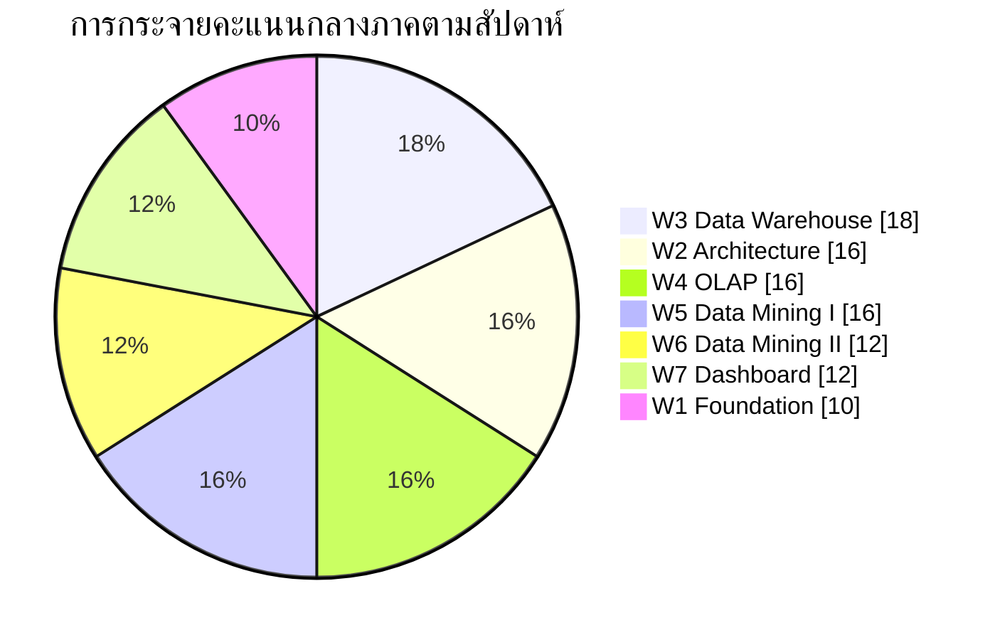

# 🧪 Blueprint สอบกลางภาค (25 คะแนน)

| รายการ | รายละเอียด |
|---|---|
| ขอบเขต | สัปดาห์ที่ 1–7 |
| น้ำหนัก | 25% ของคะแนนรวม |
| เวลา | 150 นาที |
| CLO | CLO1, CLO2, CLO3 |
| อุปกรณ์ | เครื่องคิดเลข + กระดาษสรุป A4 หน้าเดียวเขียนด้วยลายมือ |

## 1. โครงสร้างข้อสอบ

| ส่วน | รูปแบบ | จำนวนข้อ | คะแนน | เวลาแนะนำ | ระดับ Bloom |
|:--:|---|:--:|:--:|:--:|---|
| **A** | ปรนัย 4 ตัวเลือก | 20 | 5 | 20 นาที | Remember / Understand |
| **B** | อัตนัยสั้น (5–8 บรรทัด) | 4 | 8 | 40 นาที | Understand / Analyze |
| **C** | โจทย์คำนวณและวิเคราะห์ | 2 | 6 | 40 นาที | Apply / Analyze |
| **D** | กรณีศึกษาออกแบบระบบ | 1 | 6 | 50 นาที | Analyze / Create |
| | **รวม** | **27** | **25** | **150 นาที** | |

## 2. การกระจายน้ำหนักตามสัปดาห์

| สัปดาห์ | หัวข้อ | คะแนน | สัดส่วน |
|:--:|---|:--:|:--:|
| W1 | การตัดสินใจและบทบาท DSS | 2.5 | 10% |
| W2 | สถาปัตยกรรมและระบบย่อย | 4.0 | 16% |
| W3 | Data Warehouse & ETL | 4.5 | 18% |
| W4 | OLAP | 4.0 | 16% |
| W5 | Data Mining I: CRISP-DM & Classification | 4.0 | 16% |
| W6 | Data Mining II: Clustering & Rules | 3.0 | 12% |
| W7 | Dashboard & Semantic Layer | 3.0 | 12% |
| | **รวม** | **25** | **100%** |

## 3. รายละเอียดรายส่วน

### ส่วน A — ปรนัย (20 ข้อ × 0.25 = 5 คะแนน)
กระจายตามสัปดาห์: W1×3, W2×4, W3×3, W4×3, W5×3, W6×2, W7×2
- เน้นนิยาม การจำแนกประเภท และการจับคู่แนวคิดกับตัวอย่าง
- ไม่มีข้อลวงที่อาศัยการจำตัวเลขโดยไม่มีความหมาย

### ส่วน B — อัตนัยสั้น (4 ข้อ × 2 = 8 คะแนน)
ข้อสอบจะเลือกมา 4 หัวข้อจากรายการต่อไปนี้
1. เปรียบเทียบ OLTP กับ Data Warehouse ครบ 4 มิติ พร้อมอธิบายว่าเหตุใดจึงต้องแยกระบบ
2. เปรียบเทียบ OLAP กับ Data Mining ในแง่วิธีการค้นหาความรู้ พร้อมยกตัวอย่างคำถามที่แต่ละเทคนิคตอบได้ดีกว่า
3. อธิบายระบบย่อย 4 ส่วนของ DSS และผลกระทบเมื่อขาดระบบย่อยใดระบบย่อยหนึ่ง
4. อธิบายว่าเหตุใด Accuracy จึงเป็นเมตริกที่หลอกลวงในปัญหาข้อมูลไม่สมดุล พร้อมเสนอเมตริกทดแทน
5. อธิบายบทบาทของ Metadata, Data Lineage และ Semantic Layer ต่อความน่าเชื่อถือของ Dashboard
6. อธิบายแนวคิด Bounded Rationality และความเกี่ยวข้องกับการออกแบบ DSS
7. วิจารณ์ Dashboard ที่กำหนดให้ (แนบภาพ) และเสนอการปรับปรุง 3 ข้อพร้อมเหตุผลเชิงหลักการ

### ส่วน C — โจทย์คำนวณ (2 ข้อ × 3 = 6 คะแนน)
ข้อสอบจะเลือก 2 ข้อจากประเภทต่อไปนี้
| ประเภท | สิ่งที่ต้องทำ | อ้างอิง |
|---|---|---|
| C1 | ออกแบบ Star Schema จากความต้องการธุรกิจ (ระบุ fact, dimensions, granularity, measures) | [[Star-and-Snowflake-Schema]] |
| C2 | ตอบผลลัพธ์ของ roll-up / drill-down / slice / dice จากตารางลูกบาศก์ที่ให้มา | [[OLAP]] |
| C3 | คำนวณ Entropy และ Information Gain เพื่อเลือกโหนดแตกกิ่ง | [[Classification]] |
| C4 | คำนวณ Precision / Recall / F1 / Accuracy จาก Confusion Matrix พร้อมเลือกเมตริกที่เหมาะกับบริบท | [[Model-Evaluation-Metrics]] |
| C5 | คำนวณ Support / Confidence / Lift จากตารางธุรกรรม พร้อมตีความ | [[Association-Rules]] |
| C6 | เดินการวนรอบ K-Means 2 รอบจากจุดที่กำหนดให้ | [[Clustering]] |

### ส่วน D — กรณีศึกษาออกแบบระบบ (1 ข้อ × 6 คะแนน)
โจทย์จะให้บริบทองค์กรจริง (เช่น โรงพยาบาล ธนาคาร ค้าปลีก หรือหน่วยงานราชการ) แล้วให้ออกแบบ DSS

**เกณฑ์การให้คะแนน (Rubric ส่วน D):**

| เกณฑ์ | คะแนน | ระดับเต็ม |
|---|:--:|---|
| จำแนกโครงสร้างปัญหาและระบุระยะของ Simon ที่เกี่ยวข้อง | 1.0 | ระบุถูกต้องพร้อมให้เหตุผลจากบริบทในโจทย์ |
| ออกแบบชั้นข้อมูล (แหล่งข้อมูล, ETL, schema) | 1.5 | ระบุแหล่งข้อมูลครบ พร้อม fact/dimension ที่สมเหตุสมผล |
| เลือกเทคนิควิเคราะห์พร้อมเหตุผล | 1.5 | เลือกเหมาะสมและอธิบายว่าเหตุใดจึงไม่เลือกทางเลือกอื่น |
| ออกแบบส่วนนำเสนอผลและตัวชี้วัด | 1.0 | ตัวชี้วัดสอดคล้องกับการตัดสินใจจริง ไม่ใช่ตัวเลขทั่วไป |
| ระบุข้อจำกัด ความเสี่ยง และประเด็นคุณภาพข้อมูล | 1.0 | ระบุได้อย่างน้อย 3 ประเด็นที่เฉพาะเจาะจงกับบริบท |

## 4. หลักการออกข้อสอบ
- **ไม่มีข้อสอบที่ตอบได้ด้วยการท่องจำเพียงอย่างเดียวเกิน 20%** (เฉพาะส่วน A บางข้อ)
- ทุกโจทย์คำนวณต้องมีคำถามต่อท้ายว่า "แล้วผลลัพธ์นี้หมายความว่าอย่างไรต่อการตัดสินใจ"
- ส่วน D วัดความสามารถบูรณาการ ซึ่งเป็นแก่นของรายวิชา จึงมีน้ำหนักสูงสุดต่อข้อ

## 5. การเชื่อมโยงกับ CLO

| ส่วน | CLO1 | CLO2 | CLO3 |
|:--:|:--:|:--:|:--:|
| A | ● | ● | ○ |
| B | ● | ● | ● |
| C | | ● | |
| D | ● | ● | ● |

---
**ที่เกี่ยวข้อง:** [[Week-08-Midterm-Exam]] · [[Question-Bank]] · [[Assessment-and-Grading]] · [[Final-Exam-Blueprint]]
