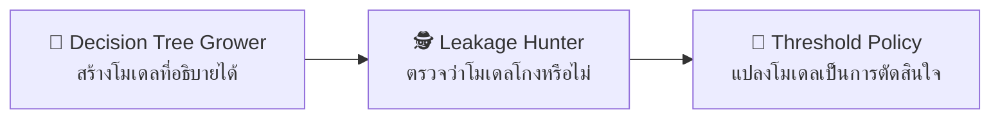

# 🤖 สื่อจำลองและ Lab สัปดาห์ที่ 5

สื่อจำลอง 3 ตัว + Lab บน Google Colab 3 ชุด ที่ใช้ **ไฟล์ CSV เดียวกัน**
ตัวเลขบนหน้าจอกับตัวเลขที่ได้จาก pandas จึงตรงกันทุกหลัก — ใช้เป็นเกณฑ์ตรวจงานได้ทันที

ชุดนี้ต่อยอดจากสัปดาห์ที่ 4 ที่ถามว่า *"ตัวเลขที่ถูกต้องยังตีความผิดได้อย่างไร"*
มาสู่คำถามของ Data Mining — **"โมเดลที่ตัวเลขสวย ยังใช้งานจริงไม่ได้เพราะอะไร"**

| สื่อจำลอง | Lab บน Colab | ชุดข้อมูล |
|---|---|---|
| 🎯 [Threshold Policy Studio](http://localhost:3000/sims/threshold-policy) | `Lab-W5-1-Threshold-Policy.ipynb` | `fraud_scored.csv` (20,000 ธุรกรรม) |
| 🕵️ [Leakage Hunter](http://localhost:3000/sims/leakage-hunter) | `Lab-W5-2-Leakage-Hunter.ipynb` | `loan_leaky.csv` (12,000 คำขอสินเชื่อ) |
| 🌳 [Decision Tree Grower](http://localhost:3000/sims/tree-grower) | `Lab-W5-3-Decision-Tree.ipynb` | `churn.csv` (3,000 ลูกค้า) |

**ที่อยู่ไฟล์**
- ชุดข้อมูล: [`datasets/week05/`](../datasets/week05) — สร้างด้วย [`datasets/generate_datasets.py`](../datasets/generate_datasets.py)
- Notebook: [`labs/week05/`](../labs/week05) — ฉบับนักศึกษาและฉบับเฉลย (`-solution.ipynb`)
- ต้นฉบับ notebook: [`labs/src/week05/`](../labs/src/week05) แก้ที่นี่แล้วรัน `python labs/build_notebooks.py`
- ตรรกะกลางที่สื่อจำลองใช้: [`web/lib/ml.ts`](../web/lib/ml.ts) — เขียนด้วยอัลกอริทึมเดียวกับใน Colab
  จึงให้ตัวเลขตรงกันทุกทศนิยม

---

## 🎯 1. Threshold Policy Studio

**แก้ความเข้าใจผิด:** เลือกโมเดลและ threshold จากค่า accuracy สูงสุดเสมอ

โมเดลตรวจจับการทุจริตเสร็จแล้วและทำงานได้ดี (**AUC 0.9915**)
งานที่เหลือคือสิ่งที่ยากกว่า — **ต้องขีดเส้นที่ค่าเท่าไรจึงจะเรียกว่า "น่าสงสัย"**

**เงื่อนไขของโจทย์:** ทุจริตจริง 333 จาก 20,000 รายการ (1.67%) ·
ต้นทุน FN 8,000 บาท · FP 300 บาท (ไม่สมมาตร **26.7 เท่า**) · เพดานตรวจสอบ 7,200 เคส

### เฉลย (ตรวจแล้วด้วย pandas และตรงกับสื่อจำลองทุกหลัก)

| เกณฑ์ที่ใช้เลือก | threshold | Accuracy | Recall | เคสที่ต้องตรวจ | ต้นทุนรวม |
|---|:--:|---:|---:|---:|---:|
| ไม่ทำอะไรเลย (ทายว่าไม่ทุจริตทุกรายการ) | 1.00 | **98.33%** | 0.00% | 0 | 2,664,000 |
| Accuracy สูงสุด | 0.57 | 99.48% | 78.08% | 291 | 593,300 |
| F1 สูงสุด | 0.55 | 99.48% | 81.68% | 316 | 501,200 |
| **ต้นทุนรวมต่ำสุด ✅** | **0.42** | 97.96% | **93.69%** | 700 | **284,400** |

> [!important] ประเด็นหลัก
> **กับดัก Accuracy** — การทายว่า "ไม่ทุจริต" ทุกรายการได้ accuracy 98.33% ทันที
> โดยไม่ต้องมีโมเดลเลย และผ่านเกณฑ์ 95% ที่หลายองค์กรตั้งไว้ได้สบาย
>
> **กับดัก F1** — F1 ถ่วงน้ำหนัก precision กับ recall เท่ากัน ซึ่งคือการสมมติว่า
> FP กับ FN แพงเท่ากัน แต่ในโจทย์นี้ต่างกัน 26.7 เท่า
>
> เลือกตาม accuracy เสียเพิ่ม **308,900 บาท** · เลือกตาม F1 เสียเพิ่ม **216,800 บาท**

### สิ่งที่ Lab บังคับให้ค้นพบเพิ่ม

**เพดานกำลังคนไม่ใช่ข้อจำกัดที่ผูกมัด** — จุดที่ดีที่สุดใช้เพียง 700 เคส จากเพดาน 7,200
นักศึกษาส่วนใหญ่คาดว่าคนไม่พอจะเป็นตัวบีบ ความจริงคือ **เศรษฐศาสตร์บีบก่อน**
(การไล่ recall ให้ถึง 100% ต้องใช้ t ≤ 0.16 → 7,959 เคส เกินเพดาน 759 เคส และต้นทุนพุ่งเป็น 2,287,800 บาท)

**การวิเคราะห์ความไว** — เมื่ออัตราส่วนต้นทุน FN:FP เปลี่ยนจาก 1 เป็น 100 เท่า
threshold ที่ดีที่สุดเลื่อนจาก 0.57 ลงมา 0.36 อย่างเป็นระบบ
ทิศทางของคำตอบไม่เปลี่ยนแม้ตัวเลขต้นทุนจะคลาดเคลื่อนไปหลายเท่า

**นโยบายสามระดับ** — เมื่อเพิ่มสมมติฐานว่าคนตรวจพลาด 15% และการระงับทันทีมีต้นทุน 800 บาท
คำตอบที่ดีที่สุดคือ `t_low = 0.42` · `t_high = 0.55` (ส่งตรวจ 384 เคส · ระงับทันที 316 เคส)
ประหยัดกว่านโยบาย threshold เดียว **168,400 บาท** — จุดคุ้มทุนอยู่ที่ precision 41.67%

---

## 🕵️ 2. Leakage Hunter

**แก้ความเข้าใจผิด:** คิดว่าโมเดลที่แม่นบนชุดทดสอบคือโมเดลที่ใช้งานได้จริง

ตารางคำขอสินเชื่อ 12,000 รายการถูกดึงจากระบบปฏิบัติการ **ณ วันนี้**
จึงมีคอลัมน์ที่บันทึกเหตุการณ์ซึ่งเกิดขึ้น **หลัง** การอนุมัติปนอยู่ด้วย

### เฉลย — ผลของทั้ง 4 กรณี

| ตัวแปรที่ใช้ | การแบ่งข้อมูล | AUC ฝึก | AUC ทดสอบ | ทำนายผิดนัด | เกิดขึ้นจริง |
|---|---|---:|---:|---:|---:|
| ถูกต้องตามเวลา | สุ่ม | 0.6788 | 0.6925 | 9.37% | 9.53% |
| ถูกต้องตามเวลา | **ตามเวลา** | 0.6824 | 0.6864 | **8.10%** | **12.03%** |
| มีตัวแปรรั่ว | สุ่ม | 1.0000 | 1.0000 | 9.94% | 9.53% |
| มีตัวแปรรั่ว | ตามเวลา | 1.0000 | 1.0000 | 12.42% | 12.03% |

### AUC ของตัวแปรเดี่ยว — เครื่องมือตรวจการรั่วที่ไม่ต้องฝึกโมเดล

| ตัวแปร | AUC เดี่ยว | สถานะ |
|---|---:|---|
| `collection_calls` | **1.0000** | 🚨 รั่ว — เกิดหลังอนุมัติ |
| `days_since_last_payment` | **1.0000** | 🚨 รั่ว — ต้องมีการชำระก่อน |
| `status_bad` | **1.0000** | 🚨 รั่ว — แทบเป็นคำตอบโดยตรง |
| `debt_ratio_at_application` | 0.6288 | ✓ ใช้ได้ |
| `prev_loans_at_application` | 0.5851 | ✓ ใช้ได้ |
| `credit_history_months_at_application` | 0.4187 | ✓ ใช้ได้ |
| `income_at_application` | 0.4571 | ✓ ใช้ได้ |
| `loan_amount_at_application` | 0.5385 | ✓ ใช้ได้ |
| `age_at_application` | 0.4988 | ✓ ใช้ได้ |

> [!important] ประเด็นหลักสองข้อที่ต้องแยกให้ออก
> **ข้อที่ 1 — การแบ่งตามเวลาไม่ได้ช่วยตรวจการรั่ว** AUC ยังเป็น 1.0000 ทั้งสองแบบ
> เพราะตัวแปรที่รั่วก็รั่วอยู่ทั้งในชุดฝึกและชุดทดสอบเท่ากัน
> สิ่งที่ตรวจการรั่วได้คือ **คำถามเชิงเวลา** — "ณ วินาทีที่ต้องตัดสินใจ ค่านี้มีอยู่แล้วหรือยัง"
>
> **ข้อที่ 2 — สิ่งที่การแบ่งตามเวลาเปิดเผยคือ calibration** AUC ของทั้งสองแบบแทบเท่ากัน
> (0.6925 กับ 0.6864) แต่การแบ่งแบบสุ่มบอกว่าโมเดลสอบเทียบดีมาก (ห่างกันไม่ถึงครึ่งจุด)
> ส่วนการแบ่งตามเวลาเปิดเผยว่าโมเดล **ประเมินความเสี่ยงต่ำกว่าจริง 3.92 จุด หรือ 48%**

### ต้นตอคือ population drift

| ช่วงเวลา | จำนวนคำขอ | อัตราผิดนัด |
|---|---:|---:|
| 2023-H1 | 2,158 | 6.58% |
| 2023-H2 | 2,291 | 6.90% |
| 2024-H1 | 2,114 | 8.85% |
| 2024-H2 | 2,229 | 11.13% |
| 2025-H1 | 2,171 | **12.30%** |

อัตราผิดนัดเพิ่มขึ้น **87% เชิงสัมพัทธ์** ตลอด 3 ปี โมเดลจึงเรียนรู้ค่าคงที่จากอดีตที่ต่ำกว่าปัจจุบัน
และประเมินความเสี่ยง **ต่ำกว่าจริงเสมอ** ไม่ใช่บางครั้ง — ความคลาดเคลื่อนเอนไปทางเดียว จึงสะสมเป็นความเสียหายจริง

> [!warning] สิ่งที่ Lab เพิ่มเข้ามาและสำคัญมาก
> `cross_val_score` แบบ 5-fold ธรรมดา **ตรวจไม่พบทั้งสองปัญหา** —
> ทุก fold มีตัวแปรที่รั่วเหมือนกันหมด และ KFold สุ่มแบ่งโดยไม่สนใจเวลา
> จำนวน fold ที่มากขึ้นไม่ได้แปลว่าเชื่อถือได้มากขึ้น ถ้าโครงสร้างของการแบ่ง
> ไม่ตรงกับวิธีที่โมเดลจะถูกใช้จริง — ข้อมูลที่มีมิติเวลาต้องใช้ `TimeSeriesSplit` เสมอ

---

## 🌳 3. Decision Tree Grower

**แก้ความเข้าใจผิด:** เลือกตัวแปรจากความรู้สึกว่าน่าจะสำคัญ แทนที่จะวัดด้วยหลักฐาน

ผู้เรียนปลูกต้นไม้ตัดสินใจด้วยมือทีละคำถาม โดยระบบ **ยังไม่บอกว่าอันไหนดีที่สุด**
จนกว่าจะกดเปิดเฉลย

**ข้อมูล:** ลูกค้าโทรคมนาคม 3,000 ราย · เลิกใช้บริการ 971 ราย (32.37%) · entropy ที่ราก **0.9083**

### เฉลย — Information Gain ของทุกเงื่อนไขที่ราก

| เงื่อนไข | Gain | ซ้าย (n / อัตรา) | ขวา (n / อัตรา) |
|---|---:|---|---|
| **ประเภทสัญญา = รายเดือน** ✅ | **0.1763** | 1,577 / 53.39% | 1,423 / 9.07% |
| ประเภทสัญญา = 2 ปี | 0.0777 | 620 / 5.48% | 2,380 / 39.37% |
| อายุการใช้งาน ≤ 24 เดือน | 0.0279 | 985 / 45.69% | 2,015 / 25.86% |
| อายุการใช้งาน ≤ 36 เดือน | 0.0277 | 1,502 / 41.48% | 1,498 / 23.23% |
| อายุการใช้งาน ≤ 12 เดือน | 0.0161 | 495 / 48.48% | 2,505 / 29.18% |
| แจ้งปัญหา ≥ 2 ครั้ง | 0.0114 | 1,131 / 39.96% | 1,869 / 27.77% |
| ไม่ตัดบัญชีอัตโนมัติ | 0.0096 | 1,354 / 38.33% | 1,646 / 27.46% |
| ค่าบริการ > 1,000 บาท | 0.0091 | 1,358 / 38.14% | 1,642 / 27.59% |
| แจ้งปัญหา ≥ 3 ครั้ง | 0.0059 | 677 / 40.32% | 2,323 / 30.05% |
| อินเทอร์เน็ต = ไฟเบอร์ | 0.0055 | 1,326 / 36.95% | 1,674 / 28.73% |
| ใบแจ้งหนี้อิเล็กทรอนิกส์ | **0.0003** | 1,822 / 33.10% | 1,178 / 31.24% |

> [!important] ประเด็นหลัก
> อันดับ 1 ให้ Gain มากกว่าอันดับ 2 ถึง **2.3 เท่า** และมากกว่า "ค่าบริการสูง" ที่นักศึกษาชอบเดา
> ถึง **19 เท่า**
>
> ส่วน "ใบแจ้งหนี้อิเล็กทรอนิกส์" ให้ Gain เพียง 0.0003 ซึ่งแทบเป็นศูนย์ —
> **ตัวแปรที่ไร้ประโยชน์มีอยู่จริง** การใส่ตัวแปรให้มากที่สุดจึงไม่ใช่กลยุทธ์
>
> **ความรู้สึกว่าตัวแปรใดสำคัญ ไม่ใช่หลักฐาน · Information Gain คือหลักฐาน และมันวัดได้**

### ต้นไม้สองชั้นที่ได้

ทั้งสองกิ่งเลือก **อายุการใช้งาน ≤ 24 เดือน** เป็นคำถามที่สอง (Gain 0.0549 และ 0.0172)

| ใบ | จำนวน | อัตราเลิกใช้ |
|---|---:|---:|
| รายเดือน + ใช้ไม่ถึง 24 เดือน | 518 | **72.78%** |
| รายเดือน + ใช้เกิน 24 เดือน | 1,059 | 43.91% |
| ไม่ใช่รายเดือน + ใช้ไม่ถึง 24 เดือน | 467 | 15.63% |
| ไม่ใช่รายเดือน + ใช้เกิน 24 เดือน | 956 | 5.86% |

ความแม่นของต้นไม้ **75.50%** เทียบกับการทายเสียงข้างมากที่ 67.63% — ดีขึ้นเพียง 7.87 จุด

### กับดักที่ Lab บังคับให้เจอ

เมื่อคำนวณความคุ้มค่าของแคมเปญ (ต้นทุน 200 บาท/ราย · รักษาได้ 1 ราย = 3,000 บาท · แคมเปญได้ผล 30%)

| แนวทาง | ติดต่อ | กำไรสุทธิ | ROI |
|---|---:|---:|---:|
| เจาะเฉพาะใบที่เสี่ยงที่สุด | 518 ราย | 235,700 | **+227.5%** |
| หว่านทั้งหมด | 3,000 ราย | **273,900** | +45.6% |

> [!warning] คำตอบไม่ใช่อย่างที่นักศึกษาคาด
> **การหว่านทั้งหมดได้กำไรรวมมากกว่า** เพราะแคมเปญมี ROI เป็นบวกกับทุกกลุ่ม
> โมเดลจะสร้างมูลค่าก็ต่อเมื่อมี **ข้อจำกัด** อยู่จริง
>
> ภายใต้งบเท่ากันที่ 103,600 บาท (ติดต่อได้ 518 ราย)
> เจาะกลุ่มเสี่ยงได้กำไร 235,700 บาท ส่วนการหว่านแบบสุ่มได้เพียง 47,293 บาท
> → **โมเดลสร้างมูลค่าเพิ่ม 188,407 บาท** เมื่อมีงบจำกัด
>
> ตัววัดที่ควรรายงานผู้บริหารจึงไม่ใช่ accuracy แต่คือ **กำไรสุทธิภายใต้งบที่มีจริง**

### Overfitting วัดได้ด้วยตัวเลข

| ความลึก | ชุดฝึก | ชุดทดสอบ | ช่องว่าง | จำนวนใบ |
|:--:|---:|---:|---:|---:|
| 2 | 75.71% | 77.11% | −1.40 | 4 |
| **4** | 77.86% | **77.89%** ✅ | −0.03 | 16 |
| 8 | 84.76% | 75.44% | 9.32 | 127 |
| 12 | 92.86% | 72.67% | 20.19 | 302 |
| 20 | **99.38%** | 70.89% | **28.49** | 476 |

ช่องว่างระหว่างสองคอลัมน์คือมาตรวัด overfitting ที่ตรงไปตรงมาที่สุด —
และเป็นสะพานเข้าสู่ ensemble ในสัปดาห์ที่ 6

---

## 🧑‍💻 การใช้งานบน Google Colab

```python
BASE = "https://raw.githubusercontent.com/babankbro/ksu-dss-course/master/datasets/week05/"
df = pd.read_csv(BASE + "fraud_scored.csv")
```

**ฉบับนักศึกษา** (`.ipynb`) มีคำสั่งงานพร้อมเซลล์ว่างให้เติม
**ฉบับผู้สอน** (`-solution.ipynb`) มีเฉลยครบ พร้อมผลลัพธ์ที่ควรได้

Lab W5-2 และ W5-3 ใช้ scikit-learn ซึ่ง Colab ติดตั้งมาให้แล้ว
ส่วน logistic regression ใน W5-2 เขียนเป็น gradient descent เองด้วย
เพื่อให้ผลตรงกับสื่อจำลองที่รันในเบราว์เซอร์ทุกทศนิยม

แก้เนื้อหา lab ที่ [`labs/src/week05/*.py`](../labs/src/week05) แล้วสร้างใหม่ด้วย

```bash
python labs/build_notebooks.py
```

## ลำดับการใช้ในคาบปฏิบัติการ 2 ชั่วโมง



ลำดับนี้เดินตามวงจรจริงของงาน Data Mining — **สร้าง → ตรวจสอบ → นำไปใช้**
และแต่ละขั้นมีกับดักคนละแบบที่สอนด้วยสไลด์ไม่ได้ผล

| เวลา | กิจกรรม |
|---|---|
| 0–25 นาที | Decision Tree Grower — ให้นักศึกษาเดาก่อนเปิดเฉลย ห้องจะเงียบเมื่อเห็นว่าเดาผิด |
| 25–50 นาที | Leakage Hunter — เริ่มด้วยเลือกทุกตัวแปร ให้ดีใจกับ AUC 1.00 ก่อน แล้วค่อยถามคำถามเดียว |
| 50–70 นาที | Threshold Policy — ให้หา "จุดที่ดีที่สุด" ก่อนเปิดเผยว่ามีต้นทุนกำกับอยู่ |
| 70–120 นาที | ทำ Lab บน Colab (ส่งเป็นการบ้านได้ถ้าเวลาไม่พอ) |

## คะแนนรวมของ Lab สัปดาห์ที่ 5

| Lab | คะแนน |
|---|:--:|
| W5-1 Threshold Policy | 20 |
| W5-2 Leakage Hunter | 20 |
| W5-3 Decision Tree | 20 |

---
**ที่เกี่ยวข้อง:** [[Simulation-Index]] · [[Week-05-Data-Mining-I]] · [[Sim-W4-OLAP-Analysis]] · [[Week-06-Data-Mining-II]]
