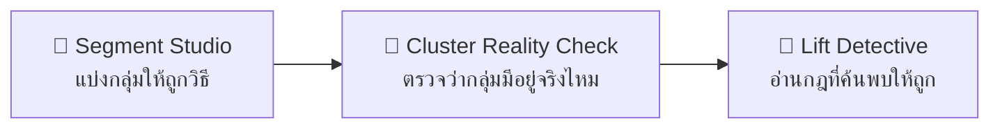

# 🧬 สื่อจำลองและ Lab สัปดาห์ที่ 6

สื่อจำลอง 3 ตัว + Lab บน Google Colab 3 ชุด ที่ใช้ **ไฟล์ CSV เดียวกัน**

ชุดนี้ต่อยอดจากสัปดาห์ที่ 5 ที่ถามว่า *"โมเดลที่ตัวเลขสวยยังใช้ไม่ได้เพราะอะไร"*
มาสู่คำถามที่ยากที่สุดของ unsupervised learning —
**"ไม่มีคำตอบที่ถูกต้องให้เทียบ แล้วจะรู้ได้อย่างไรว่าผลลัพธ์มีความหมาย"**

| สื่อจำลอง | Lab บน Colab | ชุดข้อมูล |
|---|---|---|
| 👥 [Segment Studio](http://localhost:3000/sims/segment-studio) | `Lab-W6-1-RFM-Segmentation.ipynb` | `customers_rfm.csv` (1,200 ลูกค้า) |
| 🧺 [Lift Detective](http://localhost:3000/sims/lift-detective) | `Lab-W6-2-Market-Basket.ipynb` | `baskets.csv` (5,000 ตะกร้า) |
| 🔬 [Cluster Reality Check](http://localhost:3000/sims/cluster-reality-check) | `Lab-W6-3-Cluster-Validation.ipynb` | `customers_rfm.csv` + `no_structure.csv` |

**ที่อยู่ไฟล์**
- ชุดข้อมูล: [`datasets/week06/`](../datasets/week06) — สร้างด้วย [`datasets/generate_datasets.py`](../datasets/generate_datasets.py)
- Notebook: [`labs/week06/`](../labs/week06) · ต้นฉบับ: [`labs/src/week06/`](../labs/src/week06)
- ตรรกะ K-Means และ silhouette ที่สื่อจำลองใช้: [`web/lib/ml.ts`](../web/lib/ml.ts)

> [!note] เรื่องการเทียบตัวเลขของสัปดาห์นี้
> สื่อจำลองใช้ K-Means ที่กำหนดค่าเริ่มต้นของ centroid แบบตายตัว ส่วน Lab ใช้ `KMeans`
> ของ scikit-learn ที่ใช้ k-means++ และรัน 10 รอบ
>
> **ค่าที่ตรงกันเสมอ:** silhouette ของแต่ละ k · ค่า k ที่ดีที่สุด · ขนาดและโปรไฟล์ของแต่ละกลุ่ม
> **ค่าที่ต่างในทศนิยมท้าย ๆ:** inertia — ความต่างนี้เองคือบทเรียนว่า K-Means ไวต่อค่าเริ่มต้น

---

## 👥 1. Segment Studio

**แก้ความเข้าใจผิด:** คิดว่าการปรับสเกลเป็นขั้นตอนเสริม และเลือกโมเดลจากคะแนน silhouette เพียงอย่างเดียว

### ช่วงของตัวแปรคือตัวชี้ขาด

| ตัวแปร | ต่ำสุด | สูงสุด | ช่วง |
|---|---:|---:|---:|
| `recency_days` | 3 | 419 | 416 |
| `frequency` | 1 | 48 | 47 |
| `monetary` | 481.91 | 209,471.63 | **208,990** |

ยอดเงินมีช่วงกว้างกว่าจำนวนครั้ง **4,447 เท่า** — ระยะทางแบบยุคลิดบวกกำลังสองของทุกแกนเข้าด้วยกัน
ความต่างของยอดเงินเพียง **1,000 บาท** จึงมีน้ำหนักมากกว่าความต่างของพฤติกรรมสูงสุด (47 ครั้ง) ถึง **21.3 เท่า**

### เฉลย — โปรไฟล์ที่ k = 4

**ไม่ปรับสเกล** (silhouette 0.6392)

| จำนวน | R เฉลี่ย | F เฉลี่ย | M เฉลี่ย |
|---:|---:|---:|---:|
| 540 | 213.4 | 6.1 | 6,859 |
| 316 | 61.3 | 16.1 | 35,548 |
| 188 | 68.6 | 23.8 | 97,850 |
| 156 | 95.9 | 17.8 | 165,179 |

→ ต่างกันแทบเฉพาะยอดเงิน ส่วน R และ F ปะปนกัน ผลที่ได้เทียบเท่า `pd.qcut(monetary, 4)`

**ปรับสเกลแล้ว** (silhouette 0.5847)

| จำนวน | R เฉลี่ย | F เฉลี่ย | M เฉลี่ย | ตีความ |
|---:|---:|---:|---:|---|
| 442 | 62.2 | 13.7 | 26,631 | 🛒 ลูกค้าประจำ |
| 388 | 274.6 | 3.0 | 4,835 | 😴 หลับใหล |
| 242 | 22.6 | 34.0 | 113,205 | 🏆 แชมเปี้ยน |
| 128 | 179.2 | 1.5 | 141,082 | 💎 ซื้อครั้งใหญ่ครั้งเดียว |

> [!important] ประเด็นหลัก
> กลุ่ม **ซื้อครั้งใหญ่ครั้งเดียว** (F = 1.5 · M = 141,082) มียอดเงินพอ ๆ กับแชมเปี้ยน
> แต่พฤติกรรมตรงข้ามกันสิ้นเชิง — สองกลุ่มนี้จะถูกยุบรวมกันทันทีถ้าไม่ปรับสเกล
> และนั่นคือกลุ่มที่มีมูลค่าทางการตลาดสูงที่สุดกลุ่มหนึ่ง

> [!warning] กับดักที่นักศึกษาเก่งที่สุดในห้องมักติด
> **ข้อมูลดิบให้ silhouette 0.6392 ซึ่งสูงกว่าข้อมูลที่ปรับสเกลแล้วที่ได้ 0.5847**
>
> ถ้าเลือกโมเดลด้วย silhouette เพียงอย่างเดียว จะได้โมเดลที่**ผิด**มาใช้งาน
> เพราะ silhouette คำนวณจากระยะทางในหน่วยของข้อมูลที่ป้อนเข้าไป **จึงเทียบข้ามการปรับสเกลไม่ได้**
>
> ตัววัดภายในทุกตัวใช้ได้เฉพาะการเทียบ k ภายใต้การเตรียมข้อมูลแบบเดียวกัน —
> การเลือกวิธีเตรียมข้อมูลต้องตัดสินด้วยเหตุผลเชิงโดเมน ไม่ใช่ด้วยคะแนน

### เส้นโค้งการเลือก k (ข้อมูลที่ปรับสเกลแล้ว)

| k | 2 | 3 | **4** | 5 | 6 | 7 | 8 |
|---|---:|---:|---:|---:|---:|---:|---:|
| silhouette | 0.4304 | 0.4863 | **0.5847** | 0.5500 | 0.5299 | 0.5357 | 0.5283 |

**Inertia ใช้เลือก k ตรง ๆ ไม่ได้** — มันลดลงเสมอเมื่อ k เพิ่ม และเป็นศูนย์พอดีเมื่อ k = 1,200

---

## 🧺 2. Lift Detective

**แก้ความเข้าใจผิด:** เชื่อว่า confidence สูงแปลว่ากฎมีค่า และคิดว่ากฎที่พบคือข้อสรุปที่นำไปทำได้เลย

**ข้อมูล:** 5,000 ตะกร้า · เฉลี่ย 3.35 ชิ้น/ตะกร้า · 14 ชนิดสินค้า · กฎที่ผ่าน min support 0.01 มี **180 กฎ**

### เฉลย — 10 อันดับแรกเมื่อเรียงตาม confidence

ทั้ง 10 กฎลงท้ายด้วย **ถุงพลาสติก** ซึ่งมี support เดี่ยว **0.8144** (อยู่ใน 81% ของทุกตะกร้า)
และ lift ของทั้ง 10 กฎอยู่ระหว่าง **0.98 ถึง 1.03** — คือใกล้ 1 ทั้งหมด บางกฎต่ำกว่า 1 ด้วยซ้ำ

| ถ้าซื้อ | ก็มักซื้อ | Confidence | Lift |
|---|---|---:|---:|
| บะหมี่กึ่งสำเร็จรูป | ถุงพลาสติก | 0.8381 | 1.0290 |
| นมสด | ถุงพลาสติก | 0.8374 | 1.0283 |
| ผ้าอ้อม | ถุงพลาสติก | 0.8110 | **0.9958** |

> [!important] ประเด็นหลัก
> confidence สูงเพราะถุงพลาสติกติดไปกับทุกตะกร้าอยู่แล้ว ไม่ว่าจะซื้ออะไรก็ตาม
> **การรู้ว่าลูกค้าซื้อ A ไม่ได้ช่วยให้ทำนายได้ดีขึ้นเลยแม้แต่นิดเดียว**
>
> `lift = confidence(A→B) ÷ support(B)` — ตัวหารคือสิ่งที่ confidence ลืมคิด

### กฎที่มีค่าจริง

| กฎ | Support | Confidence | Lift | อันดับเมื่อเรียงตาม confidence |
|---|---:|---:|---:|:--:|
| ผ้าอ้อม → ผ้าเช็ดทำความสะอาด | 0.0872 | 0.7044 | **5.0312** | อันดับที่ **14** |
| ผ้าอ้อม → เบียร์ | 0.0426 | 0.3441 | 1.9138 | — |

กฎที่มีค่าที่สุดไม่เคยติดสิบอันดับแรกของ confidence เพราะปลายทางไม่ใช่ของที่ใครก็หยิบ —
**กฎที่ดีที่สุดคือกฎที่การจัดอันดับแบบเดิมมองข้ามเสมอ**

### 🕳️ สิ่งที่ Apriori ถูกออกแบบมาให้มองไม่เห็น

กาแฟสด (support 0.2188) และชาเขียว (support 0.1798) — ถ้าเป็นอิสระต่อกันควรพบร่วมกันราว 197 ตะกร้า
แต่พบร่วมกันจริง **0 ตะกร้า** เพราะเป็นสินค้าทดแทนกัน

> [!warning] ประเด็นที่ตำราส่วนใหญ่ไม่พูดถึง
> Apriori ตัดทุกเซตที่ต่ำกว่า min_support ทิ้งตั้งแต่ขั้นแรกด้วยคุณสมบัติ anti-monotone
> **ความสัมพันธ์เชิงลบจึงหายไปทั้งหมดโดยไม่มีร่องรอย** — ไม่ได้แสดงเป็น lift ต่ำ แต่ไม่มีแถวนั้นเลย
>
> ทั้งที่มันมีค่าทางธุรกิจสูงมาก: ถ้าลดราคากาแฟ ยอดชาเขียวจะตกตามทันที
> การจัดโปรโมชันสองอย่างนี้พร้อมกันคือการแข่งกับตัวเอง
>
> **ตารางกฎที่ว่างเปล่าไม่ได้แปลว่าไม่มีความสัมพันธ์**
> มันอาจแปลว่ามีความสัมพันธ์ที่เครื่องมือนี้มองไม่เห็นตั้งแต่แรก

### กรณีศึกษาผ้าอ้อมกับเบียร์ — จะย้ายชั้นวางเลยไหม

**คำตอบ: ยังไม่ย้าย** — lift 1.91 บอกว่าเกิดร่วมกันบ่อยกว่าบังเอิญเกือบสองเท่า
แต่ไม่ได้บอกว่าอะไรทำให้อะไรเกิด

| คำอธิบายทางเลือก | ผลถ้าย้ายชั้นวาง |
|---|---|
| ก. พ่อที่มาซื้อผ้าอ้อมถือโอกาสซื้อเบียร์ (เหตุ → ผล) | ยอดขายเพิ่มจริง |
| ข. ครอบครัวมีลูกอ่อนจึงดื่มที่บ้าน (ตัวแปรร่วม = ช่วงชีวิต) | ไม่เพิ่มเลย |
| ค. ทั้งสองขายดีเย็นวันศุกร์เหมือนกัน (ตัวแปรร่วม = เวลา) | ไม่เพิ่มเลย |

**กฎความสัมพันธ์คือสมมติฐาน ไม่ใช่ข้อสรุป** — ต้องสุ่มเลือกสาขาครึ่งหนึ่งย้ายชั้นวาง
อีกครึ่งคงเดิม แล้ววัดส่วนต่าง 4 สัปดาห์ ก่อนตัดสินใจทั้งเครือ

---

## 🔬 3. Cluster Reality Check

**แก้ความเข้าใจผิด:** คิดว่าถ้าอัลกอริทึมรันผ่านและได้คะแนนพอใช้ แปลว่าผลลัพธ์มีความหมาย

ผู้เรียนเห็นผลการแบ่งกลุ่มของชุดข้อมูลสองชุดที่ผ่านการปรับสเกลเหมือนกัน
ใช้อัลกอริทึมเดียวกัน โค้ดบรรทัดเดียวกัน แล้วต้องเดาว่าชุดใดมีกลุ่มอยู่จริง
**ก่อน** ที่ระบบจะเฉลย

### เฉลย — สัญญาณสี่ข้อที่แยกทั้งสองชุดออกจากกัน

| สัญญาณ | ชุด A (ลูกค้าจริง) | ชุด B (จุดสุ่มล้วน) |
|---|---:|---:|
| silhouette สูงสุด | **0.5847** (k = 4) | 0.2868 (k = 6) |
| ช่วงห่างของ silhouette ตลอด k | **0.1543** | 0.0410 |
| อัตราส่วนขนาดกลุ่มใหญ่สุด÷เล็กสุด | **3.45** | 1.10 |
| ARI เมื่อสุ่มข้อมูลย่อย 80% (10 รอบ) | **0.9976** | 0.7050 (แกว่ง ±0.16) |

> [!important] ประเด็นหลักของสัปดาห์นี้
> **ชุด B ได้ silhouette 0.2868** ซึ่งตำราหลายเล่มจัดว่า "พอใช้ได้" และนักศึกษาจำนวนมาก
> จะยอมรับผลนี้แล้วเขียนรายงานต่อ ทั้งที่ข้อมูลไม่มีกลุ่มอยู่จริงแม้แต่กลุ่มเดียว
>
> **K-Means ไม่มีคำว่า "ไม่มีกลุ่ม" อยู่ในคำตอบที่เป็นไปได้เลย** —
> สั่ง k = 5 มันก็คืน 5 กลุ่ม ไม่ว่าจะป้อนอะไรเข้าไป

**เหตุใดสัญญาณข้อ 2 และ 3 จึงบอกได้มากกว่าค่าสูงสุด**
- ข้อมูลที่มีโครงสร้างจริงจะ *ตอบสนอง* ต่อการเปลี่ยน k อย่างชัดเจน ส่วนข้อมูลสุ่มให้ค่าใกล้เคียงกันทุก k
  เพราะการหั่นพื้นที่ว่างเป็น k ส่วนก็ได้ผลพอกันทุกแบบ
- กลุ่มจริงมีขนาดไม่เท่ากันเพราะสะท้อนสัดส่วนของประชากรจริง
  **กลุ่มที่ขนาดเท่ากันสวยงามเกินไปเป็นสัญญาณอันตราย**

### DBSCAN ตอบได้ในสิ่งที่ K-Means ตอบไม่ได้

| ชุดข้อมูล | K-Means (k = 4) | DBSCAN (eps 0.55, min_samples 12) |
|---|---|---|
| A (ลูกค้าจริง) | 4 กลุ่ม เสมอ | 2 กลุ่ม · noise 0 จุด |
| B (สุ่มล้วน) | 4 กลุ่ม เสมอ | 1 กลุ่ม · noise 30 จุด (3.3%) |

DBSCAN นิยามกลุ่มจาก **ความหนาแน่น** จึงตอบว่า "ไม่มี" ได้
ความสามารถในการตอบว่าไม่คือสิ่งที่ทำให้ตรวจสอบได้ —
แต่ต้องจูน `eps` ซึ่งไวต่อสเกลไม่แพ้กัน จึงไม่ใช่ทางออกสำเร็จรูป

### เกณฑ์การยอมรับที่ Lab บังคับให้เขียนเป็นโค้ด

ต้องผ่านอย่างน้อย 3 ใน 4 ข้อ จึงจะนำผลไปเสนอได้

1. silhouette สูงกว่าข้อมูลสุ่มอ้างอิงที่มีช่วงเท่ากันอย่างน้อย 0.15
2. เส้น silhouette มียอดชัดเจน (ช่วงห่าง ≥ 0.08)
3. ขนาดกลุ่มไม่เท่ากันเกินไป (อัตราส่วน ≥ 1.5)
4. กลุ่มเสถียรเมื่อสุ่มข้อมูลย่อย (ARI ≥ 0.6)

**ผลการทดสอบ:** ชุด A ผ่าน 4/4 → ยอมรับได้ · ชุด B ผ่าน 1/4 → ควรทิ้งผลนี้

> [!note] "ไม่มีกลุ่ม" เป็นข้อค้นพบเชิงบวก ไม่ใช่ความล้มเหลว
> ถ้าลูกค้าเป็นสเปกตรัมต่อเนื่อง → เลิกทำ segmented marketing แล้วไป personalization
> ถ้าสาขาทุกแห่งเหมือนกัน → ใช้นโยบายเดียวทั้งเครือ ประหยัดงบระบบบริหารแบบแยกกลุ่ม
>
> สิ่งที่ล้มเหลวคือการรายงานกลุ่มที่ไม่มีอยู่จริงว่ามีอยู่

---

## 🧑‍💻 การใช้งานบน Google Colab

```python
BASE = "https://raw.githubusercontent.com/babankbro/ksu-dss-course/master/datasets/week06/"
df = pd.read_csv(BASE + "customers_rfm.csv")
```

Lab W6-2 ใช้ `mlxtend` ซึ่งอาจต้องติดตั้งก่อน — `!pip install mlxtend`
ส่วน Lab W6-1 และ W6-3 ใช้ scikit-learn และ scipy ที่ Colab มีให้อยู่แล้ว

แก้เนื้อหา lab ที่ [`labs/src/week06/*.py`](../labs/src/week06) แล้วสร้างใหม่ด้วย

```bash
python labs/build_notebooks.py
```

## ลำดับการใช้ในคาบปฏิบัติการ 2 ชั่วโมง



| เวลา | กิจกรรม |
|---|---|
| 0–25 นาที | Segment Studio — เริ่มโหมดค่าดิบ ให้ตั้งชื่อกลุ่มเอง (จะตั้งไม่ได้) แล้วค่อยกดปรับสเกล |
| 25–45 นาที | Cluster Reality Check — ให้ห้องโหวตก่อนเฉลย ปกติจะแตกเป็นสองฝ่ายใกล้เคียงกัน |
| 45–70 นาที | Lift Detective — เรียงตาม confidence แล้วถามว่ากฎไหนน่าใช้ที่สุด |
| 70–120 นาที | ทำ Lab บน Colab (ส่งเป็นการบ้านได้ถ้าเวลาไม่พอ) |

## คะแนนรวมของ Lab สัปดาห์ที่ 6

| Lab | คะแนน |
|---|:--:|
| W6-1 RFM Segmentation | 20 |
| W6-2 Market Basket | 22 |
| W6-3 Cluster Validation | 20 |

---
**ที่เกี่ยวข้อง:** [[Simulation-Index]] · [[Week-06-Data-Mining-II]] · [[Sim-W5-Data-Mining]] · [[Clustering]] · [[Association-Rules]]
