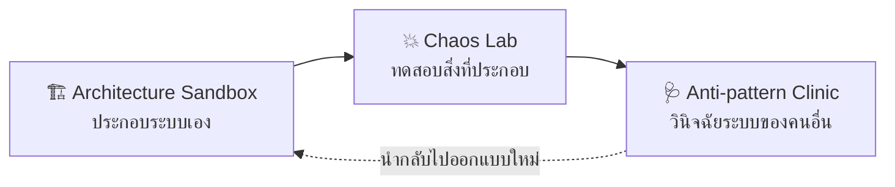

# 🎮 ดัชนีสื่อจำลองประกอบการเรียน (Simulations)

สื่อจำลองเชิงโต้ตอบสำหรับใช้สาธิตในชั้นเรียน ทำใบงานปฏิบัติการ และทบทวนก่อนสอบ
แต่ละตัวออกแบบจาก **จุดที่นักศึกษาเข้าใจผิดบ่อยที่สุดและอธิบายด้วยสไลด์ไม่ได้ผล**

## วิธีเปิดใช้งาน

**แบบเว็บแอป (แนะนำ — มีหน้าแรกและแถบข้างรวมทุกตัว)**

```bash
npm --prefix web run dev
```

เปิด `http://localhost:3000` — ดูรายละเอียดที่ [`web/README.md`](../web/README.md)

**แบบไฟล์เดียว (ไม่ต้องติดตั้งอะไร)**
ดับเบิลคลิกไฟล์ HTML ในโฟลเดอร์นี้ได้เลย เหมาะกับการแจกให้นักศึกษาหรือห้องเรียนที่ติดตั้ง Node.js ไม่ได้

## รายการสื่อจำลอง

| # | สื่อจำลอง | สัปดาห์ | สถานะ | ใบงาน | ไฟล์เดียว |
|:--:|---|:--:|:--:|---|---|
| 01 | 🎛️ **Decision Cockpit** — จำลองการตัดสินใจตามกรอบ Simon | W1–W2 | ✅ พร้อมใช้ | [[Sim-01-Decision-Cockpit]] | `sim-01-decision-cockpit.html` |
| 02 | 🧊 **OLAP Cube Explorer** — ลูกบาศก์ข้อมูลที่จับต้องได้ | W3–W4 | ✅ พร้อมใช้ | [[Sim-02-OLAP-Cube-Explorer]] | `sim-02-olap-cube-explorer.html` |
| 03 | 🏗️ **Architecture Sandbox** — ประกอบสถาปัตยกรรมเองแล้วรันจริง | W2 | ✅ พร้อมใช้ | [[Sim-03-Architecture-Sandbox]] | เว็บแอปเท่านั้น |
| 04 | 💥 **Chaos Lab** — ทุบระบบทีละชิ้น | W2 | ✅ พร้อมใช้ | [[Sim-04-Chaos-Lab]] | เว็บแอปเท่านั้น |
| 05 | 🩺 **Anti-pattern Clinic** — วินิจฉัยระบบป่วย 8 ราย | W2 | ✅ พร้อมใช้ | [[Sim-05-Antipattern-Clinic]] | เว็บแอปเท่านั้น |
| 06 | 🔎 **Grain Detective** — เลือก grain ผิดแล้วยอดขายพอง 12.96% | W3 | ✅ พร้อมใช้ | [[Sim-W3-Data-Management]] | เว็บแอป + Colab |
| 07 | 🧼 **Dirty Data Gauntlet** — เปิดกฎคุณภาพทีละข้อ | W3 | ✅ พร้อมใช้ | [[Sim-W3-Data-Management]] | เว็บแอป + Colab |
| 08 | 🔁 **ETL Pipeline Sim** — schema drift · ข้อมูลมาช้า · แฟ้มซ้ำ | W3 | ✅ พร้อมใช้ | [[Sim-W3-Data-Management]] | เว็บแอป + Colab |
| 09 | ⚖️ **Bias Lab** — ทำไม Accuracy ถึงโกหก | W5–W6, W9 | 🕓 กำลังพัฒนา | — | — |
| 10 | 🌫️ **Fuzzy vs Crisp Playground** — เส้นแบ่งที่ไม่คม | W12–W13 | 🕓 กำลังพัฒนา | — | — |
| 11 | 🏁 **Signal-to-Action Race** — BI vs AI vs DI | W15 | 🕓 กำลังพัฒนา | — | — |

### ชุดสามตัวของสัปดาห์ที่ 2 ใช้ต่อกันเป็นลำดับ



สร้าง → ทดสอบ → วิพากษ์ · ใช้เต็มคาบปฏิบัติการ 2 ชั่วโมงได้พอดี
หรือเลือกใช้ตัวเดียวคู่กับ Lab เดิมของสัปดาห์ที่ 2 ก็ได้

## หลักการออกแบบร่วมของทุกตัว

1. **ผลลัพธ์ทำซ้ำได้ (Deterministic)** — ใช้ตัวสุ่มแบบกำหนดเมล็ด ผลจึงเหมือนกันทุกเครื่อง
   ทำให้เฉลยหน้าชั้นเรียนได้และออกใบงานที่มีคำตอบตายตัวได้
2. **เปรียบเทียบได้อย่างเป็นธรรม** — เมื่อมีหลายโหมด ทุกโหมดเจอเหตุการณ์ชุดเดียวกัน
   ผลต่างจึงมาจากตัวแปรที่ต้องการสอนเท่านั้น ไม่ใช่โชค
3. **ตัวแบบผิดได้** — สื่อจำลองจงใจให้การพยากรณ์คลาดเคลื่อนในบางสถานการณ์
   เพื่อสอนว่า DSS **สนับสนุน** การตัดสินใจ ไม่ใช่ **แทนที่** ผู้ตัดสินใจ
4. **เชื่อมกลับทฤษฎีเสมอ** — ทุกหน้าจอมีกล่อง "เชื่อมกับทฤษฎี" ที่โยงสิ่งที่เพิ่งเกิดขึ้นกลับสู่แนวคิดในบทเรียน

## การนำไปใช้ในแต่ละบริบท

| บริบท | วิธีใช้ | เวลาที่ใช้ |
|---|---|---|
| สาธิตหน้าชั้นเรียน | ผู้สอนฉายจอ ให้นักศึกษาโหวตทางเลือกร่วมกันก่อนกด | 15–20 นาที |
| ปฏิบัติการรายบุคคล | นักศึกษาเล่นเองแล้วตอบใบงาน | 45–60 นาที |
| ทบทวนก่อนสอบ | ใช้โหมดท้าทายของ Sim 02 ติวข้อสอบส่วน C | 20 นาที |

---
**ที่เกี่ยวข้อง:** [[Home]] · [[Lab-Index]] · [[Course-Outline-16-Weeks]]
